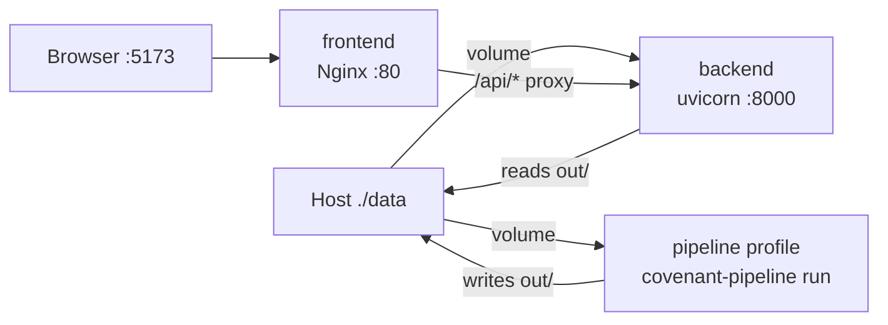

# **Table of Contents**

- [Table of Contents](#table-of-contents)

- [Road Map: Platform Engineering](#road-map-platform-engineering)

- [Stage 1: Local Containerization Overview](#stage-1-local-containerization-overview)
  - [The Setup & Goal](#the-setup--goal)
  - [Architecture Overview](#architecture-overview)
  - [Service Roles](#service-roles)

- [Stage 2: Technical Implementation](#stage-2-technical-implementation)
  - [Package Layout](#package-layout)
  - [Backend Image](#backend-image)
    - [Layer 1: Base Image](#layer-1-base-image)
    - [Layer 2: Dependencies](#layer-2-dependencies)
    - [Layer 3: Source Copy](#layer-3-source-copy)
    - [Layer 4: Execution](#layer-4-execution)
    - [Dual Role: API Server and Pipeline Runner](#dual-role-api-server-and-pipeline-runner)
  - [Frontend Image](#frontend-image)
    - [Stage 1: The Compiler (Node)](#stage-1-the-compiler-node)
    - [Stage 2: The Server (Nginx)](#stage-2-the-server-nginx)
  - [Nginx Reverse Proxy](#nginx-reverse-proxy)
  - [Compose Orchestration](#compose-orchestration)
  - [Environment & Volume Contract](#environment--volume-contract)
  - [Build Context & .dockerignore](#build-context--dockerignore)

- [Execution Workflows](#execution-workflows)
  - [Prerequisites](#prerequisites)
  - [Place Input PDF](#place-input-pdf)
  - [Run the Pipeline (Deterministic)](#run-the-pipeline-deterministic)
  - [Run the Pipeline (Full LLM)](#run-the-pipeline-full-llm)
  - [Serve the Viewer](#serve-the-viewer)
  - [Override Paths and Commands](#override-paths-and-commands)
  - [Native vs Docker](#native-vs-docker)

- [Troubleshooting](#troubleshooting)

- [Future Roadmap (Not Yet Implemented)](#future-roadmap-not-yet-implemented)

- [Appendix](#appendix)
  - [Related Documents](#related-documents)
  - [Implementation Deviations from Blueprint](#implementation-deviations-from-blueprint)

# **Road Map: Platform Engineering**

The application layer — deterministic PDF chunking, Gemini extraction, relational compilation, integrity audit, LLM validation, and the React/FastAPI viewer — is documented in [PROJECT_DOCUMENTATION.md](PROJECT_DOCUMENTATION.md). That code currently runs as raw morphisms in the volatile ambient environment of a developer laptop: Python virtualenvs, Node modules, and OS-specific paths that drift between machines.

**The Goal:** Construct the infrastructure layer so the same application runs identically on any host capable of running Docker — and later, on enterprise cloud compute — without polluting the host with application dependencies.

Planning notes for the full platform arc live in [docs/platform-engineering/](docs/platform-engineering/). This document covers **Phase 1 only** (implemented on branch `infra/docker`).

| Phase | Status | Summary |
|-------|--------|---------|
| **Phase 1: Local Containerization** | **Implemented** | Docker images + Docker Compose |
| Phase 2: Cloud Topology (ECR/ECS, ACR/ACA) | Not implemented | Container registry, serverless compute, VPC |
| Phase 3: Infrastructure as Code (Terraform) | Not implemented | Declarative cloud mapping |
| Phase 4: CI/CD Orchestration | Not implemented | GitHub Actions, audit gate, image push, deploy |

**Phase 1 deliverables:**

* **Backend image** — `python:3.11-slim` with `covenant_pipeline` + FastAPI viewer API
* **Frontend image** — multi-stage Node build served by Nginx
* **Compose orchestration** — `backend`, `frontend`, and on-demand `pipeline` services over a shared `./data` volume

# **Stage 1: Local Containerization Overview**

## **The Setup & Goal**

**The Setup:** The Credit Agreement pipeline and viewer exist as installable code (`pip install -e ".[viewer]"`, `npm run dev`). Running natively requires the host to resolve Python packages, system libraries (PyMuPDF), Node tooling, and environment variables independently on every machine.

**The Goal:** Package the application into immutable Docker images and orchestrate them locally. PDF input and pipeline artifacts persist on the host via a volume mount (`./data`), so containers can be destroyed and recreated without losing work. The host OS remains clean: dependencies live inside the image, not on the laptop.

## **Architecture Overview**



**Data flow:**

1. Place the source PDF in `./data/` on the host.
2. Run the `pipeline` service (Compose profile) — writes artifacts to `./data/out/`.
3. Start `backend` + `frontend` — backend reads `./data/out/` via the same volume; frontend proxies API calls to backend over the Compose network.

## **Service Roles**

| Service | Always running? | Role |
|---------|-----------------|------|
| `pipeline` | No (on-demand via `--profile pipeline`) | Runs `covenant-pipeline run` to extract covenants and write artifacts |
| `backend` | Yes (when viewer is up) | Read-only FastAPI server: serves audited JSON, PDF bytes, pipeline summary |
| `frontend` | Yes (when viewer is up) | Serves built React static assets; proxies `/api/*` to `backend` |

**Critical design decision:** The backend does **not** run extraction. It only serves pre-generated files from `COVENANT_*` paths. Extraction is triggered separately via the `pipeline` service, which reuses the same backend image with `entrypoint: covenant-pipeline`. This matches the separation in native mode between `covenant-pipeline run` and `covenant-pipeline serve`.

# **Stage 2: Technical Implementation**

## **Package Layout**

Docker-related files at repo root and under `viewer/`:

```
/ (repo root)
├── docker-compose.yml           # Orchestrator: backend, frontend, pipeline
├── .dockerignore                # Root build context exclusions
├── .env.docker.example          # Committed template for GEMINI_API_KEY
├── .env.docker                  # Gitignored secrets (copy from example)
├── data/                        # Host volume mount (gitignored)
│   ├── Credit_Agreement_Hallador.pdf
│   └── out/                     # Pipeline artifacts
├── viewer/
│   ├── backend/
│   │   └── Dockerfile           # Backend + pipeline image
│   └── frontend/
│       ├── Dockerfile           # Multi-stage Node → Nginx
│       ├── nginx.conf           # SPA fallback + /api proxy
│       └── .dockerignore
```

Application source consumed by images (not duplicated here — see [PROJECT_DOCUMENTATION.md](PROJECT_DOCUMENTATION.md) Package Layout):

* `covenant_pipeline/` — extraction engine and CLI
* `config/covenant_config.json` — routing rules
* `viewer/backend/main.py` — FastAPI API
* `viewer/frontend/src/` — React UI

## **Backend Image**

**Module:** `viewer/backend/Dockerfile` (build context: **repo root**)

### **Layer 1: Base Image**

**Action:** `FROM python:3.11-slim`; install system libraries for PyMuPDF.

```dockerfile
RUN apt-get update \
    && apt-get install -y --no-install-recommends \
        libmupdf-dev \
        mupdf-tools \
    && rm -rf /var/lib/apt/lists/*
```

**Reasoning:** The slim Python image does not include MuPDF binaries. PyMuPDF (`fitz`) requires these at runtime for PDF chunking. Installing only what is needed keeps the image smaller than a full `python:3.11` image.

### **Layer 2: Dependencies**

**Action:** `pip install --no-cache-dir -e ".[viewer]"` using `pyproject.toml`.

**Reasoning:** The `[viewer]` optional extra installs `fastapi` and `uvicorn` alongside core pipeline deps (`pymupdf`, `pandas`, `google-genai`, `pydantic`, `python-dotenv`). Editable install registers the `covenant-pipeline` CLI entry point and makes `covenant_pipeline` importable — required because `/api/pipeline-summary` imports `covenant_pipeline.report.summary` at request time.

**Deviation from blueprint:** [docs/platform-engineering/blueprints/PE_RM_Phase1.md](docs/platform-engineering/blueprints/PE_RM_Phase1.md) specifies `requirements.txt`, which lists only the five core deps and omits FastAPI/uvicorn. Implementation uses `pyproject.toml` as the single source of truth.

### **Layer 3: Source Copy**

**Action:** Copy into `/app`:

* `pyproject.toml`, `README.md`
* `covenant_pipeline/`
* `config/`
* `viewer/backend/`

**Reasoning:** Build context must be the repo root, not `viewer/backend/` alone. The Dockerfile path is `viewer/backend/Dockerfile`, but Compose sets `context: .` so the image can reach `covenant_pipeline/` and `config/`.

### **Layer 4: Execution**

**Action:** Default container command:

```dockerfile
CMD ["uvicorn", "main:app", "--app-dir", "viewer/backend", "--host", "0.0.0.0", "--port", "8000"]
```

**Reasoning:**

* `--app-dir viewer/backend` matches the proven native invocation in `covenant_pipeline/viewer.py` (`uvicorn main:app` with cwd at `viewer/backend`).
* `--host 0.0.0.0` is required for Docker — binding to `127.0.0.1` (native default) would make the API unreachable from other containers or the host port mapping.

### **Dual Role: API Server and Pipeline Runner**

The same image serves two Compose services:

| Service | Entrypoint | Command | Purpose |
|---------|------------|---------|---------|
| `backend` | (Dockerfile default) | `uvicorn main:app ...` | Serve viewer API on port 8000 |
| `pipeline` | `covenant-pipeline` | `run --pdf ... --output-dir ...` | Run extraction pipeline on demand |

**Reasoning:** One image avoids maintaining separate pipeline and API Dockerfiles. The pipeline CLI and FastAPI app share the same Python environment and `covenant_pipeline` package. Only the process entrypoint differs.

## **Frontend Image**

**Module:** `viewer/frontend/Dockerfile` (build context: `viewer/frontend`)

### **Stage 1: The Compiler (Node)**

**Action:**

```dockerfile
FROM node:20-alpine AS builder
COPY package.json package-lock.json ./
RUN npm ci
COPY . .
RUN npm run build
```

**Reasoning:** Vite compiles React/JSX into static HTML, JS, and CSS in `dist/`. This stage needs Node and all devDependencies; they are discarded after the build.

### **Stage 2: The Server (Nginx)**

**Action:**

```dockerfile
FROM nginx:alpine
COPY --from=builder /app/dist /usr/share/nginx/html
COPY nginx.conf /etc/nginx/conf.d/default.conf
```

**Reasoning:** Production containers should not run the Vite dev server. Nginx serves static files with minimal attack surface and memory footprint. The final image contains no Node runtime.

## **Nginx Reverse Proxy**

**Module:** `viewer/frontend/nginx.conf`

**Action:**

* `location /api/` → `proxy_pass http://backend:8000` (Docker Compose service DNS name)
* `location /` → `try_files $uri $uri/ /index.html` (SPA fallback for client-side routing)

**Reasoning:** In native dev mode, Vite proxies `/api` to `127.0.0.1:8000` via `viewer/frontend/vite.config.js`. In Docker, the browser talks to Nginx on port 5173 (mapped from container port 80); Nginx forwards API requests to the `backend` service on the internal Compose network. The frontend never hardcodes backend URLs.

## **Compose Orchestration**

**Module:** `docker-compose.yml`

| Service | Build | Ports | Purpose |
|---------|-------|-------|---------|
| `backend` | `{ context: ., dockerfile: viewer/backend/Dockerfile }` | `8000:8000` | FastAPI viewer API |
| `frontend` | `{ context: ./viewer/frontend }` | `5173:80` | Nginx static UI |
| `pipeline` | Same as backend | (none) | On-demand `covenant-pipeline run` |

**`pipeline` profile:** `profiles: ["pipeline"]` prevents the pipeline container from starting on `docker compose up`. Run it explicitly:

```bash
docker compose --profile pipeline run --rm pipeline
```

**`depends_on`:** `frontend` waits for `backend` to start. This does not guarantee the API is healthy — only that the container has been created.

**Shared volume:** `./data:/app/data` on both `backend` and `pipeline`. Artifacts written by the pipeline are immediately visible to the backend without rebuilding images.

## **Environment & Volume Contract**

**Modules:** `docker-compose.yml`, `covenant_pipeline/config.py` (`viewer_env()`), `viewer/backend/main.py`

| Variable | Container path | Set by | Purpose |
|----------|----------------|--------|---------|
| `COVENANT_PDF_PATH` | `/app/data/Credit_Agreement_Hallador.pdf` | Compose `environment` | Source PDF for `/api/pdf` |
| `COVENANT_OUTPUT_DIR` | `/app/data/out` | Compose `environment` | Base dir for pipeline artifacts |
| `COVENANT_AUDITED_JSON` | `/app/data/out/final_compiled_payload_audited.json` | Compose `environment` | Payload for `/api/document-data` |
| `COVENANT_DISPATCH_QUEUE_JSON` | `/app/data/out/dispatch_queue_output.json` | Compose `environment` | Dispatch stats for `/api/pipeline-summary` |
| `GEMINI_API_KEY` | (env only) | `.env.docker` via `env_file` | Required for LLM stages (`extract`, `validate`) |

**Secrets:** Copy `.env.docker.example` to `.env.docker` and set `GEMINI_API_KEY`. The file is gitignored (`.env.*` rule in `.gitignore`). Container env vars take precedence over repo-root `.env` loaded by `covenant_pipeline/llm/client.py`.

**Artifact filenames:** See **PipelinePaths Artifact Constants** in [PROJECT_DOCUMENTATION.md](PROJECT_DOCUMENTATION.md#pipelinepaths-artifact-constants). Docker defaults map the native `out/` directory to `/app/data/out` inside the container.

**Viewer requirement:** `final_compiled_payload_audited.json` is produced only after a **full** pipeline run (including `extract`, `compile`, `audit`, `validate`). A `--skip-llm` run does not generate this file and the viewer will return 404/500 until a full run completes.

## **Build Context & .dockerignore**

**Modules:** `.dockerignore`, `viewer/frontend/.dockerignore`

**Root `.dockerignore` excludes:**

| Pattern | Reason |
|---------|--------|
| `.git`, `.cursor` | Not needed in image; reduces build context size |
| `.venv`, `venv`, `__pycache__`, `*.egg-info` | Host Python artifacts |
| `out/`, `data/` | Runtime data via volume mounts, not image layers |
| `node_modules`, `dist` | Frontend deps built inside frontend Dockerfile |
| `legacy/`, `docs/` | Reference/planning material not used at runtime |
| `.env`, `.env.*` | Secrets must not be baked into images |

**Frontend `.dockerignore` excludes:** `node_modules`, `dist` — `npm ci` and `npm run build` run fresh inside the builder stage.

# **Execution Workflows**

## **Prerequisites**

* [Docker Desktop](https://www.docker.com/products/docker-desktop/) (Windows/macOS) or Docker Engine + Compose (Linux)
* Git clone of this repo on branch `infra/docker` (or later `main` once merged)

```bash
copy .env.docker.example .env.docker    # Windows
# cp .env.docker.example .env.docker    # macOS/Linux
```

Edit `.env.docker` and set `GEMINI_API_KEY` for full pipeline runs. Get a key at https://aistudio.google.com/apikey

## **Place Input PDF**

```bash
mkdir data
copy path\to\agreement.pdf data\Credit_Agreement_Hallador.pdf    # Windows
# cp agreement.pdf data/Credit_Agreement_Hallador.pdf              # macOS/Linux
```

Default Compose paths assume this filename. Override with custom `--pdf` arguments (see below).

## **Run the Pipeline (Deterministic)**

No API key required. Runs `chunk`, `route`, and `glossary` only.

```bash
docker compose build
docker compose --profile pipeline run --rm pipeline run --skip-llm \
  --pdf /app/data/Credit_Agreement_Hallador.pdf \
  --output-dir /app/data/out
```

**Reasoning:** `--skip-llm` is useful for validating Docker wiring and deterministic stages without Gemini billing. Artifacts land in `./data/out/` on the host.

## **Run the Pipeline (Full LLM)**

Requires `GEMINI_API_KEY` in `.env.docker`.

```bash
docker compose --profile pipeline run --rm pipeline
```

Default command (from `docker-compose.yml`):

```
run --pdf /app/data/Credit_Agreement_Hallador.pdf --output-dir /app/data/out
```

Runs all stages: `chunk → route → glossary → extract → compile → audit → validate`. Produces `final_compiled_payload_audited.json` required by the viewer.

## **Serve the Viewer**

After a full pipeline run:

```bash
docker compose up backend frontend
```

| URL | Service |
|-----|---------|
| http://localhost:5173 | Frontend (Nginx → React UI) |
| http://localhost:8000 | Backend API (direct access) |
| http://localhost:8000/api/document-data | Audited JSON payload |
| http://localhost:8000/api/pdf | Source PDF stream |

Stop with `Ctrl+C` or `docker compose down`.

## **Override Paths and Commands**

The `pipeline` service accepts any `covenant-pipeline` arguments after the service name:

```bash
# Different PDF filename
docker compose --profile pipeline run --rm pipeline run \
  --pdf /app/data/my_agreement.pdf \
  --output-dir /app/data/out

# Single stage
docker compose --profile pipeline run --rm pipeline chunk \
  --pdf /app/data/Credit_Agreement_Hallador.pdf \
  --output-dir /app/data/out
```

If you change output paths, update the `COVENANT_*` environment variables in `docker-compose.yml` (or override inline) so the backend points at the new artifact locations.

## **Native vs Docker**

| Concern | Native (`covenant-pipeline serve`) | Docker |
|---------|-----------------------------------|--------|
| Install | `pip install -e ".[viewer]"`, `npm install` | `docker compose build` |
| Frontend | Vite dev server on `:5173` | Nginx on `:5173` (maps to container `:80`) |
| Backend bind | `127.0.0.1:8000` | `0.0.0.0:8000` |
| API proxy | Vite `vite.config.js` → localhost | Nginx `nginx.conf` → `backend:8000` |
| Output directory | `{repo_root}/out/` | `./data/out/` via volume |
| PDF default | `{output_dir}/Credit_Agreement_Hallador.pdf` | `/app/data/Credit_Agreement_Hallador.pdf` |
| API key file | `.env` at repo root | `.env.docker` |
| Run extraction | `covenant-pipeline run` on host | `docker compose --profile pipeline run --rm pipeline` |
| Launch viewer | `covenant-pipeline serve` (spawns uvicorn + Vite) | `docker compose up backend frontend` |

**When to use native:** Active frontend/backend development with hot reload.

**When to use Docker:** Reproducible runs, onboarding without local Python/Node setup, validating the containerized path before cloud deployment.

# **Troubleshooting**

| Symptom | Likely cause | Fix |
|---------|--------------|-----|
| Backend `500` on `/api/document-data` | `COVENANT_AUDITED_JSON` unset or file missing | Run full pipeline first; verify `./data/out/final_compiled_payload_audited.json` exists |
| Backend `500` — env detail mentions `COVENANT_*` | Compose env not applied | Check `docker-compose.yml` `environment` block; recreate containers |
| Viewer loads but sidebar is empty / error state | `--skip-llm` run only | Full run required for audited JSON and validation data |
| Frontend `/api/*` returns `502 Bad Gateway` | Backend container not running | `docker compose ps`; start backend; check logs: `docker compose logs backend` |
| `GEMINI_API_KEY is required` during pipeline | Missing or empty `.env.docker` | Copy `.env.docker.example` → `.env.docker`; set key |
| `PDF not found` | PDF not in `./data/` or wrong filename | Place PDF at `data/Credit_Agreement_Hallador.pdf` or pass `--pdf` |
| Changes to code not reflected | Image layer cache | `docker compose build --no-cache` then recreate containers |
| Windows volume permission errors | Docker Desktop file sharing | Ensure project drive is shared in Docker Desktop settings; use paths under the cloned repo |
| `pipeline` starts on `docker compose up` | Should not happen | `pipeline` uses `profiles: ["pipeline"]`; only starts with `--profile pipeline` |

**Rebuild after dependency changes:**

```bash
docker compose build --no-cache
docker compose up --force-recreate backend frontend
```

# **Future Roadmap (Not Yet Implemented)**

The following platform-engineering phases are planned in [docs/platform-engineering/Platform Engineering Roadmap.md](docs/platform-engineering/Platform%20Engineering%20Roadmap.md) but **not present** in the codebase:

| Feature | Planning reference | Current state |
|---------|-------------------|---------------|
| Cloud container registry (ECR / ACR) | Phase 2 | Not implemented |
| Serverless compute (ECS Fargate / Azure Container Apps) | Phase 2 | Not implemented |
| VPC, subnets, load balancer, IAM | Phase 2 | Not implemented |
| Terraform provider + resource definitions | Phase 3 | Not implemented |
| `terraform plan` / `apply` idempotent deploy | Phase 3 | Not implemented |
| GitHub Actions CI workflow | Phase 4 | Not implemented |
| CI audit gate (`covenant_pipeline/phases/audit.py`) | Phase 4 | Not implemented |
| Automated image push to registry | Phase 4 | Not implemented |
| Kubernetes reconciliation loop | Math for Platform Engineer | Not implemented |

When Phase 2+ are built, images defined in this document become the deployable artifacts pushed to the cloud registry. Compose networking maps to VPC service discovery; the `./data` volume pattern maps to object storage (S3/Blob) or persistent volumes.

# **Appendix**

## **Related Documents**

| Document | Purpose |
|----------|---------|
| [PROJECT_DOCUMENTATION.md](PROJECT_DOCUMENTATION.md) | Application-layer architecture, pipeline stages, viewer UI |
| [README.md](README.md) | Quick start (native and Docker) |
| [docs/platform-engineering/Platform Engineering Roadmap.md](docs/platform-engineering/Platform%20Engineering%20Roadmap.md) | Full platform engineering arc (Phases 1–4) |
| [docs/platform-engineering/blueprints/PE_RM_Phase1.md](docs/platform-engineering/blueprints/PE_RM_Phase1.md) | Original Phase 1 blueprint (planning artifact) |
| [docs/platform-engineering/math/Math for Containerization.md](docs/platform-engineering/math/Math%20for%20Containerization.md) | Category-theoretic framing of Docker images |
| [docs/platform-engineering/math/Math for Platform Engineer.md](docs/platform-engineering/math/Math%20for%20Platform%20Engineer.md) | IaC, CI/CD, and orchestration math notes |

## **Implementation Deviations from Blueprint**

[docs/platform-engineering/blueprints/PE_RM_Phase1.md](docs/platform-engineering/blueprints/PE_RM_Phase1.md) was the design spec; the implementation on `infra/docker` differs in these ways:

| Blueprint spec | Actual implementation | Reason |
|----------------|----------------------|--------|
| `pip install -r requirements.txt` | `pip install -e ".[viewer]"` from `pyproject.toml` | Single dep source; includes FastAPI/uvicorn and registers CLI |
| `uvicorn viewer.backend.main:app` | `uvicorn main:app --app-dir viewer/backend` | Matches proven native launcher in `covenant_pipeline/viewer.py` |
| Backend container runs extraction | Separate `pipeline` service (same image, different entrypoint) | FastAPI backend is read-only; extraction is on-demand |
| Build context `./viewer/backend` | Build context repo root (`.`) | Image needs `covenant_pipeline/` and `config/` |
| `.env.docker` only mentions `GEMINI_API_KEY` | Compose also sets `COVENANT_*` paths in `environment` | Backend requires artifact path env vars at runtime |
| Frontend port `8080` optional | Host port `5173` (matches native Vite default) | Familiar URL for developers switching between native and Docker |
