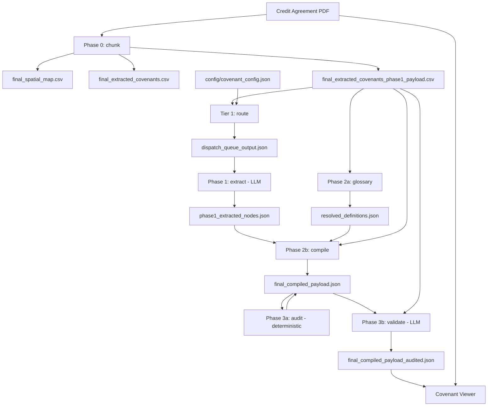

# **Table of Contents**

- [Table of Contents](#table-of-contents)

- [Related Notes](#related-notes)

- [Road Map: Credit Agreement](#road-map-credit-agreement)

- [Stage 1: Sketch Solution for Specific Example - Hallador](#stage-1-sketch-solution-for-specific-example-hallador)
  - [Overview of Pipeline](#overview-of-pipeline)
  - [Phase 0](#phase-0)
    - [Ingestion & Structural Slicing (The Python Chunker)](#ingestion-structural-slicing-the-python-chunker)
  - [Phase 1](#phase-1)
    - [The Tier 1 Deterministic Router](#the-tier-1-deterministic-router)
    - [The Extraction Agents](#the-extraction-agents)
  - [Phase 2](#phase-2)
    - [The Deterministic Glossary Engine](#the-deterministic-glossary-engine)
    - [The Multi-Hop Relational Compiler](#the-multi-hop-relational-compiler)
  - [Phase 3](#phase-3)
    - [The Automated Integrity Auditor](#the-automated-integrity-auditor)
    - [The Exception Layer: Validation Agent](#the-exception-layer-validation-agent)
    - [The Covenant Viewer](#the-covenant-viewer)
    - [Diagram Node Legend](#diagram-node-legend)

- [Stage 0: The Real-World Problem](#stage-0-the-real-world-problem)
  - [The Process](#the-process)
  - [Abrigo](#abrigo)
  - [Credit Risk Functions](#credit-risk-functions)
  - [Risk Analyst](#risk-analyst)
  - [Covenants](#covenants)
    - [The MVP Covenant Target List](#the-mvp-covenant-target-list)
    - [Other Covenants](#other-covenants)
  - [Documents](#documents)
    - [Credit Agreements](#credit-agreements)

- [Stage 2: Technical Implementation](#stage-2-technical-implementation)
  - [Package Layout](#package-layout)
  - [PDF Chunker Guide](#pdf-chunker-guide)
    - [Deterministic Bounding Box Pipeline: EDGAR PDF Extraction](#deterministic-bounding-box-pipeline-edgar-pdf-extraction)
    - [Result and Architectural Overview](#result-and-architectural-overview)
    - [Step-by-Step Documentation & Reasoning](#step-by-step-documentation-reasoning)
  - [Multi-Tier Deterministic Routing Pipeline](#multi-tier-deterministic-routing-pipeline)
    - [System Overview](#system-overview)
    - [Part 1: Tier 1 (Deterministic Matrix Router)](#part-1-tier-1-deterministic-matrix-router)
    - [Part 2: Advanced Pipeline Logic & Edge Cases](#part-2-advanced-pipeline-logic-edge-cases)
  - [Agent Covenant Extraction Architecture Documentation](#agent-covenant-extraction-architecture-documentation)
  - [Pipeline Phase 2: Deterministic Glossary Engine](#pipeline-phase-2-deterministic-glossary-engine)
  - [Pipeline Node I: Multihop Relational Compiler](#pipeline-node-i-multihop-relational-compiler)
  - [Pipeline Phase 3: Automated Integrity Auditor](#pipeline-phase-3-automated-integrity-auditor)
  - [Node L Validation Agent](#node-l-validation-agent)
  - [Orchestration & CLI](#orchestration-cli)
    - [Programmatic API](#programmatic-api)
    - [CLI Entry Point](#cli-entry-point)
    - [PipelinePaths Artifact Constants](#pipelinepaths-artifact-constants)
    - [Final Payload Structure (final_compiled_payload_audited.json)](#final-payload-structure-final-compiled-payload-auditedjson)
  - [Frontend UI](#frontend-ui)
    - [Module 1: Dependencies and Environment Setup](#module-1-dependencies-and-environment-setup)
    - [Module 2: Backend API (FastAPI)](#module-2-backend-api-fastapi)
    - [Module 3: Application State (useState)](#module-3-application-state-usestate)
    - [Module 4: Backend Initialization (useEffect)](#module-4-backend-initialization-useeffect)
    - [Module 5: Data Transformation Engine (useMemo)](#module-5-data-transformation-engine-usememo)
    - [Module 6: Presentation Helpers](#module-6-presentation-helpers)
    - [Module 7: UI Layout](#module-7-ui-layout)
    - [Launch](#launch)
  - [HTML Audit Report](#html-audit-report)

- [Future Roadmap (Not Yet Implemented)](#future-roadmap-not-yet-implemented)

- [Appendix](#appendix)
  - [The Actor-Critic Validation Paradigm](#the-actor-critic-validation-paradigm)
    - [Application to the Credit Agreement Pipeline](#application-to-the-credit-agreement-pipeline)

# **Related Notes**

Conceptual context for this pipeline lives in the companion `notes` repo (open it alongside this repo in the Cursor multi-root workspace). Project-specific platform-engineering docs are **mirrored** into `docs/platform-engineering/` (auto-synced from `notes`; see [docs/platform-engineering/README.md](docs/platform-engineering/README.md)), so they resolve locally and on GitHub. Reusable meta/math theory stays in `notes` only.

Mirrored here (project-specific strategy):

- [docs/platform-engineering/PE_Roadmap_M1.md](docs/platform-engineering/PE_Roadmap_M1.md) — M1 platform engineering roadmap (Phases 1–4).
- [docs/platform-engineering/PE_Roadmap_M2.md](docs/platform-engineering/PE_Roadmap_M2.md) — M2 IDP vision (generalize beyond CA pipeline).
- [docs/platform-engineering/blueprints/PE_RM_Phase1.md](docs/platform-engineering/blueprints/PE_RM_Phase1.md) — Phase 1 containerization blueprint.
- [docs/platform-engineering/blueprints/PE_RM_Phase2.md](docs/platform-engineering/blueprints/PE_RM_Phase2.md) — Phase 2 cloud topology blueprint.
- [docs/platform-engineering/blueprints/PE_RM_Phase3.md](docs/platform-engineering/blueprints/PE_RM_Phase3.md) — Phase 3 Terraform blueprint.
- [docs/platform-engineering/blueprints/PE_RM_Phase4.md](docs/platform-engineering/blueprints/PE_RM_Phase4.md) — Phase 4 CI/CD blueprint.
- [docs/platform-engineering/math/Math_Application_Pipeline.md](docs/platform-engineering/math/Math_Application_Pipeline.md) — category-theoretic foundations of the application pipeline.

Notes-only (reusable theory, resolve in the multi-root workspace):

- [notes/meta/Meta_Workflow.md](../notes/meta/Meta_Workflow.md) — canonical 0-4 Centaur meta-workflow.
- [notes/meta/Layer4_TypeB_Auditing.md](../notes/meta/Layer4_TypeB_Auditing.md) — Type B auditing and invariants (relevant to the integrity auditor and Pydantic gates).
- [notes/math/Math_Containerization.md](../notes/math/Math_Containerization.md) — categorical foundations of containerization.
- [notes/math/Math_Notes_Platform_Engineer.md](../notes/math/Math_Notes_Platform_Engineer.md) — platform engineering math (IaC, CI/CD, orchestration).
- [notes/projects/covenant/README.md](../notes/projects/covenant/README.md) — project note index.

Implementation (this repo):

- [Docker_Documentation.md](Docker_Documentation.md) — Phase 1 Docker implementation (as-built).
- [docs/platform-engineering/README.md](docs/platform-engineering/README.md) — platform engineering doc index.

# **Road Map: Credit Agreement**

**Stage 0: Learning the Real-World Environment and Problem**

* Understand how credit risk teams ingest and monitor covenant data
* Ground the pipeline in real bank workflows (e.g., Abrigo, covenant ticklers)

**Stage 1: Sketch Solution for Specific Example - Hallador**

* Prove the architecture on a single credit agreement PDF
* Keep generalization in mind for other LSTA-style agreements

**Stage 2: Implementation of Solution / PoC**

* Refactored `covenant_pipeline` Python package with `covenant-pipeline` CLI
* Deterministic chunking, Tier 1 routing, glossary, single-pass LLM extraction, compiler, audit, validation, and React viewer

**Stage 3: Sketch Scaling of Solution to outside Hallador**

* Additional routing rules, agreement formats, Tier 2/3 routing fallbacks

**Stage 4: Implementation of Scaling Solution / PoC**

* Vector retrieval, parallel extraction tournaments, production concurrency

**Stage 5: Enterprise Integration**

* Abrigo / core banking integration, batch processing, governance

# **Stage 1: Sketch Solution for Specific Example - Hallador**

## **Overview of Pipeline**

The refactored pipeline runs stages in this order (see `covenant_pipeline/orchestrator.py`):

```
chunk → route → glossary → extract → compile → audit → validate → [viewer]
```

Glossary runs **before** extract in code. Extract and compile do not depend on glossary output at runtime, but running glossary early ensures `resolved_definitions.json` exists before compilation and keeps deterministic work ahead of LLM calls.



## **Phase 0**

### **Ingestion & Structural Slicing (The Python Chunker)**

* **The Problem:** Feeding an entire 150-page PDF to an LLM causes token saturation, high API latency, and output truncation. Furthermore, unstructured text cannot be audited.
* **The Execution:** `covenant_pipeline/phases/chunker.py` deterministically slices the PDF using structural boundaries, physically isolating Article 1 (Definitions) from Article X (Covenants). The chunker attaches an immutable metadata payload (Article Name, Section Number, Page Number, and raw source text) to every chunk.
* **The Result:** Agents ingest strictly bounded, highly relevant text blocks that are permanently tethered to their physical location in the original document, which propagates as a high-resolution `Receipt` through the entire pipeline.

## **Phase 1**

### **The Tier 1 Deterministic Router**

* **The Problem:** Relying on generative LLMs to classify raw legal text is cost-prohibitive and slow, while naive string searches trigger false positives (cross-references) and fail when multiple distinct covenants are compressed into single paragraphs.
* **The Execution:** `covenant_pipeline/phases/router.py` evaluates each covenant rule in `config/covenant_config.json` independently against the phase 1 payload CSV using vectorized Pandas boolean masks: Article zone gate, section title regex, body blacklist, and minimum text density.
* **The Result:** When exactly one chunk matches a rule, a structured extraction envelope is appended to `dispatch_queue_output.json`. Zero or multiple matches log a Tier 2 cascade message (Tier 2 is not yet implemented — see Future Roadmap).

### **The Extraction Agents**

* **The Problem:** Generative extraction is prone to dropped clauses, hallucinated pointers, and the loss of data provenance (the "black box" problem).
* **The Execution:** `covenant_pipeline/phases/extraction.py` iterates the dispatch queue and calls Gemini with schema-constrained JSON output (`temperature=0.0`). Each result includes `Receipt`, `Agent`, `Extracted_Data`, and `Cost_Metrics`.
* **The Result:** Produces auditable structured JSON in `phase1_extracted_nodes.json` with hardcoded metadata receipts and `[$REF: Term]` tags for undefined variables.

**Note:** The current PoC uses a **single** extraction pass per envelope. Parallel agents and a Rater Agent are planned but not implemented (see Future Roadmap).

## **Phase 2**

### **The Deterministic Glossary Engine**

* **The Problem:** Extracting a 300+ term glossary using an LLM on-demand is computationally expensive, slow, and prone to hallucinated text or missed dependencies.
* **The Execution:** `covenant_pipeline/phases/glossary.py` executes a single sweep of isolated Article 1 text using regex targeting `"Term" means...` formatting, then maps nested references deterministically.
* **The Result:** Generates `resolved_definitions.json` containing raw text and explicitly nested references for every term, with zero API cost.

### **The Multi-Hop Relational Compiler**

* **The Problem:** LLM extraction outputs probabilistic placeholder tags (e.g., `[$REF: Permitted Acquisitions]`). Because LLMs hallucinate plurals and standard formatting, strict string matching fails when linking to the deterministic glossary.
* **The Execution:** `covenant_pipeline/phases/compiler.py` (`MultiHopRelationalCompiler`) recursively traverses Phase 1 JSON and resolves `[$REF: Term]` tags via exact match, TOC section injection, plural stripping, and fuzzy `difflib` matching.
* **The Result:** Merges Phase 1 math and Phase 2 dictionary into `final_compiled_payload.json` with `Document_Metadata`, `Phase1_Extracted_Covenants`, and `Phase2_Master_Glossary`.

## **Phase 3**

### **The Automated Integrity Auditor**

* **The Problem:** Compiling a flat relational database from highly interconnected legal text introduces vulnerabilities such as circular references and dangling pointers.
* **The Execution:** `covenant_pipeline/phases/audit.py` runs three sequential tests: circular reference DFS (with memoization), dangling pointer sweep, and numeric type validation on limit fields. Updates `final_compiled_payload.json` in place.
* **The Result:** Appends diagnostic metadata to `Document_Metadata.Warnings` so downstream systems can process valid math while flagging logical flaws.

### **The Exception Layer: Validation Agent**

* **The Problem:** "Silent" hallucinations can pass strict Pydantic typing (e.g., extracting 1.25 instead of 1.50) but remain factually wrong.
* **The Execution:** `covenant_pipeline/phases/validation.py` rehydrates source text from CSV receipts and runs an LLM-as-a-Judge (`AUDITOR_SYSTEM_PROMPT`) per covenant. Does not overwrite extracted data; appends `Validation_Audit`.
* **The Result:** Writes `final_compiled_payload_audited.json` with confidence scores and flagged discrepancies for human review.

### **The Covenant Viewer**

* **The Problem:** Human risk analysts cannot trust black-box AI outputs without verifying the source, but manually searching a 150-page PDF defeats the purpose of automation.
* **The Execution:** FastAPI backend (`viewer/backend/main.py`) serves audited JSON and the source PDF; React frontend (`viewer/frontend/src/App.jsx`) displays extracted math, validation flags, PDF page ranges, and glossary drill-down.
* **The Result:** Analysts verify AI logic against source clauses in seconds. Launch via `covenant-pipeline serve` or `covenant-pipeline run --serve-ui`.

### **Diagram Node Legend**

* **Node A:** Raw PDF ingestion (`--pdf`)
* **Node B:** Python Document Chunker — `final_spatial_map.csv`, `final_extracted_covenants.csv`, `final_extracted_covenants_phase1_payload.csv`
* **Node R1:** Tier 1 Deterministic Router — `dispatch_queue_output.json`
* **Node D:** Single-Pass Extraction Agent — `phase1_extracted_nodes.json`
* **Node H:** Deterministic Glossary Engine — builds `resolved_definitions.json`
* **Node G:** Master Glossary JSON (same file as Node H output)
* **Node F:** Multi-Hop Relational Compiler — `final_compiled_payload.json`
* **Node J:** Automated Integrity Auditor — in-place update to compiled JSON metadata
* **Node L:** Validation Agent / LLM-as-a-Judge — `final_compiled_payload_audited.json`
* **Node M:** Covenant Viewer — `http://localhost:5173`

# **Stage 0: The Real-World Problem**

## **The Process**

Credit agreements flow from origination through ongoing monitoring. Risk teams must track whether borrowers remain in compliance with financial and operational covenants — leverage ratios, coverage tests, spending caps, reporting deadlines, and negative covenant baskets. Today much of this work is manual: analysts read PDFs, key limits into systems, and set ticklers for reporting dates.

## **Abrigo**

Abrigo (and similar platforms) is a common system of record for covenant monitoring in community and regional banks. The pipeline's long-term goal is to produce structured, auditable covenant data that could feed such systems — but **enterprise integration is not implemented in this PoC**.

## **Credit Risk Functions**

Credit risk teams monitor portfolio health, classify credits, and escalate breaches. Covenant extraction is a foundational input: without accurate limits and definitions, downstream risk scoring and exception reporting fail.

## **Risk Analyst**

The primary user of this PoC is the risk analyst who must verify that AI-extracted covenant math matches the source agreement. The Covenant Viewer is designed for this workflow: side-by-side PDF provenance, extracted JSON, and glossary resolution.

## **Covenants**

Each target covenant below maps to an agent in `config/covenant_config.json` and a Pydantic schema in `covenant_pipeline/schemas/covenants.py` via `SCHEMA_ROUTER`.

### **The MVP Covenant Target List**

**1. Maximum Consolidated Total Leverage Ratio** (`TotalLeverageRatio`)

* **What it is:** The ratio of the company's total debt to its cash flow.
* **Why it tests the pipeline:** Stress-tests the definition linker. Forces extraction of floats (e.g., `3.00`) and tracking of nested definitions like `[$REF: Consolidated Total Debt]` and `[$REF: Consolidated EBITDA]`.

**2. Minimum Fixed Charge Coverage Ratio (FCCR)** (`FixedChargeCoverageRatio`)

* **What it is:** A measure of the company's ability to pay fixed expenses from operating profit.
* **Why it tests the pipeline:** Proves schemas handle **minimum** limits (e.g., `1.25`) versus leverage **maximums**, and different nested variables like `[$REF: Fixed Charges]`.

**3. Maximum Capital Expenditures (CapEx) Limit** (`CapitalExpenditures`)

* **What it is:** A hard cap on annual spend on physical assets.
* **Why it tests the pipeline:** Proves dollar-limit extraction (e.g., `$15,000,000`) and terms like `[$REF: Permitted Capital Expenditures]`.

### **Other Covenants**

**1. Conditional Logic: Restricted Payments (Section 7.4)** (`RestrictedPayments`)

* **What it is:** Rules for when the borrower may pay dividends.
* **The Hallador Text:** Section 7.4(b) permits Restricted Payments only if Total Leverage Ratio is ≤ 2.00 and Liquidity is ≥ $50,000,000.
* **Why it tests the architecture:** Boolean logic gates and `conditional_payments` arrays with cross-referenced conditions.

**2. Hard-Cap Dollar Limits: Investments & Acquisitions (Section 7.5)** (`InvestmentsAndAcquisitions`)

* **What it is:** Caps on acquisitions, joint ventures, and project investments.
* **The Hallador Text:** ERAS SPV investments ≤ $200,000,000; other investments ≤ $50,000,000; Permitted Acquisition consideration ≤ $50,000,000.
* **Why it tests the architecture:** Large integer boundaries and categorical carve-outs in `specific_carve_outs` arrays.

**3. Nested Sub-Limits: Debt Incurrence (Section 7.1)** (`DebtIncurrence`)

* **What it is:** Permitted additional indebtedness outside the primary facility.
* **The Hallador Text:** Capitalized Lease Obligations ≤ $25,000,000; Subordinated Debt ≤ $150,000,000.
* **Why it tests the architecture:** Multiple distinct sub-limits within one section — exhaustive array extraction is required.

**4. Operational Deadlines: Reporting Requirements (Section 6.1)** (`ReportingRequirements`)

* **What it is:** Affirmative covenants for financial statement delivery.
* **The Hallador Text:** Annual financials within 90 days; quarterly within 45 days.
* **Why it tests the architecture:** Timeline extraction (`annual_financials_days`, `quarterly_financials_days`) for tickler systems.

**5. Limitation on Liens** (`LimitationOnLiens`) and **Mergers and Consolidations** (`MergersAndConsolidations`)

* Negative covenant exception lists using the shared `UnifiedExceptions` schema.

## **Documents**

### **Credit Agreements**

The PoC default sample is `Credit_Agreement_Hallador.pdf`. EDGAR-style HTML-to-PDF agreements are the primary design target; the chunker handles printed-page vs absolute-page mapping for this format.

# **Stage 2: Technical Implementation**

## **Package Layout**

```
covenant_pipeline/
├── __init__.py          # Public API
├── cli.py               # argparse CLI (covenant-pipeline entry point)
├── config.py            # PipelinePaths, artifact names, viewer env
├── orchestrator.py      # run_full_pipeline(), run_stage()
├── viewer.py            # Spawns FastAPI + Vite dev servers
├── phases/
│   ├── chunker.py       # Phase 0
│   ├── router.py        # Tier 1 routing
│   ├── extraction.py    # Phase 1 LLM extraction
│   ├── glossary.py      # Phase 2a glossary
│   ├── compiler.py      # Phase 2b compiler
│   ├── audit.py         # Phase 3a audit
│   └── validation.py    # Phase 3b validation
├── llm/
│   ├── client.py        # Gemini client + .env loading
│   ├── prompts.py       # MASTER_SYSTEM_PROMPT, AUDITOR_SYSTEM_PROMPT
│   └── cost.py          # Token cost calculation
├── schemas/
│   ├── covenants.py     # Per-agent Pydantic schemas + SCHEMA_ROUTER
│   ├── nodes.py         # SubLimitNode, UnifiedExceptions, etc.
│   └── validation.py    # ValidationAudit schema
└── utils/
    ├── io.py            # load_json, save_json, require_file
    └── text.py          # compress_string, clean_footer_artifacts

viewer/
├── backend/main.py      # FastAPI API
└── frontend/src/App.jsx   # React UI

config/
└── covenant_config.json # Routing rules
```

**Infrastructure (Docker):** See [Docker_Documentation.md](Docker_Documentation.md) for container images, Compose orchestration, and volume/env contracts.

**Learning walkthrough:** See [Reading the Pipeline Code.md](docs/platform-engineering/learning/Reading%20the%20Pipeline%20Code.md) for a line-by-line code walkthrough of `covenant_pipeline/` in the same style as [Reading the Docker Code.md](docs/platform-engineering/learning/Reading%20the%20Docker%20Code.md).

## **PDF Chunker Guide**

### **Deterministic Bounding Box Pipeline: EDGAR PDF Extraction**

#### **Architecture Overview**

The pipeline decouples logical index extraction (TOC) from physical spatial mapping (page footers) to construct a deterministic bounding box for every legal section. This bypasses formatting anomalies, page-bleeding, and missing punctuation caused by HTML-to-PDF EDGAR conversions.

#### **Glossary of Core Concepts**

* **Printed Page:** The logical page number in the document footer (e.g., `"CREDIT AGREEMENT - Page 52"`). Dictates original document flow but does not map 1:1 to PDF file pages.
* **Absolute Page:** The physical, 1-indexed page number in the PDF file as read by PyMuPDF.
* **Page Spread:** A single Printed Page may span multiple Absolute Pages because EDGAR conversions treat text as a continuous ribbon.

#### **Module 1: Pass 1 - The TOC Skeleton (`build_simplified_skeleton`)**

**Action:** Scans the first 20 absolute pages to extract Article, Section, Section Title, and Printed Start Page.

**Core Logic:**

* **Sequential Regex:** Captures structural strings anchored to trailing page numbers.
* **The Monotonic Page Drop (Kill Switch):** If parsed page number drops by more than 2 from the highest seen, the TOC scan stops — preventing cross-reference false positives in body text.

**Reasoning:** Parsing headers from the main body is brittle. A TOC skeleton first limits extraction to known entities. Mathematical page drops reliably detect TOC exit better than hardcoded stop words.

#### **Module 2: Pass 1.5 - The Continuous Ribbon Page Map (`build_page_spread_map`)**

**Action:** Walks absolute pages from page 10 onward, reading footers to build a Printed Page → Absolute Start/End mapping.

**Reasoning:** Bridges logical printed pagination to physical PDF coordinates for boundary search windows.

#### **Module 3: Pass 2 - Targeted Window Search (`calculate_exact_boundaries`)**

**Action:** For each skeleton row, searches a bounded absolute page window for the compressed section identifier string. Writes `final_spatial_map.csv`.

**Reasoning:** Restricts search to the page spread for each printed start page, avoiding full-document scans and false section matches.

#### **Module 4: Pass 3 - Production Extraction Engine (`run_extraction_engine`)**

### **Result and Architectural Overview**

**Result:** Pass 3 ingests the spatial map, calculates `Printed_End_Page` via `calculate_printed_end_page`, extracts section text with a state machine, sanitizes footers, and exports Silver (master audit) and Gold (LLM payload) CSV layers.

**Architectural Overview:** Text utilities (`utils/text.py`) are decoupled from the PyMuPDF extraction loop. Medallion-style output preserves `Raw_Text_Unscrubbed` in `final_extracted_covenants.csv` while `final_extracted_covenants_phase1_payload.csv` drops unscrubbed columns for downstream LLM stages.

### **Step-by-Step Documentation & Reasoning**

#### **Text Utilities (`utils/text.py`)**

* **`compress_string`**
  * **What it does:** Lowercases and strips all whitespace for zero-trust boundary matching.
  * **Why it's there:** EDGAR PDFs contain hidden spaces and kerning artifacts; compression enables deterministic section header detection.
* **`clean_footer_artifacts`**
  * **What it does:** Regex-removes `CREDIT AGREEMENT - Page N` footer patterns.
  * **Why it's there:** Guarantees LLM agents receive text free of pagination noise.

#### **Metadata Operations (`calculate_printed_end_page`)**

* **What it does:** Uses `.shift(-1)` on `Printed_Start_Page` for contiguous sections; computes final row end from absolute page delta.
* **Why it's there:** Centralizes boundary logic before the extraction state machine runs.

#### **The Extraction Engine (state machine in `run_extraction_engine`)**

* **What it does:** State machine with `is_buffering` and `section_completed` flags. Accumulates lines after current section header until next section header is detected, then hard-breaks.
* **Why it's there:** Prevents multi-page sections from ingesting text belonging to the following section.

#### **Pipeline Orchestrator (`run_chunker`)**

* **What it does:** Sequences Pass 1 → 1.5 → 2 → 3 via `build_simplified_skeleton`, `build_page_spread_map`, `calculate_exact_boundaries`, `run_extraction_engine`.
* **Why it's there:** Single entry point for Phase 0; all paths resolved through `PipelinePaths`.

## **Multi-Tier Deterministic Routing Pipeline**

### **System Overview**

Retrieval-augmented routing isolates precise text chunks before generative LLM extraction. **Only Tier 1 is implemented** in the refactored codebase.

### **Part 1: Tier 1 (Deterministic Matrix Router)**

**Module:** `covenant_pipeline/phases/router.py` — `Tier1DeterministicRouter`

#### **Layer 1: Configuration (The Rulebook)**

**Action:** Business logic in `config/covenant_config.json`.

* `target_name` — maps to `SCHEMA_ROUTER` keys
* `description` — guardrail passed to LLM prompt
* `valid_zones` — `Article_Title` substring filters
* `section_title_triggers` — regex alternation for `Section_Title`

**Reasoning:** Externalizes rules so covenant targets can be added without changing Python code. Section-title triggers avoid cross-reference false positives in body text.

#### **Layer 2: Matrix Engine (The Tagger)**

**Action:** Vectorized Pandas masks per rule:

* **Zone Gate:** `Article_Title` contains any `valid_zones` entry (case-insensitive)
* **Section Gate:** `Section_Title` matches `section_title_triggers` regex
* **Body Gate:** `Raw_Text` does not match `intentionally omitted|left blank|reserved`
* **Density Gate:** `Raw_Text` length > 150 characters
* **Filter:** chunk must pass all four gates

**Reasoning:** Low-latency filtering eliminates irrelevant document noise before API execution.

#### **Layer 3: Dispatcher (The Handoff)**

**Action:** When `len(surviving_chunks) == 1`, builds envelope:

```json
{
  "Agent": "TotalLeverageRatio",
  "Schema": "TotalLeverageRatioSchema",
  "Definition_Guardrail": "...",
  "Receipt": "PDF Pages X-Y (Printed Pages A-B) | Article N: ... | Section M: ...",
  "Payload_Text": "..."
}
```

**Reasoning:** Translates tabular chunks into isolated LLM payloads with audit receipts.

### **Part 2: Advanced Pipeline Logic & Edge Cases**

#### **Independent Target Pools (Multi-Covenant Sections)**

**Problem:** One paragraph may reference multiple covenant types.

**Mechanism:** The router loop evaluates every rule independently. One chunk can generate multiple envelopes for different agents.

#### **Tier 1 Failures (0 or >1 matches)**

**Problem:** Missing metadata or ambiguous section titles cause Tier 1 to fail.

**Mechanism:** Logs `[target] Tier 1 Failed` or `Tier 1 Ambiguity` and prints "Cascading to Tier 2 Vector Search..." — **no envelope is created**. Tier 2 is not implemented.

## **Agent Covenant Extraction Architecture Documentation**

**Module:** `covenant_pipeline/phases/extraction.py`

#### **Module 1: Environment & Configuration**

**Purpose:** Establishes Gemini connection and execution parameters via `PipelinePaths`.

* **Model Selection:** Default `gemini-3.1-flash-lite` (`--model` override)
* **Pricing Constants:** `INPUT_PRICE_PER_MILLION` ($0.25), `OUTPUT_PRICE_PER_MILLION` ($1.50) in `config.py`
* **API Key:** `GEMINI_API_KEY` loaded from repo-root `.env` by `llm/client.py`

**Reasoning:** Flash-tier models optimize structured JSON output at lower cost. Local cost tracking appends `Cost_Metrics` to each extracted node.

#### **Module 2: Pydantic Schemas (The Data Blueprints)**

**Purpose:** `covenant_pipeline/schemas/covenants.py` forces rigid JSON structures.

* **Base Fields:** `is_false_flag`, `false_flag_reason`, `is_applicable` on every schema — escape hatch for cross-references and boilerplate.
* **Financial Covenants:** `Union[float, str]` for limits — captures hard numbers or `[$REF: ...]` tags.
* **Negative Covenants:** `UnifiedExceptions` with `defined_term_refs` and `inline_list_summaries`.
* **Arrays:** `specific_carve_outs`, `step_downs`, `conditional_payments` — exhaustive multi-instance extraction.

**Supported agents (`SCHEMA_ROUTER`):**

| Agent | Schema class |
|-------|--------------|
| `TotalLeverageRatio` | `TotalLeverageIntermediate` |
| `FixedChargeCoverageRatio` | `FixedChargeIntermediate` |
| `CapitalExpenditures` | `CapExIntermediate` |
| `RestrictedPayments` | `RestrictedPaymentsIntermediate` |
| `InvestmentsAndAcquisitions` | `InvestmentsIntermediate` |
| `DebtIncurrence` | `DebtIntermediate` |
| `ReportingRequirements` | `ReportingIntermediate` |
| `LimitationOnLiens` | `LiensIntermediate` |
| `MergersAndConsolidations` | `MergersIntermediate` |

#### **Module 3: System Prompt Engineering**

**Purpose:** `llm/prompts.py` — `MASTER_SYSTEM_PROMPT`

* **Dynamic Injection:** `agent_name`, `guardrail`, `payload_text`
* **Missing Variable Protocol:** Unknown capitalized terms → `[$REF: Exact Term Name]`
* **Sentinel Values:** `-1.0` = unlimited; `0.0` = not applicable
* **Agent Abort:** `is_false_flag: true` when text lacks operational limits

#### **Module 4: Cost Tracking Engine**

**Purpose:** `llm/cost.py` — `calculate_api_cost(usage_metadata)` from Gemini response metadata.

#### **Module 5: Execution Pipeline**

**Purpose:** Sequential `for` loop over dispatch queue with `time.sleep(rate_limit_seconds)`.

**Reasoning:** Intentional PoC constraint for Gemini RPM limits. Production would use concurrent execution.

**Output:** `phase1_extracted_nodes.json` — array of `{ Receipt, Agent, Extracted_Data, Cost_Metrics }`.

**Deviation from legacy:** Single pass at `temperature=0.0`. No parallel agents or Rater Agent.

## **Pipeline Phase 2: Deterministic Glossary Engine**

**Module:** `covenant_pipeline/phases/glossary.py`

**Module Goal:** Extract every legally defined term from Article 1 and link nested references without an LLM.

**Code Breakdown & Reasoning:**

* **`build_deterministic_glossary(article_1_text)`**
  * **Function 1 (The Sweep):** Regex `["\"]([^\"\"]+)[\"\"]\s*(?:of\s+a\s+Person)?\s*means` locates definition starts.
  * **Function 2 (The Chipper):** Slices text between Term A and Term B start indices.
  * **Function 3 (The Deterministic Linker):** Sorts terms by length descending; uses word-boundary regex to find nested references. Prevents shorter terms matching inside longer composite terms.
* **`run_glossary`**
  * **What it does:** Filters CSV rows where `Article` contains "Article 1", concatenates `Raw_Text`, writes `resolved_definitions.json`.
  * **Why it's there:** Restricts dictionary building to the definitions article only.

## **Pipeline Node I: Multihop Relational Compiler**

**Module:** `covenant_pipeline/phases/compiler.py` — `MultiHopRelationalCompiler`

**Module Goal:** Resolve `[$REF: ...]` tags in Phase 1 JSON and merge with Phase 2 glossary.

**Code Breakdown & Reasoning:**

* **Initialization:** Loads `resolved_definitions.json` and phase 1 payload CSV; builds `toc_routing_index` from section titles (strips `Section X.Y` prefixes).
* **`_resolve_term(raw_term)` — Five hops:**
  1. Exact glossary key match
  2. Exact TOC section title match → dynamic glossary injection
  3. Fuzzy TOC match (`difflib`, cutoff 0.85) → injection
  4. Plural strip (trailing `s`) → base term match
  5. Fuzzy glossary match (cutoff 0.8) → else dangling pointer log
* **`_traverse_and_mutate`:** Recursive visitor replaces `[$REF: raw]` with `[$REF: resolved]` in all nested strings.
* **`compile`:** Writes `final_compiled_payload.json` with `Document_Metadata`, `Phase1_Extracted_Covenants`, `Phase2_Master_Glossary`.

## **Pipeline Phase 3: Automated Integrity Auditor**

**Module:** `covenant_pipeline/phases/audit.py` — `run_database_audit`

**Module Goal:** Verify relational integrity before UI or downstream consumption.

**Code Breakdown & Reasoning:**

* **Circular Reference Audit:** DFS on `nested_references` with `global_visited` memoization. Records loops; fails soft to prevent stack overflow in UIs.
* **Pointer Audit:** Regex sweep for `[$REF: ...]` in covenant JSON; verifies each term exists in glossary keys.
* **Type Validation:** Keys containing `"limit"` must be `int` or `float`.

**Note:** Mutates `final_compiled_payload.json` in place. Validation writes a separate `final_compiled_payload_audited.json`.

## **Node L Validation Agent**

**Module:** `covenant_pipeline/phases/validation.py`

#### **Module 1: Configuration & Schemas**

* `ValidationAudit` schema in `schemas/validation.py`: `is_verified`, `confidence_score`, `requires_human_context`, `flagged_discrepancies`

#### **Module 2: Data Ingestion & Rehydration**

* **`build_rehydration_db`:** Reconstructs receipt strings from CSV metadata columns and maps them to `Raw_Text` for provenance joins.

#### **Module 3: The Audit Engine**

* **`execute_llm_audit`:** Formats `AUDITOR_SYSTEM_PROMPT` with source text and JSON payload; Gemini returns structured `ValidationAudit`.
* **`apply_chaos_injection`:** When `--adversarial` is set, corrupts known fields to test validation detection (non-production only).

#### **Module 4: Orchestration**

* **`run_validation_pipeline`:** Iterates covenants, skips empty quantitative payloads, appends `Validation_Audit`, sleeps `rate_limit_seconds` between calls.
* **Output:** `final_compiled_payload_audited.json`

## **Orchestration & CLI**

**Modules:** `orchestrator.py`, `cli.py`, `config.py`

### **Programmatic API**

```python
from covenant_pipeline.config import PipelinePaths
from covenant_pipeline.orchestrator import run_full_pipeline, run_stage

paths = PipelinePaths(pdf_path="agreement.pdf")
run_full_pipeline(paths, skip_llm=False, serve_ui=False)
run_stage("extract", paths)
```

**Default output directory:** `{repo_root}/out/` (override with `--output-dir` or `PipelinePaths(output_dir=...)`).

### **CLI Entry Point**

Installed as `covenant-pipeline` via `pyproject.toml` → `covenant_pipeline.cli:main`.

### **PipelinePaths Artifact Constants**

| Property | Filename |
|----------|----------|
| `spatial_map` | `final_spatial_map.csv` |
| `covenants` | `final_extracted_covenants.csv` |
| `phase1_payload` | `final_extracted_covenants_phase1_payload.csv` |
| `dispatch_queue` | `dispatch_queue_output.json` |
| `phase1_nodes` | `phase1_extracted_nodes.json` |
| `glossary` | `resolved_definitions.json` |
| `compiled` | `final_compiled_payload.json` |
| `audited` | `final_compiled_payload_audited.json` |
| `report_html` | `covenant_audit_report.html` |

### **Final Payload Structure (`final_compiled_payload_audited.json`)**

```json
{
  "Document_Metadata": {
    "Processing_Timestamp": "...",
    "Pipeline_Version": "...",
    "Audit_Status": "Clean | Warnings_Detected",
    "Warnings": { "Dangling_Pointers": [], "Circular_References": [], "Type_Violations": [] }
  },
  "Phase1_Extracted_Covenants": [
    {
      "Receipt": "...",
      "Agent": "TotalLeverageRatio",
      "Extracted_Data": { },
      "Cost_Metrics": { },
      "Validation_Audit": {
        "is_verified": true,
        "confidence_score": 1.0,
        "requires_human_context": false,
        "flagged_discrepancies": null
      }
    }
  ],
  "Phase2_Master_Glossary": {
    "Term Name": {
      "raw_definition_text": "...",
      "nested_references": ["Other Term"]
    }
  }
}
```

## **Frontend UI**

**Modules:** `viewer/backend/main.py`, `viewer/frontend/src/App.jsx`, `covenant_pipeline/viewer.py`

### **Module 1: Dependencies and Environment Setup**

* **What it does:** React 19 + Vite 8 + Tailwind 4 + `react-pdf`. Sets `pdfjs.GlobalWorkerOptions.workerSrc` for background PDF parsing.
* **Why it's there:** Heavy PDF rendering must not block the main UI thread.

### **Module 2: Backend API (FastAPI)**

* **`GET /api/document-data`:** Returns `final_compiled_payload_audited.json`
* **`GET /api/pdf`:** Streams source PDF bytes
* **`GET /api/pipeline-summary`:** Aggregates covenant count, validation pass/fail, extraction cost, dispatch envelope count

**Environment variables** (set by `config.viewer_env()` when launching):

| Variable | Purpose |
|----------|---------|
| `COVENANT_AUDITED_JSON` | Path to audited JSON |
| `COVENANT_PDF_PATH` | Path to source PDF |
| `COVENANT_OUTPUT_DIR` | Output dir (for dispatch queue stats) |
| `COVENANT_DISPATCH_QUEUE_JSON` | Path to dispatch queue JSON |

### **Module 3: Application State (`useState`)**

* **What it does:** Holds payload, pipeline summary, selected covenant, glossary term, loading/error flags.
* **Why it's there:** Drives React re-renders on user interaction and API load.

### **Module 4: Backend Initialization (`useEffect`)**

* **What it does:** Parallel `fetch` to `/api/document-data` and `/api/pipeline-summary` on mount.
* **Why it's there:** Loads pipeline output into frontend memory via Vite proxy to `localhost:8000`.

### **Module 5: Data Transformation Engine (`useMemo`)**

* **`uniqueCovenants`:** Deduplicates by `Agent` name for the sidebar queue.
* **`pagesToRender`:** Regex-parses `Receipt` for `PDF Pages N-M` → integer array for `react-pdf`.
* **`availableTerms`:** Finds `[$REF: ...]` in selected covenant JSON; expands nested glossary references for dropdown.

### **Module 6: Presentation Helpers**

* **`formatAgentName`:** Inserts spaces before capitals (`TotalLeverageRatio` → `Total Leverage Ratio`).
* **`renderFormattedData`:** Recursive JSON renderer; hides internal keys; highlights `[$REF:]` in blue.
* **`getAuditInfo`:** Surfaces `Validation_Audit` confidence, verification status, and false-flag metadata.

### **Module 7: UI Layout**

* **Pipeline Run Summary (collapsible):** Audit status, covenant count, validation pass/fail, extraction cost.
* **Column 1 — Phase 1 Queue:** Covenant navigation with receipt page/section split.
* **Column 2 — Document Provenance:** Stacked PDF pages from `/api/pdf`.
* **Column 3 — Audit & Glossary:** Validation badge, formatted extraction, glossary term selector.

### **Launch**

```bash
covenant-pipeline serve --pdf agreement.pdf
# or after full run:
covenant-pipeline run --pdf agreement.pdf --serve-ui
```

* Backend: `uvicorn main:app` on `http://127.0.0.1:8000`
* Frontend: `npm run dev` on `http://localhost:5173`

## **HTML Audit Report**

**Modules:** `covenant_pipeline/report/html_report.py`, `covenant_pipeline/report/formatters.py`, `covenant_pipeline/report/pdf_images.py`, `covenant_pipeline/report/summary.py`

After a full pipeline run (through `validate`), the pipeline writes a self-contained offline HTML report that mirrors the Covenant Viewer layout: pipeline summary, covenant sidebar navigation, embedded PDF page images, extracted math, and dynamic glossary.

* **Output:** `{output_dir}/covenant_audit_report.html`
* **Default:** Generated automatically on `covenant-pipeline run` (when LLM stages run)
* **Skip:** `covenant-pipeline run --no-html-report`
* **Regenerate:** `covenant-pipeline report --pdf agreement.pdf --output-dir out/`

**File size:** The report embeds JPEG page images (700px width) for every covenant’s receipt page range. Expect multi‑MB to tens of MB depending on document length and covenant count. The CLI logs the final file size after write.

**Shared logic:** `build_pipeline_summary()` in `covenant_pipeline/report/summary.py` is used by both the HTML report and the viewer API (`GET /api/pipeline-summary`).

# **Future Roadmap (Not Yet Implemented)**

**Infrastructure:** Local Docker containerization (Phase 1) is implemented — see [Docker_Documentation.md](Docker_Documentation.md). Cloud registry, Terraform, and CI/CD remain on the platform engineering roadmap ([docs/platform-engineering/PE_Roadmap_M1.md](docs/platform-engineering/PE_Roadmap_M1.md)).

The following features appear in legacy documentation or router log messages but are **not present** in the refactored codebase:

| Feature | Legacy reference | Current state |
|---------|------------------|---------------|
| Tier 2 vector / hybrid retrieval | Cascade log in `router.py` | Message only; no implementation |
| Tier 3 LLM re-ranker / classifier | Legacy waterfall router | Not implemented |
| Parallel extraction agents (3 temperatures) | Legacy Node D | Single pass, `temperature=0.0` |
| Rater Agent | Legacy Node D | Not implemented |
| Chunker standalone QA audits | Legacy footer/stream/block audit scripts | Not ported |
| Enterprise / Abrigo integration | Road Map Stage 5 | Out of scope for PoC |

When Tier 2/3 are built, routing should follow the legacy **cascade** model: on Tier 1 failure, search the full unassigned pool for that article zone — not a funnel of "closest" Tier 1 guesses.

# **Appendix**

## **The Actor-Critic Validation Paradigm**

**Reference:** [Advancing Mathematics Research with AI-Driven Formal Proof Search](https://arxiv.org/html/2605.22763v1), May 2026, Google DeepMind

#### **1. Deterministic Validation (The "Compiler")**

* **Concept:** Binary, hard-coded validation. The system either passes or fails based on strict rules.
* **Mechanism:** Pydantic schema enforcement, `audit.py` circular-reference and pointer sweeps, numeric type checks.
* **Reasoning:** LLMs are probabilistic; deterministic gates sandbox them and prevent malformed data from cascading downstream.
* **Limitation:** Cannot evaluate factual fidelity against source text — only structure and referential integrity.

#### **2. Heuristic / Score-Based Validation (The "Critic")**

* **Concept:** Decouple generation from evaluation to score outputs against source text.
* **Mechanism:** A separate LLM compares extracted JSON to raw receipt text (`validation.py`, `AUDITOR_SYSTEM_PROMPT`).
* **Reasoning:** LLMs often evaluate existing text more reliably than they generate correct structured output from scratch.

### **Application to the Credit Agreement Pipeline**

| Layer | Legacy vision | Current implementation |
|-------|---------------|------------------------|
| Generation | Parallel extraction tournament + Rater Agent | Single-pass extraction (`extraction.py`) |
| Deterministic gate | Pydantic + integrity audit | `schemas/covenants.py` + `audit.py` |
| Fidelity gate | Rater / proofreader | LLM-as-Judge (`validation.py`) |
| Human gate | Terminal UI | Covenant Viewer (`viewer/`) |

The refactored PoC implements the **deterministic compiler** and **LLM critic** layers. The extraction tournament and Rater Agent remain on the roadmap (see Future Roadmap).

**Further reading:** [DeepMind's New AI Found A Strange New Way To Think](https://www.youtube.com/watch?v=Dkqzqw8rxXI)
