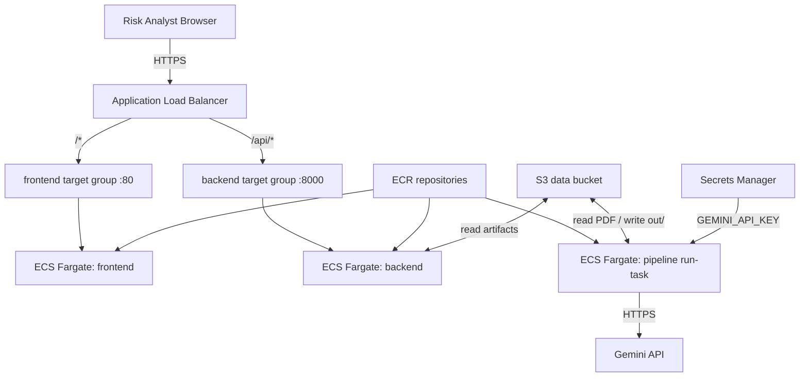

<!-- MIRROR: auto-synced from notes/projects/covenant/platform-engineering/blueprints/PE_RM_Phase2.md - do not edit directly. Edit the canonical file in the notes repo and run scripts/sync_project_docs.py -->

---
id: projects-covenant-platform-engineering-blueprints-PE_RM_Phase2
type: blueprint
status: draft
dependencies:
  - math/platform-engineering/Math_Containerization.md
  - projects/covenant/platform-engineering/blueprints/PE_RM_Phase1.md
tags: []
invariants:
  - id: topology-completeness
    statement: "Every runtime dependency in the topology diagram maps to a named AWS resource"
---
# Technical Blueprint: Phase 2 - Target Cloud Topology (AWS)

## I. Objective

**CS / English:** Define the AWS cloud architecture that hosts the Phase 1 Docker images ($Y^D_{Backend}$ and $Y^D_{Frontend}$) in a production-grade, enterprise-banking-appropriate environment. Phase 2 identifies the concrete AWS services — registry, compute, networking, secrets, and persistence — that replace local Docker Compose while preserving the same application contracts (`COVENANT_*` env vars, `/api/*` routing, on-demand pipeline execution).

**Mathematical Formalization:** Phase 1 internalized application morphisms into exponential objects $Y^D \in \text{Ob}(\mathcal{C}_{local})$. Phase 2 selects the target objects in the **Cloud Category** $\mathcal{D}_{AWS}$ that will store and evaluate those objects:

- **Registry object** $R \in \mathcal{D}_{AWS}$ — stores immutable image artifacts (ECR repositories holding $Y^D_{Backend}$ and $Y^D_{Frontend}$).
- **Compute object** $C \in \mathcal{D}_{AWS}$ — runs the evaluation morphism $eval : Y^D \times D \to Y$ (ECS Fargate tasks).
- **Network object** $N \in \mathcal{D}_{AWS}$ — routes external traffic to compute (VPC, ALB, security groups).

The mapping from local Compose services to cloud objects must preserve the Phase 1 service topology: `frontend` → `backend` API proxy, and on-demand `pipeline` execution separate from the read-only viewer API.

> **Prerequisite note:** Phase 1 [`docker-compose.yml`](https://github.com/endisciple13/covenant_pipeline/blob/main/docker-compose.yml) already defines the `pipeline` profile (`docker compose run --rm pipeline`). Phase 2 maps that same topology to ECS `run-task` — it is not a new service topology, only a cloud runtime for the existing on-demand extraction path.

**Prerequisite:** Phase 1 complete. See [Docker_Documentation.md](https://github.com/endisciple13/covenant_pipeline/blob/main/Docker_Documentation.md) for the implemented local containerization.

## II. Target Architecture & File Tree

Phase 2 is a **design specification** — no AWS resources are provisioned yet. The following documents the target topology and the operational artifacts that Phase 3 (Terraform) will declare.

```
AWS Account (target)
├── ECR
│   ├── covenant-pipeline-backend     # $Y^D_{Backend}$ repository
│   └── covenant-pipeline-frontend    # $Y^D_{Frontend}$ repository
├── ECS (Fargate)
│   ├── Cluster: covenant-pipeline
│   ├── Service: backend              # Long-running FastAPI (desired count ≥ 1)
│   ├── Service: frontend             # Long-running Nginx (desired count ≥ 1)
│   └── Task Definition: pipeline     # On-demand run-task (no persistent service)
├── VPC
│   ├── Public subnets                # ALB
│   ├── Private subnets               # ECS tasks
│   ├── Internet Gateway
│   ├── NAT Gateway                   # Outbound from private subnets (Gemini API)
│   └── Application Load Balancer
│       ├── Listener :443 (HTTPS)
│       ├── Rule: /api/*  → backend target group (:8000)
│       └── Rule: /*      → frontend target group (:80)
├── IAM
│   ├── ecsTaskExecutionRole          # Pull images, read Secrets Manager
│   ├── ecsTaskRole (backend)         # S3 read/write for artifacts
│   └── ecsTaskRole (pipeline)        # S3 read/write + Secrets Manager (GEMINI_API_KEY)
├── Secrets Manager
│   └── covenant-pipeline/gemini-api-key
└── S3
    └── covenant-pipeline-data-{env}  # PDFs + pipeline artifacts (replaces ./data volume)
        ├── agreements/
        │   └── Credit_Agreement_Hallador.pdf
        └── out/
            └── final_compiled_payload_audited.json
```

**Phase 3 will materialize this tree** under `infra/terraform/` (see [PE_RM_Phase3.md](PE_RM_Phase3.md)).

## III. Component Specifications

### Step A: The Container Registry (Amazon ECR)

**Purpose:** Store built Docker images as versioned, immutable artifacts. ECR is the cloud repository for exponential objects $Y^D$.

- **Repositories:** Create two private ECR repositories:
    - `covenant-pipeline-backend` — image built from [viewer/backend/Dockerfile](https://github.com/endisciple13/covenant_pipeline/blob/main/viewer/backend/Dockerfile)
    - `covenant-pipeline-frontend` — image built from [viewer/frontend/Dockerfile](https://github.com/endisciple13/covenant_pipeline/blob/main/viewer/frontend/Dockerfile)

- **Image tagging strategy:**
    - `latest` — most recent successful CI build (Phase 4)
    - `{git-sha}` — immutable tag per commit (global element $j_P$ selecting a specific release)
    - `v{semver}` — optional release tags for production promotion

- **Lifecycle policy:** Retain last N tagged images; expire untagged images after 7 days to control storage cost.

- **Scan on push:** Enable ECR image scanning for vulnerability detection (enterprise banking baseline).

**Reasoning:** Separating backend and frontend repositories mirrors Phase 1's two exponential objects. Independent versioning allows backend-only or frontend-only deploys without rebuilding both images. Immutable SHA tags enable rollback by re-pointing ECS task definitions.

### Step B: The Compute Engine (ECS Fargate)

**Purpose:** Execute container workloads without managing EC2 instances. Fargate is the cloud runtime for $eval_{D,Y}$.

#### Service 1: `backend` (Long-Running API)

- **Launch type:** Fargate
- **Task definition:** Points to `covenant-pipeline-backend:{tag}` from ECR
- **Command:** `uvicorn main:app --app-dir viewer/backend --host 0.0.0.0 --port 8000` (same as Phase 1 Dockerfile CMD)
- **CPU / Memory:** Start with 0.5 vCPU / 1 GB (tune after profiling PDF serving)
- **Desired count:** 1 (minimum for PoC; scale to 2+ for HA in production)
- **Networking:** Private subnet only; no public IP; reachable via ALB target group
- **Environment variables** (same contract as [docker-compose.yml](https://github.com/endisciple13/covenant_pipeline/blob/main/docker-compose.yml)):
    - `COVENANT_PDF_PATH` → S3 path or local mount synced from S3
    - `COVENANT_OUTPUT_DIR` → `/app/data/out`
    - `COVENANT_AUDITED_JSON` → `/app/data/out/final_compiled_payload_audited.json`
    - `COVENANT_DISPATCH_QUEUE_JSON` → `/app/data/out/dispatch_queue_output.json`

#### Service 2: `frontend` (Long-Running UI)

- **Launch type:** Fargate
- **Task definition:** Points to `covenant-pipeline-frontend:{tag}` from ECR
- **CPU / Memory:** 0.25 vCPU / 512 MB (static Nginx serving)
- **Desired count:** 1
- **Networking:** Private subnet; ALB routes `/*` (except `/api/*`) to port 80
- **Nginx config:** Same [viewer/frontend/nginx.conf](https://github.com/endisciple13/covenant_pipeline/blob/main/viewer/frontend/nginx.conf) — but `proxy_pass` must target the ALB internal backend target group or ECS service discovery DNS for `backend`, not Docker Compose hostname `backend`

#### Task 3: `pipeline` (On-Demand Extraction)

- **Launch type:** Fargate **run-task** (not a persistent ECS service)
- **Task definition:** Same backend image; `entrypoint: covenant-pipeline`
- **Default command:** `run --pdf /app/data/agreements/Credit_Agreement_Hallador.pdf --output-dir /app/data/out`
- **Trigger:** Manual (`aws ecs run-task`), EventBridge schedule, or S3 upload event (future)
- **Secrets:** `GEMINI_API_KEY` from Secrets Manager (replaces `.env.docker`)
- **CPU / Memory:** 1 vCPU / 2 GB (PDF chunking + LLM calls are memory-intensive)

**Mapping from Phase 1 Compose:**

| Compose (Phase 1) | AWS (Phase 2) |
|-------------------|---------------|
| `backend` service (always on) | ECS service `backend` |
| `frontend` service (always on) | ECS service `frontend` |
| `pipeline` profile (`docker compose run`) | ECS `run-task` on demand |
| `./data:/app/data` volume | S3 bucket + init/sync sidecar or Fargate ephemeral storage with S3 sync |

**Reasoning:** Fargate eliminates host management while matching the Phase 1 separation of read-only API (service) vs extraction engine (on-demand task). The backend image dual-role from Phase 1 is preserved.

### Step C: Networking, IAM & Persistence

**Purpose:** Securely route public HTTP traffic to containers, grant least-privilege access, and persist artifacts outside ephemeral Fargate storage.

#### Networking (VPC + ALB)

- **VPC:** Dedicated VPC with CIDR `10.0.0.0/16` (adjust per enterprise IP plan)
- **Public subnets (2 AZs):** ALB only
- **Private subnets (2 AZs):** ECS tasks
- **ALB listener rules:**
    - `HTTPS :443` → ACM certificate (TLS termination at load balancer)

    > **Prerequisite (added 2026-07-04):** a public ACM certificate requires an *owned domain* plus DNS validation — ACM will not issue a cert for the raw ALB DNS name. Without a domain, fall back to an `HTTP :80` listener for the PoC (and adjust the Phase 4 smoke-test scheme accordingly). `domain_name` in Phase 3 is optional only if this HTTP fallback is accepted.
    - Path `/api/*` → backend target group (port 8000)
    - Path `/*` → frontend target group (port 80)
- **Security groups:**
    - ALB SG: inbound 443 from `0.0.0.0/0` (or corporate IP range)
    - Backend SG: inbound 8000 from ALB SG only
    - Frontend SG: inbound 80 from ALB SG only
    - Egress: backend/pipeline tasks need outbound HTTPS to `generativelanguage.googleapis.com` (Gemini API) via NAT Gateway

    > **Personal-account deviation (added 2026-07-04):** a NAT Gateway costs ~$35/month plus data transfer — correct for the enterprise target, hostile to a personal PoC. For home implementation reps, run tasks in public subnets with public IPs (no NAT) and record the deviation; restore the private-subnet + NAT topology for the enterprise variant.

**Reasoning:** Private subnets for compute follow banking security baseline. ALB path-based routing replaces Nginx's internal `proxy_pass http://backend:8000` — in cloud, the ALB performs this split instead of frontend Nginx proxying to backend (alternative: keep Nginx proxy and route all traffic to frontend only; ALB split is cleaner for independent scaling).

#### IAM Roles

- **`ecsTaskExecutionRole`:** ECR pull, CloudWatch Logs write, Secrets Manager read
- **`ecsBackendTaskRole`:** S3 `GetObject`/`ListBucket` on `covenant-pipeline-data-{env}/out/` and `agreements/`
- **`ecsPipelineTaskRole`:** S3 read/write on entire data bucket; Secrets Manager read for `GEMINI_API_KEY`

**Reasoning:** Least privilege — viewer backend only reads artifacts; pipeline task writes them. No task receives blanket `s3:*`.

#### Secrets (AWS Secrets Manager)

- **Secret:** `covenant-pipeline/gemini-api-key`
- **Injection:** ECS task definition `secrets` block maps to `GEMINI_API_KEY` env var
- **Rotation:** Manual for PoC; enable automatic rotation in production if supported

**Reasoning:** Replaces `.env.docker` from Phase 1. Secrets never appear in task definition plaintext or Terraform state.

#### Persistence (S3 — replaces `./data` volume)

**Critical deviation from Phase 1:** Fargate tasks use ephemeral storage. The local `./data:/app/data` bind mount has no direct cloud equivalent.

- **S3 bucket:** `covenant-pipeline-data-{env}` (versioning enabled)
- **Layout mirrors local `data/`:**
    - `s3://.../agreements/{filename}.pdf` — source PDFs
    - `s3://.../out/` — all pipeline artifacts (see PipelinePaths constants in [PROJECT_DOCUMENTATION.md](https://github.com/endisciple13/covenant_pipeline/blob/main/PROJECT_DOCUMENTATION.md))
- **Sync strategy (choose one at implementation):**
    - **Option A (recommended for PoC):** Pipeline `run-task` downloads PDF from S3 to `/app/data/`, runs extraction, uploads `out/` back to S3 on completion. Backend task syncs `out/` from S3 at startup or on interval.

    > **Scoped application work (added 2026-07-04):** Option A is not infra-only — it requires application-layer changes scoped nowhere else: S3 download/upload (boto3) in the pipeline entrypoint, and an `out/` sync step in backend startup. Budget this as an explicit work item alongside Phase 2 implementation; otherwise the infrastructure deploys green and the app finds no files.
    - **Option B (corrected 2026-07-04):** ~~Mountpoint for Amazon S3 (Fargate-compatible POSIX mount)~~ — **not Fargate-compatible.** Mountpoint requires FUSE and privileged containers, which Fargate does not support ([containers-roadmap #412](https://github.com/aws/containers-roadmap/issues/412), [mountpoint-s3 #450](https://github.com/awslabs/mountpoint-s3/issues/450)). Fargate-native alternatives if a POSIX mount is truly needed: **EFS volume** (supported on Fargate), or evaluate the newer NFS-based Amazon S3 Files offering. Option A remains the recommendation.

**Reasoning:** Artifact persistence must survive task termination. S3 is the cloud-native equivalent of the host volume, with versioning for audit trail in a banking context.

## IV. Service Topology Diagram



## V. Out of Scope (Phase 2 Blueprint)

- Terraform resource definitions (Phase 3)
- CI/CD automation (Phase 4)
- Multi-region deployment, WAF, CloudFront CDN
- Azure equivalents (ACR, Container Apps) — AWS chosen for this blueprint series

## VI. Design Audit Notes (2026-07-04)

External design review prior to implementation; corrections applied in place, marked "added/corrected 2026-07-04":

1. **Mountpoint-on-Fargate claim removed** (§III Step C, Persistence Option B) — verified false against AWS documentation; Fargate does not support FUSE/privileged containers.
2. **Option A application work scoped** — S3 sync is an application-layer change, not infrastructure; previously unbudgeted.
3. **ACM/domain prerequisite made explicit** — the HTTPS listener is not implementable without an owned domain.
4. **NAT Gateway personal-account deviation documented** — cost trap for home implementation.
