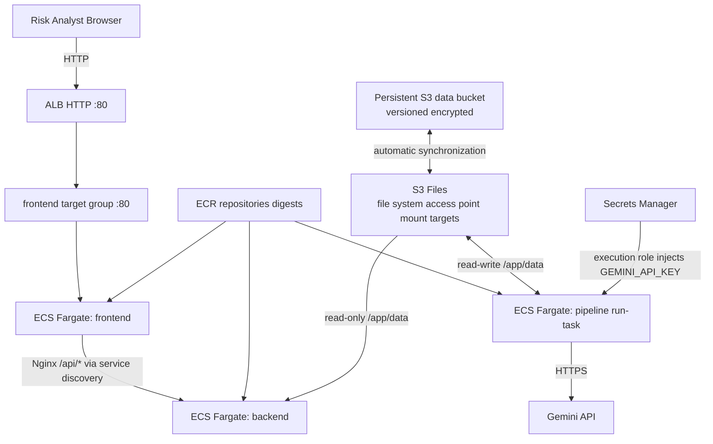

<!-- MIRROR: auto-synced from notes/projects/covenant/platform-engineering/blueprints/PE_RM_Phase2.md - do not edit directly. Edit the canonical file in the notes repo and run scripts/sync_project_docs.py -->

---
id: projects-covenant-platform-engineering-blueprints-PE_RM_Phase2
type: blueprint
status: draft
dependencies:
  - math/platform-engineering/Math_Containerization.md
  - projects/covenant/application/Pipeline_Invariants.md
  - projects/covenant/platform-engineering/PE_Infrastructure_Invariants.md
  - projects/covenant/platform-engineering/blueprints/PE_RM_Phase1.md
tags: []
invariants:
  - id: topology-completeness
    statement: "Every runtime dependency in the topology diagram maps to a named AWS resource"
inherited_invariants:
  - id: host-isolation
    from: math/platform-engineering/Math_Containerization.md
    status: planned
    enforced_by: "tests/platform/test_host_isolation.py::test_runtime_deps_disjoint_from_host"
  - id: eval-morphism
    from: math/platform-engineering/Math_Containerization.md
    status: waived
    note: "Phase 2 defines cloud topology; eval-morphism transfer tests belong to the containerization implementation phase."
  - id: image-determinism
    from: projects/covenant/platform-engineering/blueprints/PE_RM_Phase1.md
    status: planned
    enforced_by: "tests/platform/test_image_determinism.py::test_base_image_digest_pinned"
  - id: host-isolation
    from: projects/covenant/platform-engineering/blueprints/PE_RM_Phase1.md
    status: planned
    enforced_by: "tests/platform/test_host_isolation.py::test_compose_services_need_no_host_runtime"
  - id: provenance-grounding
    from: projects/covenant/application/Pipeline_Invariants.md
    status: waived
    note: "Extraction pipeline invariants are out of scope for the AWS topology blueprint."
  - id: chunker-partition
    from: projects/covenant/application/Pipeline_Invariants.md
    status: waived
    note: "Extraction pipeline invariants are out of scope for the AWS topology blueprint."
  - id: chunker-coverage-audit
    from: projects/covenant/application/Pipeline_Invariants.md
    status: waived
    note: "Extraction pipeline invariants are out of scope for the AWS topology blueprint."
  - id: router-rule-dispatch
    from: projects/covenant/application/Pipeline_Invariants.md
    status: waived
    note: "Extraction pipeline invariants are out of scope for the AWS topology blueprint."
  - id: glossary-acyclic
    from: projects/covenant/application/Pipeline_Invariants.md
    status: waived
    note: "Extraction pipeline invariants are out of scope for the AWS topology blueprint."
  - id: metamorphic-stability
    from: projects/covenant/application/Pipeline_Invariants.md
    status: waived
    note: "Extraction pipeline invariants are out of scope for the AWS topology blueprint."
  - id: container-parity
    from: projects/covenant/platform-engineering/PE_Infrastructure_Invariants.md
    status: planned
    enforced_by: "tests/invariants/test_container_parity.py::test_container_parity_host_vs_docker"
  - id: config-totality
    from: projects/covenant/platform-engineering/PE_Infrastructure_Invariants.md
    status: planned
    enforced_by: "tests/invariants/test_config_totality.py::test_missing_env_fails_fast"
---
# Technical Blueprint: Phase 2 - Target Cloud Topology (AWS)

## I. Objective

**Parent authority (A1–A4):** Learning is the objective function (A1). Andy specifies and verifies Layers 0/1/4; agents implement Layers 2/3 (A2). The operating loop `apply → smoke test → observe → destroy → recreate` is where understanding forms (A3). The competency surface is the four-pillar ladder — containerization, infrastructure-as-code, CI/CD, runtime orchestration (A4). See [PE_Roadmap_M1.md](../PE_Roadmap_M1.md).

**Goal.** Build and operate the cloud path for the Covenant Pipeline **in order to learn the workings of platform engineering**. AWS is the sole target cloud for this milestone (ECS Fargate + ECR + VPC); other clouds may appear only as labeled contrast.

**Phase 1 freeze.** Phase 1 is **implemented and frozen as-built**. This blueprint maps the working Compose topology to AWS; it does not propose rewrites to Dockerfiles, compose, or application code.

**Three-service shape.** Backend ECS service + frontend ECS service + on-demand pipeline `run-task` (same topology as Compose `backend` / `frontend` / `pipeline` profile).

**Andy role:** Supplies topology axioms (what must be reachable, what must stay private, what may be PoC-deviated); ratifies the public-subnet/no-NAT threat boundary and native S3 Files persistence (Human Decision 1, 2026-07-16); validates idle-cost inventory, storage synchronization/ownership, security-group ingress graph, and killed-task replacement observation on ECS — without claiming the E1 orchestration gap is closed.

**Operating-loop exit (A3):** Andy can name, for each Compose service, its AWS host object and which identity acts; explain the idle-cost inventory; verify the threat-boundary checks after apply; and destroy/recreate the topology unassisted. Observing Fargate replace a failed task is in scope; operating a full reconciliation control plane is not (see E1).

**E1 boundary:** Math step 4 (`k8s-control-loop`, tight) has no full milestone home in M1; Fargate hides the reconciliation loop. **E1(c) ratified:** record the gap now. In-scope observation duties in Phase 2 do **not** close this gap (E4).

**Prerequisite:** Phase 1 complete. See [Docker_Documentation.md](https://github.com/endisciple13/covenant_pipeline/blob/main/Docker_Documentation.md) for the implemented local containerization.

### Invariant candidates (body obligations; not frontmatter)

Candidates graduate to frontmatter `invariants:` only via `/invariant-propose` + human ratification. Neither agents nor Composer write frontmatter `invariants:` entries.

| Candidate | Phase 2 body obligation | Enforceability split |
|-----------|-------------------------|----------------------|
| **9** | Port listening + ALB target-group health | **Port listening:** container listens on declared port; SG admits ALB→task only. **ALB / TG health:** HTTP(S) GET to `HealthCheckPath` (default `/`) returns status matching matcher — **status-code contract only** ([ALB target-group health checks](https://docs.aws.amazon.com/elasticloadbalancing/latest/application/target-group-health-checks.html)). **Schema / response-shape validity:** lives only in prediction `P2-SMOKE-01`, not in ALB health. |
| **10** (Phase 2 half) | Digest-oriented deployment identity | Task definitions reference images by digest (`repo@sha256:…`). Tag immutability may be enabled as complement, never as substitute ([ECR image tag mutability](https://docs.aws.amazon.com/AmazonECR/latest/userguide/image-tag-mutability.html)). Deps-locked half remains Phase 4. |

Do **not** add candidates 9 or 10 to frontmatter `invariants:`.

## II. Target Architecture & Topology Tree

Phase 2 is a **design specification** — no AWS resources are provisioned yet. Phase 3 (Terraform) will declare this topology.

### Operative personal-PoC branch (binding)

```
AWS Account (personal PoC)
├── ECR
│   ├── covenant-pipeline-backend     # images addressed by digest
│   └── covenant-pipeline-frontend
├── ECS (Fargate)
│   ├── Cluster: covenant-pipeline
│   ├── Service: backend              # Long-running FastAPI (desired count ≥ 1)
│   ├── Service: frontend             # Long-running Nginx (desired count ≥ 1)
│   └── Task Definition: pipeline     # On-demand run-task (no persistent service)
├── VPC
│   ├── Public subnets (2 AZs)        # ALB AND ECS tasks (public IPs)
│   ├── Internet Gateway
│   └── Application Load Balancer
│       ├── Listener :80 (HTTP)       # operative PoC; TLS/ACM = enterprise contrast
│       └── Target: frontend TG (:80) only  # sole public ingress
├── IAM
│   ├── ecsTaskExecutionRole          # pull ECR, write logs, retrieve secrets for injection
│   ├── ecsBackendTaskRole            # S3 Files mount/read access
│   ├── ecsPipelineTaskRole           # S3 Files mount/read/write access
│   └── s3FilesSyncRole               # S3 Files service synchronizes with data bucket
├── Secrets Manager
│   └── covenant-pipeline/gemini-api-key
└── Persistence (S3 Files — Human Decision 1 ratified 2026-07-16)
    ├── Persistent versioned/encrypted S3 data bucket      # external to main-stack destroy
    ├── S3 Files file system + access point                # session-scoped main stack
    ├── Mount target in each operative AZ                  # one local path per task AZ
    └── Mount-target security group                        # TCP 2049 from backend/pipeline only
```

**No NAT Gateway / NAT EIP** in the operative PoC branch.

### Enterprise contrast (labeled, non-operative)

Private subnets for ECS tasks + NAT Gateway (or VPC endpoints) for egress + TLS/ACM at the ALB edge. Remains the design of record for anything beyond personal practice.

### Threat boundary: public-subnet / no-NAT (personal PoC)

**The deviation.** The enterprise-correct topology is private subnets with NAT (or VPC endpoints) for egress and TLS at the edge. This PoC deliberately runs tasks in public subnets with public IPs and no NAT Gateway (~$35/month avoided), and serves HTTP-only when no owned domain exists for ACM. The deviation buys cost, not correctness — this section records exactly what it exposes and the conditions under which it stays acceptable.

**Accepted threat classes.** (1) *Direct inbound exposure:* task ENIs carry public IPs, so the security group is the only barrier between the internet and the containers — there is no private-subnet defense in depth. (2) *Plaintext transport:* HTTP-only means anything transiting the ALB is readable in flight. (3) *Uncontrolled egress origin:* without NAT, tasks originate traffic from their own ephemeral public IPs — no single egress point to monitor or allowlist.

**Compensating controls (each one checkable).** Task security groups admit ingress from the ALB security group only — never 0.0.0.0/0 on task ports; the ALB listener is the sole public entry; no SSH/exec ingress exists anywhere; the Gemini API key travels via Secrets Manager (task-definition `secrets` injection via the **execution role**; application use of AWS APIs via the **task role**), never in the image, the repo, or HTTP traffic (its egress to the API is HTTPS regardless of the inbound scheme); and every session ends in `terraform destroy`, so the exposure window is hours, not standing.

**Boundary invariant — the deviation is valid only while all three hold:** (i) the data processed is the public-materials fixture — the moment any private or client document enters, this topology is disqualified; (ii) sessions are teardown-bounded per the cost rules; (iii) the only ingress path is the ALB listener. Violating any condition routes back to the enterprise variant (private subnets + NAT + TLS).

**After `apply`, verify (A3):** public IP count matches expectation (task ENIs + ALB, nothing else); direct requests to task ports from the internet time out; the security-group graph shows task ingress referencing only the ALB security group.

**Phase 3 will materialize this tree** under `infra/terraform/` (see [PE_RM_Phase3.md](PE_RM_Phase3.md)).

## III. Component Specifications

### Step A: The Container Registry (Amazon ECR)

**Purpose:** Store built Docker images as digest-addressed artifacts.

- **Repositories:** Create two private ECR repositories:
    - `covenant-pipeline-backend` — image built from [viewer/backend/Dockerfile](https://github.com/endisciple13/covenant_pipeline/blob/main/viewer/backend/Dockerfile)
    - `covenant-pipeline-frontend` — image built from [viewer/frontend/Dockerfile](https://github.com/endisciple13/covenant_pipeline/blob/main/viewer/frontend/Dockerfile)

- **Deployment identity (binding):** ECS task definitions pin images by digest:
  `image = "<repo-url>@sha256:<digest>"`.
  Tags (`latest`, `{git-sha}`, `v{semver}`) may exist for human/CI convenience; they are **not** the running deployment contract. Tag immutability may be enabled as a complement to digests, never as a substitute ([ECR image tag mutability](https://docs.aws.amazon.com/AmazonECR/latest/userguide/image-tag-mutability.html)).

- **Lifecycle policy:** Retain last N tagged images; expire untagged images after 7 days (cost control intent).

- **Scan on push:** Enable ECR image scanning for vulnerability detection (intent at existing blueprint strength — not a price claim).

**Reasoning:** Digest identity makes the deployed artifact content-addressed. Independent repositories allow backend-only or frontend-only deploys without rebuilding both images.

### Step B: The Compute Engine (ECS Fargate)

**Purpose:** Execute container workloads without managing EC2 instances.

#### Service 1: `backend` (Long-Running API)

- **Launch type:** Fargate
- **Task definition:** Points to `covenant-pipeline-backend@sha256:<digest>` from ECR
- **Command:** `uvicorn main:app --app-dir viewer/backend --host 0.0.0.0 --port 8000` (same as Phase 1 Dockerfile CMD)
- **Port:** 8000
- **CPU / Memory:** 0.5 vCPU / 1 GB (Fargate floor size; [Fargate pricing](https://aws.amazon.com/fargate/pricing/))
- **Desired count:** 1 (minimum for PoC)
- **Networking:** Public subnet with public IP (operative PoC); reachable from frontend via ECS service-discovery DNS — **not** via ALB path-split
- **Environment variables** (exact Phase 1 contract — do not rewrite paths):
    - `COVENANT_PDF_PATH` → `/app/data/Credit_Agreement_Hallador.pdf`
    - `COVENANT_OUTPUT_DIR` → `/app/data/out`
    - `COVENANT_AUDITED_JSON` → `/app/data/out/final_compiled_payload_audited.json`
    - `COVENANT_DISPATCH_QUEUE_JSON` → `/app/data/out/dispatch_queue_output.json`

#### Service 2: `frontend` (Long-Running UI)

- **Launch type:** Fargate
- **Task definition:** Points to `covenant-pipeline-frontend@sha256:<digest>` from ECR
- **Port:** 80 (container)
- **CPU / Memory:** 0.25 vCPU / 0.5 GB
- **Desired count:** 1
- **Networking:** Public subnet with public IP; ALB targets **frontend only**
- **Nginx config:** Same [viewer/frontend/nginx.conf](https://github.com/endisciple13/covenant_pipeline/blob/main/viewer/frontend/nginx.conf) — `proxy_pass` targets ECS service-discovery DNS for `backend` (replace Compose hostname `backend` with the cloud-equivalent service DNS). Do **not** encode ALB `/api/*` path-split as inherited behavior.

#### Task 3: `pipeline` (On-Demand Extraction)

- **Launch type:** Fargate **run-task** (not a persistent ECS service)
- **Task definition:** Same backend image; `entrypoint: covenant-pipeline`
- **Default command:** `run --pdf /app/data/Credit_Agreement_Hallador.pdf --output-dir /app/data/out`
- **Trigger:** Manual (`aws ecs run-task`), EventBridge schedule, or S3 upload event (future)
- **Secrets:** `GEMINI_API_KEY` injected via task-definition `secrets` (execution role retrieves; never plaintext in image/repo)
- **CPU / Memory:** 1 vCPU / 2 GB (PDF chunking + LLM calls are memory-intensive)

**Viewer-readiness precondition:** Smoke tests run only after a **full** pipeline run produces `final_compiled_payload_audited.json` at the ratified storage location. A `--skip-llm` run does not generate this file; the viewer returns 404/500 until a full run completes.

**Mapping from Phase 1 Compose:**

| Compose (Phase 1) | AWS (Phase 2) |
|-------------------|---------------|
| `backend` service (always on) | ECS service `backend` |
| `frontend` service (always on) | ECS service `frontend` |
| `pipeline` profile (`docker compose run`) | ECS `run-task` on demand |
| `./data:/app/data` volume | Shared native S3 Files access point mounted at `/app/data` on backend (read-only) and pipeline (read-write) — Human Decision 1 ratified 2026-07-16 |

**Reasoning:** Fargate eliminates host management while matching the Phase 1 separation of read-only API (service) vs extraction engine (on-demand task). The backend image dual-role from Phase 1 is preserved.

### Step C: Networking, IAM, Secrets & Persistence

#### Networking (VPC + ALB)

- **VPC:** Dedicated VPC with CIDR `10.0.0.0/16` (adjust per account)
- **Public subnets (2 AZs):** ALB **and** ECS tasks (public IPs); **no NAT Gateway / NAT EIP**
- **ALB listener (operative):** `HTTP :80` only (Human 2 ratified). TLS/ACM = enterprise contrast — requires an owned domain + DNS validation; do not treat `:443` as operative without that prerequisite.
- **ALB routing (operative):** Sole public ingress = ALB → frontend target group `:80`. Frontend Nginx owns `/api/*` → backend via service discovery (Human 3 ratified). Do **not** encode ALB path-split `/api/*` → backend TG as inherited.
- **Frontend target-group health:** path `/`, status-code matcher (default ALB behavior). Schema/response-shape checks live only in `P2-SMOKE-01`.
- **Security groups:**
    - ALB SG: inbound 80 from `0.0.0.0/0` (or corporate IP range)
    - Frontend SG: inbound 80 from ALB SG only
    - Backend SG: inbound 8000 from frontend SG / service-discovery path only — **not** from `0.0.0.0/0`
    - S3 Files mount-target SG: inbound TCP 2049 from backend/pipeline task SGs only; no public ingress
    - No SSH/exec ingress anywhere
    - Egress: tasks need outbound HTTPS to `generativelanguage.googleapis.com` (Gemini API) via their public IPs (PoC; no NAT)

**Post-apply threat-boundary observations:** public IP inventory; direct requests to task ports time out; SG graph shows task ingress only from ALB (frontend) / allowed peers (backend).

#### IAM Roles (execution vs task — do not collapse)

1. **Task execution role** — pulls ECR images, writes logs, retrieves Secrets Manager/SSM values referenced in the task definition for injection ([task execution IAM role](https://docs.aws.amazon.com/AmazonECS/latest/developerguide/task_execution_IAM_role.html)).
2. **Task role** — assumed by application code for AWS APIs. The backend receives least-privilege S3 Files mount/read permissions; the pipeline receives mount/read/write permissions. Exact current S3 Files actions are Review-verified before implementation ([task IAM roles](https://docs.aws.amazon.com/AmazonECS/latest/userguide/task-iam-roles.html)).
3. **S3 Files synchronization role** — assumed by the S3 Files service to synchronize the versioned/encrypted data bucket with the file system; scoped to that bucket/prefix and required EventBridge synchronization actions.

- **`ecsTaskExecutionRole`:** ECR pull, CloudWatch Logs write, Secrets Manager retrieve for injection
- **`ecsBackendTaskRole`:** scoped S3 Files mount/read permissions
- **`ecsPipelineTaskRole`:** scoped S3 Files mount/read/write permissions; no Secrets Manager *application* read required when injection uses the execution role
- **`s3FilesSyncRole`:** S3 Files service trust; scoped synchronization access to the owned data bucket/prefix and required EventBridge actions

**Reasoning:** Least privilege — execution role retrieves secrets for injection; task role is what the application assumes. No task receives blanket `s3:*`.

#### Secrets (AWS Secrets Manager)

- **Secret:** `covenant-pipeline/gemini-api-key`
- **Injection:** ECS task definition `secrets` block maps to `GEMINI_API_KEY` env var; retrieval uses the **execution role**
- **Rotation:** Manual for PoC; enable automatic rotation in production if supported

**Reasoning:** Replaces `.env.docker` from Phase 1. Secrets never appear in task definition plaintext, the image, the repo, or HTTP traffic.

#### Persistence — native S3 Files (Human Decision 1 ratified 2026-07-16)

**Critical constraint:** Fargate tasks use ephemeral storage. Human Decision 1 selects native **S3 Files** to preserve the frozen `/app/data` contract without application-adapter work. AWS documents S3 Files volumes as supported on Fargate ([S3 Files on ECS](https://docs.aws.amazon.com/AmazonECS/latest/developerguide/s3files-volumes.html); [mounting on ECS](https://docs.aws.amazon.com/AmazonS3/latest/userguide/s3-files-mounting-ecs.html)).

- **Data authority:** a dedicated general-purpose S3 bucket with versioning and SSE-S3/SSE-KMS is the durable source of truth. It is an explicitly owned persistent prerequisite outside the session-scoped main stack.
- **File-system surface:** one S3 Files file system linked to the bucket/prefix, one access point with POSIX identity verified against the actual containers, and one mount target per operative Availability Zone. Backend and pipeline mount the same access point at `/app/data`; frontend does not mount it. File-system data/metadata use S3 Files at-rest KMS encryption (default AWS-owned key unless Review justifies a customer-managed key); bucket-object encryption remains a separate bucket setting. ECS enforces transit encryption for S3 Files volumes and does not permit disabling it.
- **Writer discipline:** pipeline is the primary writer; backend is read-only for the selected public-fixture PoC. Concurrent bucket-side and file-system-side writes to the same path are prohibited because S3 wins synchronization conflicts.
- **Network/IAM:** transit encryption is mandatory; task roles and the mount-target security group are least-privilege as specified above.
- **Cost:** meter S3 Files high-performance storage/data access plus underlying S3 storage/requests ([S3 pricing](https://aws.amazon.com/s3/pricing/); [S3 Files metering](https://docs.aws.amazon.com/AmazonS3/latest/userguide/s3-files-metering.html)). Estimate before apply and stop if a normal practice session cannot fit the `$5/month` threshold.
- **Teardown:** before main-stack destroy, `PendingExports = 0` and `ExportFailures = 0` (or equivalent current synchronization-health evidence). Destroy session-scoped file-system/access-point/mount-target resources; retain and inventory the data bucket separately.

Exact `COVENANT_*` path strings remain unchanged. The application-level S3 object adapter is portability contrast only and is not implemented in this PoC.

**Historical (not current authority):** 2026-07-04 Mountpoint-for-S3 / Fargate incompatibility remains true as history. Mountpoint requires FUSE and privileged containers, which Fargate does not support. AWS subsequently introduced native S3 Files support for Fargate; Human Decision 1 selected that newer service on 2026-07-16.

## IV. Cost, Teardown & Service Topology Diagram

### Cost and teardown

Reference the parent's sourced unit-price table in [PE_Roadmap_M1.md](../PE_Roadmap_M1.md) (§Cost and teardown / Sourced unit prices) — do not duplicate a second price table here.

**Binding rules (from parent):**

1. Standing cost while not practicing ≈ **$0**: every practice session ends in `terraform destroy` of the main stack.
2. The Terraform **state backend** (S3 bucket; lockfile locking) exists **before** the main stack and is **not** destroyable by it.
3. Observable post-session check: no *unintended session-scoped* cost-bearing resources remain; every *deliberate persistent exception* is enumerated, owned, and bounded (state bucket, data bucket, optional ECR repos, Secrets Manager secret, CloudWatch log groups). S3 Files synchronization is healthy before its session-scoped resources are destroyed.
4. **$5/month ceiling** (E2): AWS Budget alerting control — **alerts, does not hard-cap charges**. If a typical practice session cannot fit, **stop and route to Andy** — never silently loosen.

### Service topology diagram (operative PoC)



## V. Out of Scope (Phase 2 Blueprint)

- Terraform resource definitions (Phase 3)
- CI/CD automation (Phase 4)
- Multi-region deployment, WAF, CloudFront CDN
- Azure equivalents (ACR, Container Apps) — AWS chosen for this blueprint series
- Application-level S3 object adapter (portability contrast; not selected for this PoC)
- Committed `.tf` or cloud execution

## VI. Phase 2 Prediction Register

Distinct from Phase 3. Do not merge registers.

| ID | Before-the-run condition | Prediction stated in advance | Falsifier / evidence to retain |
|---|---|---|---|
| P2-VAL-01 | Phase 3 Terraform is authored from this topology, including the ratified S3 Files design. | `terraform validate` exits `0`, emits its success result, and emits no error diagnostic. | Non-zero exit or any error diagnostic. Retain stdout/stderr and tool version. |
| P2-PLAN-01 | Fresh account/region scope with the out-of-band state backend available and no main-stack resources present. | The initial plan proposes a non-zero create set and `0` changes / `0` destroys; every Phase 2 topology node has a named planned object; the personal-PoC branch contains no NAT Gateway or NAT EIP. | Any unnamed topology node, any planned destroy, any NAT resource in the PoC branch, or any resource outside the declared topology without an explicit disposition. Retain the saved plan summary and topology-to-address checklist. |
| P2-STOR-01 | Human Decision 1 ratified native S3 Files and the persistent data bucket is available. | The plan contains one S3 Files file system, an access point, a mount target in each operative AZ, least-privilege mount networking/IAM, and `/app/data` mounts for backend/pipeline without application-adapter code or path rewrites. | Missing/extra storage node, only one-AZ reachability, public NFS ingress, adapter code, path rewrite, or unowned data bucket. Retain storage topology-to-address matrix and task-definition volume diff. |
| P2-SMOKE-01 | Full pipeline output exists at the ratified storage location; backend and frontend services report ready through the corrected routing design. | A request through the sole ALB entry to `/` returns the viewer successfully; `/api/document-data` returns HTTP 200 JSON that is a JSON object (schema/shape check — not an ALB health claim); `/api/pdf` returns the public fixture (`application/pdf`). Direct internet requests to task ports fail. | Viewer/API/PDF failure through the ALB, success on a direct task-port request, or a 404/500 caused by absent audited output after the precondition claims to hold. Retain response codes, minimal response-shape check, and direct-access result. |
| P2-LOOP-01 | One backend or frontend task is deliberately stopped during a bounded practice session. | Within **300 seconds** of the stop event, the ECS service `runningCount` returns to the declared `desiredCount`, and the service event/log trail identifies a replacement task. This observes reconciliation but does **not** close E1. | Desired count does not recover within 300s, recovery requires manual task creation, or the blueprint claims the E1 gap is closed. Retain before/after service state and event timestamps. |
| P2-THREAT-01 | Personal-PoC topology is applied using only the public-materials fixture. | Public-IP inventory matches the blueprint expectation; the security-group graph matches the detailed allowed-edge set (ALB SG → frontend:80; frontend/discovery path → backend:8000; backend/pipeline → mount-target:2049; no SSH/exec); ALB is the sole **public** ingress path. | Any extra public IP, task ingress from `0.0.0.0/0`, a missing allowed peer edge, a second public ingress path, or private/client data entering the topology. Retain inventory and SG-edge evidence. |
| P2-DOWN-01 | S3 Files synchronization reports no pending exports/failures and the main stack has been destroyed at session end. | No unintended session-scoped ALB, ECS service/task, task public IP, S3 Files file system/access point/mount target, or other cost-bearing main-stack resource remains; each retained data/state bucket and ECR/Secrets/Logs exception is enumerated, owned, and bounded. | Pending/failed synchronization, residual session resource, unowned persistent exception, or main destroy attempting to retire either persistent bucket. Retain synchronization evidence, destroy result, and post-destroy inventory. |

**P2-LOOP-01 window note:** 300 seconds is a practice observation bound (default ALB health grace `0` + healthy-path class + Fargate start budget). It is **not** an AWS SLA.

## VII. Design Audit Notes

### 2026-07-04 (historical)

External design review prior to implementation; corrections applied in place, marked "added/corrected 2026-07-04":

1. **Mountpoint-on-Fargate claim removed** — verified false against AWS documentation; Fargate does not support FUSE/privileged containers. (Superseded as *selection* authority by R06 / S3 Files reopening — Mountpoint incompatibility remains historically true.)
2. **Option A application work scoped** — S3 sync is an application-layer change, not infrastructure; previously unbudgeted. (Option A as *recommendation* deleted 2026-07-16; comparison reopened.)
3. **ACM/domain prerequisite made explicit** — the HTTPS listener is not implementable without an owned domain.
4. **NAT Gateway personal-account deviation documented** — cost trap for home implementation.

### 2026-07-16 (re-grounding)

Re-grounded in place from parent [PE_Roadmap_M1.md](../PE_Roadmap_M1.md) (R06 storage comparison was open at this Step 2 checkpoint; public-subnet/no-NAT threat boundary; HTTP :80 operative; Nginx `/api/*` ownership; digest-oriented ECR; execution-role vs task-role; candidate 9 ALB-status vs schema-valid split) via implementation plan `inbox/_processed/2026-07-16-pe-blueprints-regrounding-l2-plan.md`.

### 2026-07-16 (Human Decision 1 closure; post-Step-2 L2 re-entry)

Andy ratified native S3 Files for the personal PoC. The application-level adapter remains contrast only. This separately attributed re-entry makes the data bucket an owned persistent prerequisite, makes the S3 Files network/IAM/volume topology operative, and replaces the open-gate prediction with selection-conformance and synchronization-safe teardown checks. The completed Step 2 field-test evidence is not rewritten.
