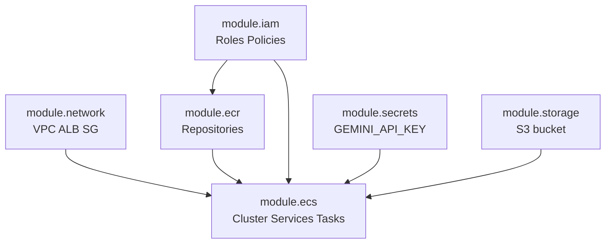

<!-- MIRROR: auto-synced from notes/projects/covenant/platform-engineering/blueprints/PE_RM_Phase3.md - do not edit directly. Edit the canonical file in the notes repo and run scripts/sync_pe_docs.py -->

# Technical Blueprint: Phase 3 - Infrastructure as Code (Terraform)

## I. Objective

**CS / English:** Encode the Phase 2 AWS cloud topology as declarative Terraform configuration. Manual clicking in the AWS console is prohibited — every VPC, ECR repository, ECS service, IAM role, and S3 bucket must be defined as version-controlled code that can be planned, reviewed, and applied idempotently.

**Mathematical Formalization:** Let $\mathcal{C}$ be the **Code Category** whose objects $C_1, C_2$ are discrete infrastructure blueprints (Git commits of Terraform). Let $\mathcal{D}_{AWS}$ be the **Physical Cloud Category** whose objects $I_1, I_2$ are live AWS resource topologies.

Terraform acts as a covariant **Functor** $F : \mathcal{C} \to \mathcal{D}_{AWS}$:

$$F(C_1) = I_{current} \qquad F(C_2) = I_{desired}$$

A code change is a tracking morphism $\Delta_C : C_1 \to C_2$. The functor maps it to a cloud migration:

$$F(\Delta_C) = \Delta_D : I_{current} \to I_{desired}$$

**Idempotence:** If $\Delta_C = \text{id}_{C_1}$ (no code change), then $F(\text{id}_{C_1}) = \text{id}_{I_{current}}$ — `terraform apply` executes zero mutations.

**Prerequisites:** Phase 1 (Docker images) implemented; Phase 2 (cloud topology) designed. See [PE_RM_Phase2.md](PE_RM_Phase2.md).

## II. Target Architecture & File Tree

Cursor must generate the following directory structure within the existing repository:

```
/ (Project Root)
├── infra/
│   └── terraform/
│       ├── main.tf                 # Root module: wires child modules together
│       ├── variables.tf            # Input variables (region, env, image tags)
│       ├── outputs.tf              # Exported values (ALB DNS, ECR URLs)
│       ├── providers.tf            # AWS provider configuration
│       ├── backend.tf              # Remote state: S3 bucket + DynamoDB lock table
│       ├── versions.tf             # Terraform and provider version constraints
│       └── modules/
│           ├── network/            # VPC, subnets, IGW, NAT, ALB, security groups
│           │   ├── main.tf
│           │   ├── variables.tf
│           │   └── outputs.tf
│           ├── ecr/                # ECR repositories + lifecycle policies
│           │   ├── main.tf
│           │   ├── variables.tf
│           │   └── outputs.tf
│           ├── ecs/                # Cluster, services, task definitions
│           │   ├── main.tf
│           │   ├── variables.tf
│           │   └── outputs.tf
│           ├── iam/                # Task execution roles, task roles, policies
│           │   ├── main.tf
│           │   ├── variables.tf
│           │   └── outputs.tf
│           ├── secrets/            # Secrets Manager for GEMINI_API_KEY
│           │   ├── main.tf
│           │   ├── variables.tf
│           │   └── outputs.tf
│           └── storage/            # S3 data bucket + versioning
│               ├── main.tf
│               ├── variables.tf
│               └── outputs.tf
└── infra/
    └── terraform/
        └── environments/
            ├── dev/
            │   └── terraform.tfvars    # Dev-specific variable values
            └── prod/
                └── terraform.tfvars    # Prod-specific variable values
```

## III. Component Specifications

### Step A: Provider Configuration & Remote State

**Purpose:** Initialize the Terraform runtime and persist state outside the developer laptop.

- **Provider:** `hashicorp/aws` — pinned to a specific minor version in `versions.tf`
- **Region:** Configurable via `var.aws_region` (default `us-east-1` for PoC)
- **Remote backend (`backend.tf`):**
    - **State storage:** S3 bucket `covenant-pipeline-tfstate-{account-id}` (versioning enabled, encryption SSE-S3)
    - **State locking:** DynamoDB table `covenant-pipeline-tflock` (prevents concurrent `apply` corruption)
    - **Key:** `env/{environment}/terraform.tfstate` (separate state per environment)

- **Input variables (`variables.tf`):**

| Variable | Type | Purpose |
|----------|------|---------|
| `environment` | string | `dev` or `prod` |
| `aws_region` | string | AWS region |
| `backend_image_tag` | string | ECR tag for backend image |
| `frontend_image_tag` | string | ECR tag for frontend image |
| `domain_name` | string | Optional custom domain for ACM cert |

**Reasoning:** Remote state is mandatory for team collaboration and CI/CD (Phase 4). Per-environment state keys prevent dev `apply` from touching prod resources. Locking prevents race conditions when GitHub Actions runs `terraform apply` on merge.

### Step B: Resource Definitions (Modules)

**Purpose:** Declare every AWS object from [PE_RM_Phase2.md](PE_RM_Phase2.md) as Terraform resources.

#### Module: `network`

- `aws_vpc` — dedicated VPC
- `aws_subnet` — 2 public + 2 private across 2 AZs
- `aws_internet_gateway`, `aws_nat_gateway`, `aws_eip`
- `aws_lb` (Application Load Balancer) — public-facing
- `aws_lb_listener` — HTTPS :443 with ACM certificate
- `aws_lb_listener_rule` — path `/api/*` → backend TG; `/*` → frontend TG
- `aws_lb_target_group` — backend (:8000) and frontend (:80)
- `aws_security_group` — ALB, backend, frontend (least-privilege ingress)

**Outputs:** `vpc_id`, `public_subnet_ids`, `private_subnet_ids`, `alb_dns_name`, `backend_target_group_arn`, `frontend_target_group_arn`

#### Module: `ecr`

- `aws_ecr_repository` — `covenant-pipeline-backend`, `covenant-pipeline-frontend`
- `aws_ecr_lifecycle_policy` — retain last 10 tagged images; expire untagged after 7 days
- `aws_ecr_repository_policy` — allow ECS task execution role to pull

**Outputs:** `backend_repository_url`, `frontend_repository_url`

#### Module: `ecs`

- `aws_ecs_cluster` — `covenant-pipeline`
- `aws_ecs_task_definition` — `backend`, `frontend`, `pipeline` (three definitions, two services + one run-task template)
- `aws_ecs_service` — `backend` and `frontend` (desired count from variable)
- `aws_cloudwatch_log_group` — per task definition for container logs
- Task definitions reference ECR image URLs + tags from `var.backend_image_tag` / `var.frontend_image_tag`
- Environment block: `COVENANT_*` paths (same as Phase 1/2 contract)
- Secrets block: `GEMINI_API_KEY` from Secrets Manager ARN (pipeline task only)

**Outputs:** `cluster_arn`, `backend_service_name`, `frontend_service_name`, `pipeline_task_definition_arn`

#### Module: `iam`

- `aws_iam_role` — `ecsTaskExecutionRole` (trust: `ecs-tasks.amazonaws.com`)
- `aws_iam_role_policy_attachment` — `AmazonECSTaskExecutionRolePolicy`
- `aws_iam_role` — `ecsBackendTaskRole` (S3 read on data bucket)
- `aws_iam_role` — `ecsPipelineTaskRole` (S3 read/write + Secrets Manager read)
- `aws_iam_policy` — scoped S3 and Secrets Manager permissions per role

**Outputs:** `task_execution_role_arn`, `backend_task_role_arn`, `pipeline_task_role_arn`

#### Module: `secrets`

- `aws_secretsmanager_secret` — `covenant-pipeline/gemini-api-key`
- Secret value **not** stored in Terraform — set manually or via CI/CD secret injection on first deploy

**Outputs:** `gemini_api_key_secret_arn`

#### Module: `storage`

- `aws_s3_bucket` — `covenant-pipeline-data-{environment}`
- `aws_s3_bucket_versioning` — enabled
- `aws_s3_bucket_server_side_encryption_configuration` — SSE-S3
- `aws_s3_bucket_public_access_block` — all public access blocked

**Outputs:** `data_bucket_name`, `data_bucket_arn`

#### Root `main.tf` wiring

```hcl
# Conceptual wiring (design-level — not committed HCL)
module "network"  { source = "./modules/network"  ... }
module "ecr"      { source = "./modules/ecr"      ... }
module "iam"      { source = "./modules/iam"      ... }
module "secrets"  { source = "./modules/secrets"  ... }
module "storage"  { source = "./modules/storage"  ... }
module "ecs"      { source = "./modules/ecs"
                    depends_on = [module.network, module.ecr, module.iam, module.secrets, module.storage]
                    ... }
```

**Reasoning:** Modular Terraform mirrors the categorical decomposition of Phase 2 — each module is an object in $\mathcal{C}$ that maps to a subgraph of $\mathcal{D}_{AWS}$. `depends_on` encodes the directed dependency graph (network before ECS, IAM before ECS tasks).

### Step C: The State Functor Execution

**Purpose:** Define the operational workflow for translating code changes into live AWS mutations.

#### Workflow

1. **`terraform init`** — Download providers; configure remote backend
2. **`terraform plan -var-file=environments/dev/terraform.tfvars`** — Compute $\Delta_D$: show exact resource creates/updates/destroys
3. **Human or CI review** — Inspect plan output (required for prod)
4. **`terraform apply`** — Execute $\Delta_D$; converge $I_{current} \to I_{desired}$
5. **`terraform output`** — Retrieve ALB DNS name, ECR URLs for smoke testing

#### Idempotence guarantee

- Re-running `apply` with unchanged `.tf` files produces: `No changes. Your infrastructure matches the configuration.`
- This is the operational manifestation of $F(\text{id}_C) = \text{id}_I$

#### State drift detection

- If manual console changes occur, next `plan` reveals drift as unexpected diffs
- Policy: **no manual console edits** — all changes flow through Git → Terraform

#### Image tag updates (handoff to Phase 4)

- CI/CD updates `backend_image_tag` / `frontend_image_tag` in `terraform.tfvars` or passes `-var` flags
- `terraform apply` updates ECS task definitions to pull new ECR tags
- ECS performs rolling deployment of backend/frontend services

**Reasoning:** Separating `plan` (read-only diff) from `apply` (mutation) is the review gate that prevents accidental infrastructure destruction. Image tag as a Terraform variable creates a clean interface between Phase 4 (build/push) and Phase 3 (deploy).

## IV. Dependency Graph



## V. Out of Scope (Phase 3 Blueprint)

- Committed `.tf` files (design-level only; implementation is a follow-on task)
- `terraform import` of existing resources
- Multi-account AWS Organizations / cross-account IAM
- Terraform Cloud / HCP Terraform (remote backend uses S3 + DynamoDB directly)
