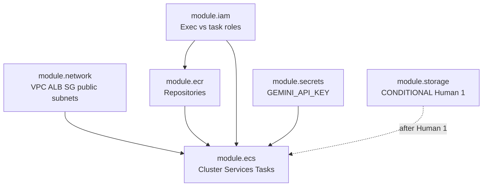

<!-- MIRROR: auto-synced from notes/projects/covenant/platform-engineering/blueprints/PE_RM_Phase3.md - do not edit directly. Edit the canonical file in the notes repo and run scripts/sync_project_docs.py -->

---
id: projects-covenant-platform-engineering-blueprints-PE_RM_Phase3
type: blueprint
status: draft
dependencies:
  - projects/covenant/application/Pipeline_Invariants.md
  - projects/covenant/platform-engineering/PE_Infrastructure_Invariants.md
  - projects/covenant/platform-engineering/blueprints/PE_RM_Phase2.md
tags: []
invariants:
  - id: iac-topology-parity
    statement: "Terraform plan materializes every object declared in Phase 2 topology without undeclared resources"
inherited_invariants:
  - id: topology-completeness
    from: projects/covenant/platform-engineering/blueprints/PE_RM_Phase2.md
    status: planned
    enforced_by: "tests/terraform/test_topology_completeness.py::test_every_diagram_node_has_resource"
  - id: provenance-grounding
    from: projects/covenant/application/Pipeline_Invariants.md
    status: waived
    note: "Extraction pipeline invariants are out of scope for the Terraform IaC blueprint."
  - id: chunker-partition
    from: projects/covenant/application/Pipeline_Invariants.md
    status: waived
    note: "Extraction pipeline invariants are out of scope for the Terraform IaC blueprint."
  - id: chunker-coverage-audit
    from: projects/covenant/application/Pipeline_Invariants.md
    status: waived
    note: "Extraction pipeline invariants are out of scope for the Terraform IaC blueprint."
  - id: router-rule-dispatch
    from: projects/covenant/application/Pipeline_Invariants.md
    status: waived
    note: "Extraction pipeline invariants are out of scope for the Terraform IaC blueprint."
  - id: glossary-acyclic
    from: projects/covenant/application/Pipeline_Invariants.md
    status: waived
    note: "Extraction pipeline invariants are out of scope for the Terraform IaC blueprint."
  - id: metamorphic-stability
    from: projects/covenant/application/Pipeline_Invariants.md
    status: waived
    note: "Extraction pipeline invariants are out of scope for the Terraform IaC blueprint."
  - id: container-parity
    from: projects/covenant/platform-engineering/PE_Infrastructure_Invariants.md
    status: planned
    enforced_by: "tests/invariants/test_container_parity.py::test_container_parity_host_vs_docker"
  - id: config-totality
    from: projects/covenant/platform-engineering/PE_Infrastructure_Invariants.md
    status: planned
    enforced_by: "tests/invariants/test_config_totality.py::test_missing_env_fails_fast"
---
# Technical Blueprint: Phase 3 - Infrastructure as Code (Terraform)

## I. Objective

**Parent authority.** Declare the Phase 2 AWS topology in Terraform. Manual clicking in the console is prohibited for the main stack. AWS is the sole target provider (other clouds may be named only as contrast). Phase 1 is frozen as-built; this phase materializes the **corrected** Phase 2 PoC topology (public-subnet/no-NAT, HTTP :80, Nginx-preserving edge, digest-oriented images, open persistence gate).

**Andy role:** Supplies the teardown/ownership axioms for the state backend vs main stack; ratifies `plan` diffs before `apply`; validates that a second plan on unchanged code is empty after a clean apply, and that `destroy` leaves no unintended session-scoped billable resources.

**Operating-loop exit (A3):** Andy can run `plan → apply → observe → destroy → recreate` unassisted, explain what state records, why locking exists, and the teardown order (main stack first; state bucket emptied/deleted only when retiring the backend).

### Math lens

**[Analogy]** Terraform as an `iac-functor` mapping code objects to cloud objects is heuristic inventory discipline. The analogy is **false under drift** — out-of-band console mutations break any claim that code and cloud stay in lockstep without a plan check.

**Checkable residue:** Absent external drift, a second unchanged plan after a clean apply is empty (`P3-APPLY-01`). That residue — not the functor metaphor — is what this phase verifies.

**Prerequisites:** Phase 1 (Docker images) implemented; Phase 2 (cloud topology) designed and re-grounded. See [PE_RM_Phase2.md](PE_RM_Phase2.md).

### Invariant candidates (body obligations; not frontmatter)

| Candidate | Phase 3 body obligation | Gate |
|-----------|-------------------------|------|
| **11** (Phase 3 half — persistence-reproducibility) | Name branch-specific reset/artifact checks for *both* open persistence shapes without selecting either. Compose-acyclic half remains Phase 1 ownership. | **Conditional on Human Decision 1.** Eventual `/invariant-propose` + Human gate. Do **not** write candidate 11 into frontmatter. |

Frontmatter invariant `iac-topology-parity` remains tied to the corrected Phase 2 blueprint: every Phase 2 topology node maps to a named Terraform address; undeclared extras are prohibited.

## II. Target Architecture & File Tree

Cursor must generate the following directory structure within the existing repository (design-level — committed `.tf` is out of scope for this blueprint-document pass):

```
/ (Project Root)
├── infra/
│   └── terraform/
│       ├── main.tf                 # Root module: wires child modules together
│       ├── variables.tf            # Input variables (region, digests, conditional persistence)
│       ├── outputs.tf              # Exported values (ALB DNS, ECR URLs)
│       ├── providers.tf            # AWS provider configuration
│       ├── backend.tf              # Remote state: S3 + use_lockfile = true
│       ├── versions.tf             # Terraform ≥ 1.11.0 and provider constraints
│       ├── modules/
│           ├── network/            # VPC, public subnets, IGW, ALB :80, SGs (no NAT/EIP in PoC)
│           │   ├── main.tf
│           │   ├── variables.tf
│           │   └── outputs.tf
│           ├── ecr/                # ECR repositories + lifecycle policies
│           │   ├── main.tf
│           │   ├── variables.tf
│           │   └── outputs.tf
│           ├── ecs/                # Cluster, services, task definitions (digest pins)
│           │   ├── main.tf
│           │   ├── variables.tf
│           │   └── outputs.tf
│           ├── iam/                # Execution role vs task roles
│           │   ├── main.tf
│           │   ├── variables.tf
│           │   └── outputs.tf
│           ├── secrets/            # Secrets Manager for GEMINI_API_KEY
│           │   ├── main.tf
│           │   ├── variables.tf
│           │   └── outputs.tf
│           └── storage/            # CONDITIONAL on Human 1 — both shapes specified, neither selected
│               ├── main.tf
│               ├── variables.tf
│               └── outputs.tf
│       └── environments/
│           └── poc/
│               └── terraform.tfvars    # ONE PoC environment/state path (Human 4)
```

**Contrast only (non-operative):** multi-environment scaffolding (`environments/dev` + `environments/prod`) may be named as an enterprise pattern; it is **not** the PoC target (Human 4 ratified).

## III. Component Specifications

### Step A: Provider Configuration & Remote State

**Purpose:** Initialize the Terraform runtime and persist state outside the developer laptop.

- **Provider:** `hashicorp/aws` — pinned to a specific minor version in `versions.tf`
- **Terraform version:** require **≥ 1.11.0** so `use_lockfile` is GA ([Terraform v1.11.0](https://github.com/hashicorp/terraform/releases/tag/v1.11.0); [CHANGELOG](https://github.com/hashicorp/terraform/blob/v1.11/CHANGELOG.md))
- **Region:** Configurable via `var.aws_region` (default `us-east-1` for PoC)
- **Remote backend (`backend.tf`):**
    - **State storage:** S3 bucket `covenant-pipeline-tfstate-{account-id}` (versioning enabled, encryption SSE-S3)
    - **State locking (target):** `use_lockfile = true` — S3-native locking ([S3 backend](https://developer.hashicorp.com/terraform/language/backend/s3))
    - **DynamoDB locking:** deprecated/legacy **contrast only** — not the target design
    - **Key:** `env/poc/terraform.tfstate` (one PoC state path)
    - **Bootstrap:** the state bucket cannot be created by the Terraform it backs (chicken-and-egg). Create it once, out-of-band, *before* the first `terraform init` — via AWS CLI or a tiny separate bootstrap stack with local state. Explicit ownership; teardown-last retirement (empty/delete bucket only when retiring the backend — never as part of main-stack `destroy`).

- **Input variables (`variables.tf`):**

| Variable | Type | Purpose |
|----------|------|---------|
| `aws_region` | string | AWS region |
| `backend_image_digest` | string | ECR digest for backend image (`sha256:…`) |
| `frontend_image_digest` | string | ECR digest for frontend image (`sha256:…`) |
| `domain_name` | string | Optional; unused in operative HTTP :80 PoC (TLS contrast) |
| `persistence_mode` | string | **Conditional / gated** — set only after Human Decision 1; until then authoring stops before a runnable main-stack plan that materializes storage (`P3-PLAN-02`) |

Do **not** use `backend_image_tag` / `frontend_image_tag` as deployment identity.

**Reasoning:** Remote state is mandatory for collaboration and CI/CD (Phase 4). Lockfile locking removes the DynamoDB lock table from the target design. Digest variables create a clean interface between Phase 4 (build/push) and Phase 3 (deploy).

### Step B: Resource Definitions (Modules)

**Purpose:** Declare every AWS object from the corrected [PE_RM_Phase2.md](PE_RM_Phase2.md) as Terraform resources.

#### Module: `network`

- `aws_vpc` — dedicated VPC
- `aws_subnet` — public subnets across 2 AZs (ALB **and** ECS tasks)
- `aws_internet_gateway`
- **No** `aws_nat_gateway` / NAT `aws_eip` in the operative PoC branch
- `aws_lb` (Application Load Balancer) — public-facing
- `aws_lb_listener` — **HTTP :80** operative (TLS/ACM = enterprise contrast only)
- `aws_lb_target_group` — **frontend (:80) only** as public target
- **No** ALB listener rules splitting `/api/*` → backend TG (Nginx preserves `/api/*` ownership)
- `aws_security_group` — ALB, frontend, backend (least-privilege ingress; no SSH/exec)

**Outputs:** `vpc_id`, `public_subnet_ids`, `alb_dns_name`, `frontend_target_group_arn`, security-group IDs

#### Module: `ecr`

- `aws_ecr_repository` — `covenant-pipeline-backend`, `covenant-pipeline-frontend`
- `aws_ecr_lifecycle_policy` — retain last 10 tagged images; expire untagged after 7 days
- `aws_ecr_repository_policy` — allow ECS task execution role to pull

**Outputs:** `backend_repository_url`, `frontend_repository_url`

#### Module: `ecs`

- `aws_ecs_cluster` — `covenant-pipeline`
- `aws_ecs_task_definition` — `backend`, `frontend`, `pipeline` (three definitions, two services + one run-task template)
- `aws_ecs_service` — `backend` and `frontend` (desired count from variable); tasks in public subnets with public IPs
- `aws_cloudwatch_log_group` — per task definition for container logs
- Task definitions pin images by digest: `"${repo_url}@${var.backend_image_digest}"` / frontend equivalent
- Environment block: exact frozen `COVENANT_*` paths from Phase 2 / Compose:
  - `COVENANT_PDF_PATH` = `/app/data/Credit_Agreement_Hallador.pdf`
  - `COVENANT_OUTPUT_DIR` = `/app/data/out`
  - `COVENANT_AUDITED_JSON` = `/app/data/out/final_compiled_payload_audited.json`
  - `COVENANT_DISPATCH_QUEUE_JSON` = `/app/data/out/dispatch_queue_output.json`
- Backend command: `uvicorn main:app --app-dir viewer/backend --host 0.0.0.0 --port 8000`
- Pipeline: entrypoint `covenant-pipeline`; command `run --pdf /app/data/Credit_Agreement_Hallador.pdf --output-dir /app/data/out`
- Secrets block: `GEMINI_API_KEY` from Secrets Manager ARN (injection via execution role)
- Frontend TG health: path `/`, status-code matcher only
- Fargate floor sizes: backend 0.5 vCPU / 1 GB; frontend 0.25 vCPU / 0.5 GB

**Outputs:** `cluster_arn`, `backend_service_name`, `frontend_service_name`, `pipeline_task_definition_arn`

#### Module: `iam`

- `aws_iam_role` — `ecsTaskExecutionRole` (trust: `ecs-tasks.amazonaws.com`) — ECR pull, logs, secret retrieve for injection
- `aws_iam_role_policy_attachment` — `AmazonECSTaskExecutionRolePolicy`
- `aws_iam_role` — `ecsBackendTaskRole` / `ecsPipelineTaskRole` — app AWS APIs (S3 object and/or S3 Files perms **only after** Human 1 selects a branch)
- `aws_iam_policy` — scoped permissions per role; do not pre-select storage IAM

**Outputs:** `task_execution_role_arn`, `backend_task_role_arn`, `pipeline_task_role_arn`

#### Module: `secrets`

- `aws_secretsmanager_secret` — `covenant-pipeline/gemini-api-key`
- Secret value **not** stored in Terraform — set manually or via CI/CD secret injection on first deploy

**Outputs:** `gemini_api_key_secret_arn`

#### Module: `storage` (conditional on Human Decision 1)

Two **conditional** shapes — module list must not select storage:

| Branch | Shape (when ratified) |
|--------|------------------------|
| (a) S3 Files | Volume / mount resources preserving the exact file contract; task-role S3 Files permissions |
| (b) Adapter | S3 bucket + application-scoped sync contract; no silent path rewrite before ratification |

Until Human 1 closes: retain both shapes in the blueprint; **authoring stops before a runnable main-stack plan** that materializes either (`P3-PLAN-02`).

**Outputs (when selected):** branch-specific bucket/volume identifiers

#### Root `main.tf` wiring

```hcl
# Conceptual wiring (design-level — not committed HCL)
module "network"  { source = "./modules/network"  ... }
module "ecr"      { source = "./modules/ecr"      ... }
module "iam"      { source = "./modules/iam"      ... }
module "secrets"  { source = "./modules/secrets"  ... }
# module "storage" — only after Human Decision 1; both shapes specified above
module "ecs"      { source = "./modules/ecs"
                    depends_on = [module.network, module.ecr, module.iam, module.secrets]
                    ... }
```

**Topology parity:** Every corrected Phase 2 node → named Terraform address. Prohibit undeclared extras. State backend is **external** to the main-stack graph.

**Reasoning:** Modular Terraform mirrors Phase 2 decomposition. `depends_on` encodes the directed dependency graph. Persistence stays gated so Human Decision 1 is not silently closed by module wiring.

### Step C: Workflow (full A3 loop)

**Purpose:** Define the operational workflow for translating code changes into live AWS mutations.

#### Workflow

1. **`terraform validate`** — syntax/config check (TF ≥ 1.11.0)
2. **`terraform init`** — Download providers; configure remote backend (`use_lockfile`)
3. **`terraform plan -var-file=environments/poc/terraform.tfvars -out=tfplan`** — Compute creates/updates/destroys
4. **Human review** — Andy ratifies the saved plan before apply
5. **`terraform apply tfplan`** — Execute; converge desired state
6. **Smoke test** — use Terraform outputs (ALB DNS) per Phase 2 `P2-SMOKE-01` / `P2-THREAT-01` observations (reference; do not copy evidence rows into this register)
7. **Observe** — idle-cost inventory; optional killed-task replacement observation (Phase 2 `P2-LOOP-01`; does not close E1)
8. **Second unchanged plan** — expect `0` add / `0` change / `0` destroy (`P3-APPLY-01`)
9. **`terraform destroy`** — main stack first
10. **Post-destroy inventory** — no unintended session-scoped billable resources; enumerate persistent exceptions
11. **Recreate** — next plan create-only; second unchanged plan returns to `0/0/0`

**$5 stop rule:** If a typical practice session cannot fit the alerting threshold, **stop and route to Andy** — never silently loosen.

**Teardown order:** main stack first; state bucket emptied/deleted only in a separate backend-retirement operation.

#### Drift policy

- If manual console changes occur, next `plan` reveals drift as unexpected diffs
- Policy: **no manual console edits** for the main stack — all changes flow through Git → Terraform

#### Image digest updates (handoff to Phase 4)

- CI/CD updates `backend_image_digest` / `frontend_image_digest` or passes `-var` flags
- `terraform apply` updates ECS task definitions to pull new digests
- ECS performs rolling deployment of backend/frontend services

**Reasoning:** Separating `plan` (read-only diff) from `apply` (mutation) is the review gate. Digest-as-variable creates the Phase 4 ↔ Phase 3 interface without treating tags as deployment identity.

## IV. Dependency Graph



## V. Out of Scope (Phase 3 Blueprint)

- Committed `.tf` files in **this** blueprint-document pass (design-level only; Track A implementation is a follow-on)
- Cloud execution / `apply` in this field-test measurement
- `terraform import` of existing resources
- Multi-account AWS Organizations / cross-account IAM
- Terraform Cloud / HCP Terraform (remote backend uses S3 + `use_lockfile` directly)
- Storage mechanism **selection** (Human Decision 1)
- Multi-environment PoC scaffolding (contrast only)

## VI. Phase 3 Prediction Register

Distinct from Phase 2. Do not merge registers. Do not copy Phase 2 prediction evidence rows into this register.

| ID | Before-the-run condition | Prediction stated in advance | Falsifier / evidence to retain |
|---|---|---|---|
| P3-VAL-01 | Terraform files are generated from the ratified blueprint and initialized with the Review-verified tool/provider versions (Terraform ≥ 1.11.0). | `terraform validate` exits `0`, emits its success result, and emits no error diagnostic. | Non-zero exit or any error diagnostic. Retain stdout/stderr and version output. |
| P3-PLAN-01 | State backend exists out of band; main stack is absent; storage choice and all other Human decisions are ratified. | The initial saved plan reports a non-zero add count, `0` changes, and `0` destroys. It contains no DynamoDB lock table, no NAT Gateway/NAT EIP in the PoC branch, and no state-backend bucket owned by the main stack. | Any destroy, any prohibited resource, a backend bucket in the main graph, or a Phase 2 topology node without a Terraform address. Retain plan summary and address-to-topology matrix. |
| P3-PLAN-02 | Storage choice remains unratified. | Authoring stops before a runnable main-stack plan; the blueprint retains two conditional persistence shapes and an open `[Human]` gate. | A runnable plan silently chooses or partly materializes either storage branch. Retain gate status and branch diff. |
| P3-APPLY-01 | Human has reviewed the saved plan and apply completes without an out-of-band mutation. | A second unchanged plan reports `0` to add, `0` to change, and `0` to destroy. | Any non-zero diff absent a separately recorded drift event. Retain both plan summaries and apply result. |
| P3-SMOKE-01 | Apply completed and the full pipeline output prerequisite holds. | Terraform output supplies the smoke-test entry value; the same root, `/api/document-data`, `/api/pdf`, direct-task-port, and threat-boundary observations specified in P2-SMOKE-01/P2-THREAT-01 pass without copying their evidence into the Phase 3 register. | Missing/incorrect output, failed ALB-path checks, successful direct task access, or a threat-boundary mismatch. Retain Phase 3 output-to-Phase 2 observation references. |
| P3-DOWN-01 | `terraform destroy` runs against the main stack after smoke and observation. | Destroy completes successfully; a follow-up inventory finds no unintended session-scoped main-stack resources; the state bucket and only enumerated persistent exceptions remain. The state bucket is emptied/deleted only in a separate backend-retirement operation. | Destroy failure, residual unowned main-stack resource, missing persistent-exception record, or main destroy attempting to retire the backend. Retain destroy result and inventory. |
| P3-RECREATE-01 | Main stack was cleanly destroyed while the backend remains valid. | The next plan again shows the expected create-only topology, and recreate followed by a second unchanged plan returns to `0/0/0`. | Missing resources, unexpected changes/destroys, or a non-empty unchanged plan without recorded drift. Retain recreate plan and second-plan result. |
| P3-REPRO-01 | The selected persistence branch is reapplied to the same public fixture under the blueprint's declared reset conditions. | The run reproduces the declared artifact set/content checks required by candidate 11's Phase 3 half. **While Human 1 is open:** blueprint must name branch-specific reset/artifact checks for *both* branches without selecting either; concrete hashes/manifest bind after ratification. | Missing artifact, unexplained content difference, or dependence on undeclared local state. Retain artifact manifest/hash comparison as later specified after storage ratification. |

## VII. Design Audit Notes

### 2026-07-04 (historical)

External design review prior to implementation; corrections applied in place:

1. **State-backend bootstrap documented** (§III Step A) — the chicken-and-egg was previously unstated and would stall the first `terraform init`.
2. **ACM certificate resources** — previously required for unconditional HTTPS; operative PoC is now HTTP :80 (Human 2); ACM remains enterprise contrast.
3. **Native S3 state locking noted** — historically as a DynamoDB alternative (Terraform ≥ 1.10). **Superseded 2026-07-16:** target is `use_lockfile` + TF ≥ 1.11.0; DynamoDB locking is deprecated contrast only — not "acceptable" as target design.
4. **§II file tree fixed** — a duplicated `infra/` subtree (generation artifact) merged; `environments/` sits inside the single `infra/terraform/` directory.

### 2026-07-16 (re-grounding)

Re-grounded in place from parent [PE_Roadmap_M1.md](../PE_Roadmap_M1.md) and corrected [PE_RM_Phase2.md](PE_RM_Phase2.md) via implementation plan `inbox/2026-07-16-pe-blueprints-regrounding-l2-plan.md`: `use_lockfile` + TF ≥ 1.11.0; one PoC env path; digest variables; no NAT/EIP in PoC; Nginx-preserving edge; conditional storage modules; candidate 11 conditional on Human 1; full A3 workflow; distinct 8-row prediction register. Storage selection remains open.
