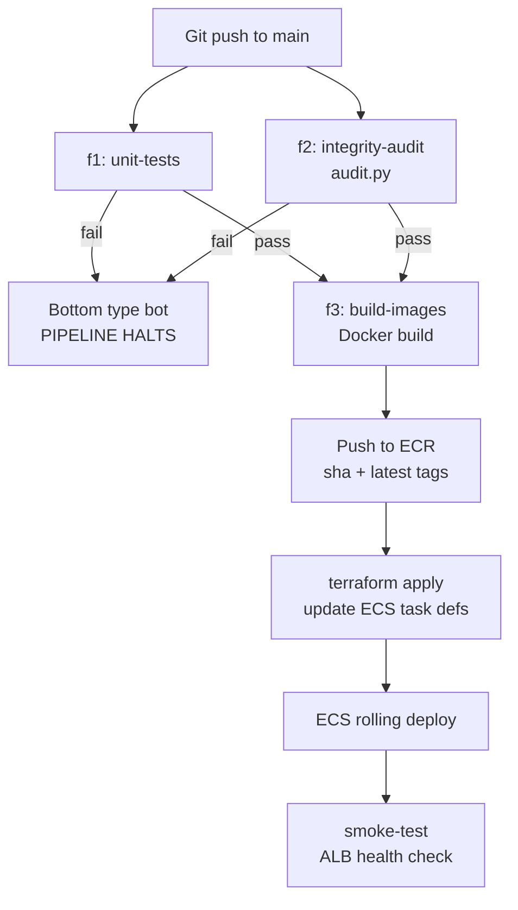

<!-- MIRROR: auto-synced from notes/projects/covenant/platform-engineering/blueprints/PE_RM_Phase4.md - do not edit directly. Edit the canonical file in the notes repo and run scripts/sync_project_docs.py -->

---
id: projects-covenant-platform-engineering-blueprints-PE_RM_Phase4
type: blueprint
status: draft
dependencies:
  - projects/covenant/platform-engineering/blueprints/PE_RM_Phase2.md
  - projects/covenant/platform-engineering/blueprints/PE_RM_Phase3.md
  - projects/covenant/platform-engineering/PE_Invariant_Suite.md
tags: []
invariants:
  - id: promotion-order
    statement: "CI/CD auto-deploys dev on merge; staging and prod require manual workflow_dispatch or environment approval"
inherited_invariants:
  - id: topology-completeness
    from: projects/covenant/platform-engineering/blueprints/PE_RM_Phase2.md
    status: planned
    enforced_by: "tests/terraform/test_topology_completeness.py::test_every_diagram_node_has_resource"
  - id: iac-topology-parity
    from: projects/covenant/platform-engineering/blueprints/PE_RM_Phase3.md
    status: planned
    enforced_by: "tests/terraform/test_iac_topology_parity.py::test_plan_matches_phase2_topology"
  - id: provenance-grounding
    from: projects/covenant/platform-engineering/PE_Invariant_Suite.md
    status: waived
    note: "Extraction pipeline invariants are out of scope for the CI/CD orchestration blueprint."
  - id: chunker-partition
    from: projects/covenant/platform-engineering/PE_Invariant_Suite.md
    status: waived
    note: "Extraction pipeline invariants are out of scope for the CI/CD orchestration blueprint."
  - id: chunker-coverage-audit
    from: projects/covenant/platform-engineering/PE_Invariant_Suite.md
    status: waived
    note: "Extraction pipeline invariants are out of scope for the CI/CD orchestration blueprint."
  - id: router-rule-dispatch
    from: projects/covenant/platform-engineering/PE_Invariant_Suite.md
    status: waived
    note: "Extraction pipeline invariants are out of scope for the CI/CD orchestration blueprint."
  - id: glossary-acyclic
    from: projects/covenant/platform-engineering/PE_Invariant_Suite.md
    status: waived
    note: "Extraction pipeline invariants are out of scope for the CI/CD orchestration blueprint."
  - id: metamorphic-stability
    from: projects/covenant/platform-engineering/PE_Invariant_Suite.md
    status: waived
    note: "Extraction pipeline invariants are out of scope for the CI/CD orchestration blueprint."
  - id: container-parity
    from: projects/covenant/platform-engineering/PE_Invariant_Suite.md
    status: planned
    enforced_by: "tests/invariants/test_container_parity.py::test_container_parity_host_vs_docker"
  - id: config-totality
    from: projects/covenant/platform-engineering/PE_Invariant_Suite.md
    status: planned
    enforced_by: "tests/invariants/test_config_totality.py::test_missing_env_fails_fast"
---
# Technical Blueprint: Phase 4 - CI/CD Orchestration (The Control Loop)

## I. Objective

**CS / English:** Automate the full path from a Git push to a live AWS deployment. A developer merges application or infrastructure code; GitHub Actions runs integrity checks, builds Docker images, pushes them to ECR, and triggers a Terraform apply to roll out the new images to ECS Fargate — with no manual steps.

**Mathematical Formalization:** Continuous Integration is a strict composition of validation morphisms on the code category $\mathcal{C}$:

$$CI_{eval} = f_3 \circ f_2 \circ f_1$$

Where:

- $f_1 : X_0 \to X_{linted}$ — static analysis / unit tests
- $f_2 : X_{linted} \to X_{audited}$ — deterministic integrity audit (`audit.py`)
- $f_3 : X_{audited} \to X_{built}$ — Docker image build

**The Bottom Type ($\bot$):** If $f_2$ fails (dangling pointers, circular references, type violations in compiled payload), the morphism evaluates to $\bot$. Because $f_3$ requires domain $X_{audited}$ and $\bot \neq X_{audited}$, the composition $CI_{eval}$ is **undefined** — the pipeline halts.

> **Scope correction (2026-07-04):** as specified in Job 1, $f_2$ runs `audit.py` against a *committed fixture*, so what is actually proven per commit is "the audit tool still passes on known-good data" — a regression test of the auditor, not an audit of artifacts this commit produced. The strong reading ("unproven artifacts cannot deploy") requires a release-level gate: run the audit against the payload the deployed pipeline actually produces (post-`run-task` against S3 output, or as a final step of the pipeline task itself). Tracked as follow-on work; until then, the formalization above describes the **target** gate, not the implemented one.

**The Deployment Functor:** Let $\mathcal{C}_{valid} \subset \mathcal{C}$ be the subcategory of commits that passed $CI_{eval}$. The CD pipeline is a functor:

$$F_{deploy} : \mathcal{C}_{valid} \to \mathcal{D}_{AWS}$$

restricted to validated code only. Phase 3's Terraform functor $F$ executes the infrastructure update; Phase 4 orchestrates when $F$ is invoked.

**Prerequisites:** Phase 1 (Docker images), Phase 2 (AWS topology designed), Phase 3 (Terraform modules designed). See [PE_RM_Phase2.md](PE_RM_Phase2.md) and [PE_RM_Phase3.md](PE_RM_Phase3.md).

## II. Target Architecture & File Tree

```
/ (Project Root)
├── .github/
│   └── workflows/
│       ├── ci.yml                  # PR checks: test + audit (no deploy)
│       └── deploy.yml              # Main branch: full CI + build + push + terraform apply
├── infra/
│   └── terraform/                  # Phase 3 Terraform (target of deploy job)
└── (existing application + Docker files from Phase 1)
```

**GitHub repository secrets required (not committed):**

| Secret | Purpose |
|--------|---------|
| `AWS_ACCESS_KEY_ID` | CI role for ECR push + Terraform apply |
| `AWS_SECRET_ACCESS_KEY` | Paired with above |
| `AWS_REGION` | e.g. `us-east-1` |
| `GEMINI_API_KEY` | Optional: for integration test stage (not stored in repo) |

**Recommended:** Replace long-lived access keys with **OIDC federation** (`aws-actions/configure-aws-credentials` + `id-token: write` permission) for production. Design-level PoC may use access keys initially.

## III. Component Specifications

### Step A: Workflow Triggers

**Purpose:** Define when automation runs and what code paths activate which jobs.

#### `ci.yml` — Pull Request Gate

- **Trigger:** `pull_request` to `main` (and optionally `infra/docker`)
- **Jobs:** Test + Audit only (no build, no deploy)
- **Purpose:** Fail fast on PRs before merge; protect `main`

#### `deploy.yml` — Main Branch Deploy

- **Trigger:** `push` to `main`
- **Jobs:** Full pipeline — Audit → Build → Push → Deploy
- **Concurrency:** `group: deploy-${{ github.ref }}` with `cancel-in-progress: false` — queue, don't cancel (corrected 2026-07-04: cancelling a run mid-`terraform apply` can leave a locked state file and a half-applied topology; the concurrency group already prevents overlap)

**Reasoning:** Separating PR checks from deploy workflow follows the $\mathcal{C}_{valid}$ restriction — only merged code reaches $F_{deploy}$.

### Step B: CI/CD Jobs (deploy.yml)

**Purpose:** Implement the morphism chain $f_3 \circ f_2 \circ f_1$ followed by deployment.

#### Job 1: `integrity-audit` ($f_2$ — The Deterministic Gate)

**Purpose:** Run Phase 3a database audit before any image is built. Fail closed.

- **Runner:** `ubuntu-latest`
- **Steps:**
    1. Checkout code
    2. Set up Python 3.11
    3. `pip install -e ".[viewer]"`
    4. Generate a **fixture compiled payload** for audit (or use committed test fixture under `tests/fixtures/`)
    5. Run: `covenant-pipeline audit` (invokes [covenant_pipeline/phases/audit.py](https://github.com/endisciple13/covenant_pipeline/blob/main/covenant_pipeline/phases/audit.py))
    6. **Exit criteria:** Non-zero exit if `Audit_Status` is not `Clean` or if dangling pointers / circular references / type violations are detected

- **Audit checks (from `audit.py`):**
    - Circular reference detection in glossary graph
    - Dangling `[$REF: ...]` pointer sweep
    - Numeric type validation on extracted covenant fields

**Reasoning:** This is the deterministic compiler gate — binary pass/fail before probabilistic LLM code ships. Maps directly to the roadmap's "Job 1: Run Phase 3a `audit.py`". In banking context, structural integrity of covenant data must be proven before deployment.

#### Job 2: `unit-tests` ($f_1$ — parallel with audit)

**Purpose:** Run existing Python unit tests.

- **Command:** `python -m unittest discover -s tests`
- **Fail:** Any test failure → $\bot$; downstream jobs skipped via `needs:` dependency

**Reasoning:** Fast, deterministic checks that don't require AWS credentials or Docker.

#### Job 3: `build-images` ($f_3$ — requires audit + tests pass)

**Purpose:** Build Phase 1 Docker images and tag with Git SHA.

- **Runner:** `ubuntu-latest`
- **Needs:** `[integrity-audit, unit-tests]`
- **Steps:**
    1. Configure AWS credentials
    2. Login to ECR (`aws ecr get-login-password`)
    3. Build backend: `docker build -f viewer/backend/Dockerfile -t {ecr}/covenant-pipeline-backend:{sha} .`
    4. Build frontend: `docker build -f viewer/frontend/Dockerfile -t {ecr}/covenant-pipeline-frontend:{sha} ./viewer/frontend`
    5. Tag both as `:latest` in addition to `:{sha}`
    6. Push all tags to ECR

- **Image tags:**
    - `{github.sha}` — immutable (global element $j_P$)
    - `latest` — rolling pointer to most recent successful build

**Reasoning:** Build only after $f_1$ and $f_2$ succeed. SHA tags enable rollback by re-deploying a previous Terraform variable value.

#### Job 4: `deploy-infrastructure` (Deployment Functor $F_{deploy}$)

**Purpose:** Update live AWS infrastructure to pull new images.

- **Runner:** `ubuntu-latest`
- **Needs:** `[build-images]`
- **Steps:**
    1. Configure AWS credentials
    2. Setup Terraform (`hashicorp/setup-terraform`)
    3. `cd infra/terraform`
    4. `terraform init`
    5. `terraform plan -out=tfplan -var="backend_image_tag=${{ github.sha }}" -var="frontend_image_tag=${{ github.sha }}" -var-file=environments/dev/terraform.tfvars`
    6. `terraform apply tfplan` (dev only; prod requires manual approval gate. Corrected 2026-07-04: applying the saved plan makes step 5 the actual reviewed artifact — a bare `apply -auto-approve` re-plans from scratch and ignores step 5 entirely)
    7. Output ALB DNS for smoke test comment on commit

- **ECS rolling update:** Terraform updates task definition image tags → ECS service triggers rolling deployment → old tasks drain, new tasks start

**Reasoning:** Terraform apply is the operational invocation of Phase 3's functor $F$. Passing image tags as variables creates a clean handoff from build job without editing `.tf` files in CI.

### Step C: Post-Deploy Verification (Smoke Test)

**Purpose:** Confirm the deployment functor produced a reachable system.

- **Optional Job 5: `smoke-test`** (needs `deploy-infrastructure`)
- **Checks (corrected 2026-07-04 — `curl -f` fails on 404, contradicting the documented acceptable-404 case; test status codes explicitly):**
    - `code=$(curl -s -o /dev/null -w "%{http_code}" {scheme}://{alb_dns}/api/pipeline-summary)` — pass on `200` or `404` (no artifacts in S3 yet), fail on `5xx` or timeout
    - `curl -fsS {scheme}://{alb_dns}/` — frontend serves HTML
    - `{scheme}` follows the Phase 2/3 domain decision: `https` only when `domain_name` is set (ACM cannot issue a cert for the raw ALB DNS name); otherwise `http`
- **Notify:** GitHub commit status or Slack webhook on failure

**Reasoning:** Closes the control loop — verifies $I_{desired}$ is actually reachable, not just that Terraform reported success.

## IV. Control Loop Diagram



## V. Job Dependency Summary

| Job | Depends on | AWS credentials | Produces |
|-----|------------|-----------------|----------|
| `unit-tests` | — | No | Test pass/fail |
| `integrity-audit` | — | No | Audit pass/fail |
| `build-images` | tests + audit | Yes (ECR push) | Docker images in ECR |
| `deploy-infrastructure` | build-images | Yes (Terraform) | Updated ECS services |
| `smoke-test` | deploy | Yes (read ALB) | Health check pass/fail |

## VI. Security Considerations

- **No secrets in workflow YAML** — use GitHub Encrypted Secrets or OIDC
- **`GEMINI_API_KEY` never in CI logs** — mask outputs; only injected into ECS via Secrets Manager at runtime
- **Branch protection on `main`** — require PR + passing `ci.yml` before merge
- **Prod deploy gate** — `terraform apply` on prod requires manual `workflow_dispatch` or environment approval rule in GitHub

## VII. Out of Scope (Phase 4 Blueprint)

- Committed `.github/workflows/*.yml` files (design-level only)
- OIDC setup walkthrough (recommended for prod, not specified here)
- Pipeline `run-task` automation via EventBridge (on-demand extraction trigger — future enhancement)
- Blue/green or canary ECS deployments (rolling update sufficient for PoC)

## VIII. Design Audit Notes (2026-07-04)

External design review prior to implementation; corrections applied in place:

1. **Smoke test rewritten** (§III Step C) — `curl -f` fails on the documented-acceptable 404; status codes are now checked explicitly, and the URL scheme follows the Phase 2/3 domain decision.
2. **Deploy concurrency changed to queue** (`cancel-in-progress: false`) — cancelling mid-`apply` risks a locked state file and half-applied topology.
3. **`plan -out` / `apply tfplan` pattern adopted** — the previous step pair re-planned at apply time, making the reviewed plan decorative.
4. **$\bot$-gate scope corrected** (§I) — the fixture audit is a regression test of the auditor, not a release audit; the strong guarantee is reclassified as the target gate, with a release-level audit tracked as follow-on work.
