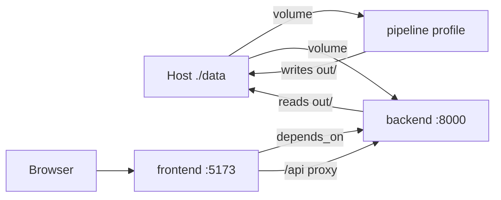
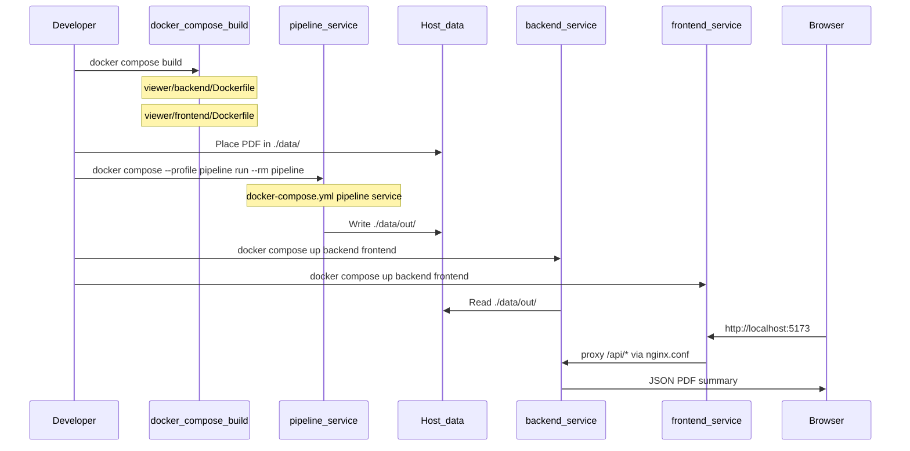

# Reading the Docker Code: Personal Learning Notes

Personal learning notes for reading the Docker configuration in this repository. These notes bridge abstract theory ([Math_Containerization.md](../../../notes/math/Math_Containerization.md)), operational reference ([Docker_Documentation.md](../../../Docker_Documentation.md)), and the Phase 1 blueprint ([PE_RM_Phase1.md](../../../notes/projects/covenant/PE_RM_Phase1.md)) into a line-by-line code walkthrough.

**Audience:** You read Python comfortably; Docker is new.

**Notation:** Reuses $D$, $Y$, $Y^D$, $eval$, $\Gamma$, $\pi$ from the platform math notes.

---

## Table of Contents

- [Section 0: Prelude — Why Docker Here?](#section-0-prelude--why-docker-here)
- [Section 1: The Dockerfile as Constructing $Y^D$](#section-1-the-dockerfile-as-constructing-yd)
- [Section 2: Build Context as a Projection](#section-2-build-context-as-a-projection)
- [Section 3: One Image, Two Services](#section-3-one-image-two-services)
- [Section 4: Multi-Stage Frontend Build as a Functor](#section-4-multi-stage-frontend-build-as-a-functor)
- [Section 5: Compose as a Labeled Graph](#section-5-compose-as-a-labeled-graph)
- [Section 6: Networking and the Proxy Morphism](#section-6-networking-and-the-proxy-morphism)
- [Section 7: Configuration vs Persistent State](#section-7-configuration-vs-persistent-state)
- [Section 8: End-to-End Execution as a Composed Sequence](#section-8-end-to-end-execution-as-a-composed-sequence)
- [Appendix](#appendix)

---

## Section 0: Prelude — Why Docker Here?

### I. Mathematical Field

**Ambient Context Theory and Cartesian Products**

The host machine is modeled as a large ambient context object. The container mechanism constructs a strict terminal context where execution depends only on the dependency object $D$.

### II. English & Industry Language

The Credit Agreement pipeline is complete Python code: chunking, extraction, compilation, audit, validation, plus a FastAPI backend and React frontend. Running it natively means your laptop must resolve Python packages, system libraries (PyMuPDF/MuPDF), Node tooling, and environment variables. A colleague's machine may have different Python versions, missing libs, or conflicting global packages — **configuration drift**.

**Docker** packages the application and its dependencies into an **immutable image**. When you **run** the image, you get an isolated **container** process. The host OS stays clean; dependencies live inside the image, not on your machine.

In this repo, Docker is Phase 1 of platform engineering: local containerization before any cloud deployment. See [PE_Roadmap_1.md](../../../notes/projects/covenant/PE_Roadmap_1.md).

### III. Rigorous Mathematical Definition

Let $D \in \mathcal{C}$ be the dependency object — the exact product of runtime requirements:

$$D = T_{\text{OS}} \times T_{\text{Python}} \times T_{\text{PyMuPDF}} \times T_{\text{FastAPI}} \times T_{\text{Pandas}} \times \cdots$$

Let $P : D \to Y$ be the application morphism (the pipeline + viewer code).

**Your host configuration** is an ambient context:

$$\Gamma_{\text{host}} = D \times H$$

where $H$ represents unrelated host state: other Python versions, global `node_modules`, conflicting paths, OS-specific quirks.

Native execution requires a projection $\pi_D : \Gamma_{\text{host}} \to D$ so that $P \circ \pi_D : \Gamma_{\text{host}} \to Y$ is well-defined.

**A colleague's machine** may be $\Gamma_{\text{colleague}} = D_{\text{missing}} \times H'$. If $D \neq D_{\text{missing}}$, then:

$$\nexists \pi_D : \Gamma_{\text{colleague}} \to D$$

and $P \circ \pi_D$ is undefined — runtime crash or silent misbehavior.

**The container context** is constructed so that:

$$\Gamma_{\text{container}} = D$$

Execution collapses to the identity on the dependency domain:

$$P \circ \text{id}_D : \Gamma_{\text{container}} \to Y$$

Host pollution is isolated:

$$\Gamma_{\text{container}} \cap \Gamma_{\text{host}} = \emptyset$$

### IV. Reading the Code

There is no single "Docker file" for this section — the contrast is between **native** and **containerized** invocation:

| Action | Native (host) | Docker (container) |
|--------|---------------|-------------------|
| Run extraction | `covenant-pipeline run --pdf ... --output-dir out/` | `docker compose --profile pipeline run --rm pipeline` |
| Serve viewer | `covenant-pipeline serve` (spawns uvicorn + Vite) | `docker compose up backend frontend` |
| API key | `.env` at repo root | `.env.docker` via Compose `env_file` |
| Artifacts | `{repo_root}/out/` | `./data/out/` on host via volume mount |

The Docker files you will read in later sections implement $\Gamma_{\text{container}} = D$ and the evaluation paths $eval_{api}$ and $eval_{pipeline}$.

> **Python reader:** Think of Docker as shipping a virtualenv + OS libs + your code as a single sealed box. You do not `pip install` on the host; you `docker compose build` once and run the box.

> **Gotcha:** Docker does not replace understanding the Python code. It only guarantees the *environment* in which that code runs. See [Docker_Documentation.md](../../../Docker_Documentation.md) for full command reference.

---

## Section 1: The Dockerfile as Constructing $Y^D$

### I. Mathematical Field

**Exponential Objects, Layer Monoids, and Internalization**

A Dockerfile is a recipe that internalizes the external hom-set $\text{Hom}(D, Y)$ into an object $Y^D$ inside the infrastructure category. Each `RUN` and `COPY` instruction appends an immutable layer — formally, a **monoid** $(L, \cdot, \varepsilon)$ where layers compose by ordered append and the empty image is the identity $\varepsilon$.

### II. English & Industry Language

A **Dockerfile** is a text script that tells Docker how to build an **image**. An image is a stack of read-only **layers**. Each instruction (`FROM`, `RUN`, `COPY`, …) typically creates a new layer. Layers are cached: if nothing changed since the last build, Docker reuses the cached layer.

Key vocabulary:

| Term | Meaning |
|------|---------|
| **Base image** | Starting layer (e.g. `python:3.11-slim`) |
| **WORKDIR** | Default directory inside the container |
| **COPY** | Copy files from build context into the image |
| **RUN** | Execute a command during build (install deps, compile) |
| **EXPOSE** | Document which port the container listens on |
| **CMD** | Default command when a container starts |

**File:** [viewer/backend/Dockerfile](../../../viewer/backend/Dockerfile) — builds the backend image (also reused by the `pipeline` service).

### III. Rigorous Mathematical Definition

The build process is a morphism in the category of images:

$$\text{build} : \text{Context} \to Y^D$$

where $Y^D$ is the exponential object containing program $P$ closed over dependencies $D$.

Layer construction is a fold over instructions:

$$Y^D = \ell_n \cdot \ell_{n-1} \cdot \cdots \cdot \ell_1 \cdot \ell_0$$

where $\ell_0 = \text{FROM}$ (base object) and each subsequent $\ell_i$ is a `RUN` or `COPY` morphism.

**Caching invariant:** If instructions $1..k$ are unchanged, layers $\ell_1..\ell_k$ are reused. Placing slow-changing dependencies (pip install) *before* fast-changing source (`COPY covenant_pipeline/`) minimizes rebuild cost — a **stability ordering** on the layer monoid.

The global element selecting this specific release:

$$j_P : 1 \to Y^D$$

corresponds to the image tag (e.g. `covenant_pipeline-backend:latest`).

At runtime, the evaluation morphism applies:

$$eval_{D,Y} : Y^D \times D \to Y$$

In practice, $D$ is already baked into $Y^D$ for containerized apps, so $eval$ reduces to starting the process defined by `CMD`.

### IV. Reading the Code

**Line 1 — Base image**

```1:1:viewer/backend/Dockerfile
FROM python:3.11-slim
```

Selects $T_{\text{OS}} \times T_{\text{Python}}$: Debian-based slim image with Python 3.11. "Slim" means fewer preinstalled packages → smaller $Y^D$, but you must add system libs yourself (next step).

> **Python reader:** Like choosing `python:3.11` in pyenv, except frozen into the image forever until you rebuild.

**Lines 3 — Working directory**

```3:3:viewer/backend/Dockerfile
WORKDIR /app
```

Sets the coordinate system inside the container. All subsequent `COPY` and `RUN` paths are relative to `/app`.

**Lines 6–10 — System dependencies**

```6:10:viewer/backend/Dockerfile
RUN apt-get update \
    && apt-get install -y --no-install-recommends \
        libmupdf-dev \
        mupdf-tools \
    && rm -rf /var/lib/apt/lists/*
```

Extends $D$ with MuPDF binaries. PyMuPDF (`fitz`) needs these at runtime for PDF chunking. The `rm -rf /var/lib/apt/lists/*` keeps the layer small (deletes apt cache).

This is a **separate layer** from pip install — system packages vs Python packages.

**Lines 12–15 — Source copy**

```12:15:viewer/backend/Dockerfile
COPY pyproject.toml README.md ./
COPY covenant_pipeline ./covenant_pipeline
COPY config ./config
COPY viewer/backend ./viewer/backend
```

Injects application source into the image. Build context must be repo root (see Section 2) because the Dockerfile needs `covenant_pipeline/` and `config/`, not just `viewer/backend/`.

> **Python reader:** `COPY` is not `import`. It physically copies files into the image filesystem at build time. No dynamic loading from host after build.

**Line 17 — Python dependencies**

```17:17:viewer/backend/Dockerfile
RUN pip install --no-cache-dir -e ".[viewer]"
```

Constructs the Python part of $D$: installs core pipeline deps plus FastAPI/uvicorn via the `[viewer]` extra. Editable install (`-e`) registers the `covenant-pipeline` CLI entry point.

**Order matters:** `pyproject.toml` is copied *before* this `RUN`, but full source is copied *before* pip runs so the package is installable. Dependency metadata changes less often than code — in a more optimized Dockerfile you might copy only `pyproject.toml` first, run pip, then copy source (this repo copies source first, which is simpler but invalidates the pip layer on every code change).

**Line 19 — Port metadata**

```19:19:viewer/backend/Dockerfile
EXPOSE 8000
```

Documents that the container process listens on port 8000. Does **not** publish the port to the host — that happens in `docker-compose.yml` (`ports: "8000:8000"`).

**Lines 21 — Default process**

```21:21:viewer/backend/Dockerfile
CMD ["uvicorn", "main:app", "--app-dir", "viewer/backend", "--host", "0.0.0.0", "--port", "8000"]
```

Default $eval_{api}$: start the FastAPI server.

- `--app-dir viewer/backend` — matches native launcher in `covenant_pipeline/viewer.py`
- `--host 0.0.0.0` — bind all interfaces inside the container (required for Docker networking)

> **Gotcha:** `--host 0.0.0.0` is required. Binding to `127.0.0.1` (uvicorn default in some setups) makes the API unreachable from other containers and from host port mapping. See [Docker_Documentation.md](../../../Docker_Documentation.md#troubleshooting).

---

## Section 2: Build Context as a Projection

### I. Mathematical Field

**Projections, Subobjects, and Filters**

The build context is a subset of the repository selected by a projection map. `.dockerignore` acts as a filter morphism that excludes paths from the domain of $\pi$.

### II. English & Industry Language

When Docker builds an image, it does not see your entire hard drive. It sees only the **build context** — a directory you specify (e.g. `.` for repo root). Docker sends that directory to the daemon before build starts.

**.dockerignore** works like `.gitignore`: patterns excluded from the context. Smaller context → faster builds, smaller attack surface, no secrets accidentally baked in.

**Critical distinction in this repo:**

| Service | Build context | Why |
|---------|---------------|-----|
| `backend`, `pipeline` | `.` (repo root) | Dockerfile copies `covenant_pipeline/`, `config/`, `pyproject.toml` |
| `frontend` | `./viewer/frontend` | Only needs React app files |

### III. Rigorous Mathematical Definition

Let $\mathcal{R}$ be the repository file tree (object in a category of filesystems).

The **build context** is a subobject $C \subseteq \mathcal{R}$ selected by projection:

$$\pi_{\text{context}} : \mathcal{R} \twoheadrightarrow C$$

The **dockerignore filter** is a morphism:

$$\phi_{\text{ignore}} : \mathcal{R} \to C'$$

where $C' = \mathcal{R} \setminus I$ and $I$ is the ignored set (`.git`, `data/`, `.venv`, etc.).

Effective context sent to the daemon:

$$C_{\text{eff}} = \pi_{\text{context}}(\phi_{\text{ignore}}(\mathcal{R}))$$

For the backend, Compose specifies:

$$\pi_{\text{context}} = \text{repo root}, \quad \text{dockerfile} = \text{viewer/backend/Dockerfile}$$

The Dockerfile path is relative to the context, not the Dockerfile's location on disk.

For the frontend:

$$\pi_{\text{context}} = \text{viewer/frontend}$$

a strict subobject — the backend's global source is invisible to the frontend build.

### IV. Reading the Code

**Root [.dockerignore](../../../.dockerignore)**

```1:20:.dockerignore
.git
.venv
venv
__pycache__
*.py[cod]
*.egg-info
.eggs
dist
build
out
data
node_modules
legacy
docs
.env
.env.*
!.env.example
!.env.docker.example
*.log
.cursor
```

| Pattern | Reason |
|---------|--------|
| `.git`, `.cursor` | Not needed at runtime |
| `.venv`, `__pycache__`, `*.egg-info` | Host Python artifacts — would pollute image |
| `out/`, `data/` | Runtime data via volume mounts, not image layers |
| `node_modules`, `dist` | Frontend built in its own Dockerfile |
| `legacy/`, `docs/` | Reference material, not runtime |
| `.env`, `.env.*` | Secrets must not be baked into images |
| `!.env.docker.example` | Exception: allow example template (not secrets) |

**Compose build contexts**

```3:5:docker-compose.yml
    build:
      context: .
      dockerfile: viewer/backend/Dockerfile
```

```19:21:docker-compose.yml
    build:
      context: ./viewer/frontend
      dockerfile: Dockerfile
```

Backend: context is `.` so `COPY covenant_pipeline ./covenant_pipeline` resolves correctly.

Frontend: context is `./viewer/frontend` — a minimal subobject. The frontend Dockerfile never sees the Python pipeline.

**Frontend [.dockerignore](../../../viewer/frontend/.dockerignore)**

```
node_modules
dist
```

`npm ci` and `npm run build` run fresh inside the builder stage; host `node_modules` would be wrong platform anyway.

> **Python reader:** Build context is like `PYTHONPATH` scope for Docker — it defines what files exist when `COPY` runs. If a path is outside context, `COPY` fails.

> **Gotcha:** If you put the Dockerfile in `viewer/backend/` but set `context: ./viewer/backend`, the build breaks because `covenant_pipeline/` is outside context. This repo uses `context: .` deliberately. See [Docker_Documentation.md](../../../Docker_Documentation.md#build-context--dockerignore).

---

## Section 3: One Image, Two Services

### I. Mathematical Field

**Evaluation Morphisms and Global Element Selection**

One exponential object $Y^D$ can be evaluated along different paths. `entrypoint` and `command` override the default $eval$ morphism without rebuilding $Y^D$.

### II. English & Industry Language

A Docker **image** is a template. A **container** is a running instance of that image.

This repo builds **one backend image** but runs it as **two different services**:

| Service | Purpose | How it starts |
|---------|---------|---------------|
| `backend` | FastAPI viewer API | Dockerfile `CMD` → uvicorn |
| `pipeline` | Extraction pipeline | `entrypoint: covenant-pipeline` + `command: run ...` |

Same image, different process at container start. No need for two Dockerfiles.

This mirrors native mode:

- `covenant-pipeline serve` ≈ `backend` service
- `covenant-pipeline run` ≈ `pipeline` service

The backend is **read-only** — it serves pre-generated JSON/PDF from disk. It does not run extraction.

### III. Rigorous Mathematical Definition

Let $Y^D_{\text{backend}}$ be the image constructed in Section 1.

Two evaluation morphisms share the same object:

$$eval_{api} : Y^D_{\text{backend}} \times D \to Y_{api}$$

$$eval_{pipeline} : Y^D_{\text{backend}} \times D \to Y_{artifacts}$$

where $Y_{api}$ is HTTP responses and $Y_{artifacts}$ is the filesystem output under `/app/data/out`.

The Dockerfile defines the default:

$$eval_{default} = eval_{api}$$

Compose overrides for the `pipeline` service:

$$eval_{pipeline} = \text{entrypoint}(\text{command}) \circ j_P$$

Formally, `entrypoint` + `command` replace `CMD` as the point in $\text{Hom}(1, \text{Process})$ selected at container creation.

The `pipeline` service is gated by a **profile** — a conditional subgraph inclusion (see Section 5).

### IV. Reading the Code

**Backend service — uses Dockerfile defaults**

```2:16:docker-compose.yml
  backend:
    build:
      context: .
      dockerfile: viewer/backend/Dockerfile
    ports:
      - "8000:8000"
    env_file:
      - .env.docker
    environment:
      COVENANT_PDF_PATH: /app/data/Credit_Agreement_Hallador.pdf
      COVENANT_OUTPUT_DIR: /app/data/out
      COVENANT_AUDITED_JSON: /app/data/out/final_compiled_payload_audited.json
      COVENANT_DISPATCH_QUEUE_JSON: /app/data/out/dispatch_queue_output.json
    volumes:
      - ./data:/app/data
```

No `entrypoint` or `command` override → container runs `CMD` from Dockerfile (uvicorn).

**Pipeline service — overrides process**

```27:49:docker-compose.yml
  pipeline:
    profiles:
      - pipeline
    build:
      context: .
      dockerfile: viewer/backend/Dockerfile
    entrypoint:
      - covenant-pipeline
    command:
      - run
      - --pdf
      - /app/data/Credit_Agreement_Hallador.pdf
      - --output-dir
      - /app/data/out
    env_file:
      - .env.docker
    environment:
      COVENANT_PDF_PATH: /app/data/Credit_Agreement_Hallador.pdf
      COVENANT_OUTPUT_DIR: /app/data/out
      COVENANT_AUDITED_JSON: /app/data/out/final_compiled_payload_audited.json
      COVENANT_DISPATCH_QUEUE_JSON: /app/data/out/dispatch_queue_output.json
    volumes:
      - ./data:/app/data
```

- `entrypoint: covenant-pipeline` — same CLI registered by `pip install -e ".[viewer]"`
- `command: run --pdf ... --output-dir ...` — arguments passed to that entrypoint
- Effective process: `covenant-pipeline run --pdf /app/data/... --output-dir /app/data/out`

No `ports` — pipeline is batch work, not a network server.

> **Python reader:** `CMD` in Dockerfile ≈ `if __name__ == "__main__"` default. Compose `entrypoint` + `command` ≈ overriding `sys.argv` when spawning the process.

> **Gotcha:** The viewer needs `final_compiled_payload_audited.json`, produced only after a **full** pipeline run (including LLM validate). A `--skip-llm` run does not generate it — backend returns 404/500. See [Docker_Documentation.md](../../../Docker_Documentation.md#run-the-pipeline-full-llm).

---

## Section 4: Multi-Stage Frontend Build as a Functor

### I. Mathematical Field

**Functors Between Build and Runtime Categories**

A multi-stage Dockerfile defines a functor $F : \mathcal{B} \to \mathcal{R}$ from a **Build category** $\mathcal{B}$ (Node, devDependencies, Vite compiler) to a **Runtime category** $\mathcal{R}$ (Nginx, static assets only). Objects in $\mathcal{R}$ are not required to embed the structure of $\mathcal{B}$.

### II. English & Industry Language

The React frontend needs Node.js and Vite to **compile** JSX into static HTML/JS/CSS. Production does not need Node at runtime — only the compiled files.

**Multi-stage build:**

1. **Stage 1 (builder):** `node:20-alpine` — run `npm ci`, `npm run build` → output in `dist/`
2. **Stage 2 (runtime):** `nginx:alpine` — copy only `dist/` from stage 1, serve with Nginx

The final image contains no Node runtime. Smaller, faster, fewer vulnerabilities.

**File:** [viewer/frontend/Dockerfile](../../../viewer/frontend/Dockerfile)

### III. Rigorous Mathematical Definition

Let $\mathcal{B}$ be the category of build environments:

$$\text{Ob}(\mathcal{B}) = \{ \text{Node}_{20}, \text{Vite}, \text{devDependencies} \}$$

Let $\mathcal{R}$ be the category of runtime environments:

$$\text{Ob}(\mathcal{R}) = \{ \text{Nginx}, \text{StaticAssets} \}$$

The builder stage computes a morphism:

$$compile : \text{Source} \to \text{dist}$$

The functor $F : \mathcal{B} \to \mathcal{R}$ acts as:

$$F(\text{Source}) = \text{StaticAssets}, \quad F(compile) = \text{serve}$$

The critical operation is **cross-stage copy**:

$$\text{COPY --from=builder} : F(\text{dist}) \hookrightarrow \text{Nginx}_{\text{html}}$$

Everything in $\mathcal{B}$ not mapped to $\mathcal{R}$ is discarded — the Node object is not carried forward. This is **structure collapse**: $\dim(\mathcal{B}) \gg \dim(\mathcal{R})$.

Identity preservation: the static assets in $\mathcal{R}$ are determined entirely by the build morphism; the runtime cannot recompile.

### IV. Reading the Code

**Stage 1 — Builder**

```1:10:viewer/frontend/Dockerfile
# Stage 1: Build static assets
FROM node:20-alpine AS builder

WORKDIR /app

COPY package.json package-lock.json ./
RUN npm ci

COPY . .
RUN npm run build
```

| Line | Role |
|------|------|
| `AS builder` | Names this stage for later `COPY --from=builder` |
| `COPY package.json package-lock.json` then `npm ci` | Install deps first (layer cache) |
| `COPY . .` | Source files |
| `npm run build` | Vite compiles to `/app/dist` |

**Stage 2 — Runtime**

```12:20:viewer/frontend/Dockerfile
# Stage 2: Serve with Nginx
FROM nginx:alpine

COPY --from=builder /app/dist /usr/share/nginx/html
COPY nginx.conf /etc/nginx/conf.d/default.conf

EXPOSE 80

CMD ["nginx", "-g", "daemon off;"]
```

| Line | Role |
|------|------|
| `FROM nginx:alpine` | Fresh base — no Node from stage 1 |
| `COPY --from=builder /app/dist` | Pull only compiled assets across the functor boundary |
| `nginx.conf` | SPA routing + API proxy (Section 6) |
| `daemon off` | Run Nginx in foreground (Docker needs PID 1 to stay alive) |

> **Python reader:** Like building a wheel in CI with `python -m build`, then shipping only the `.whl` to production — not the compiler, not `dev-requirements.txt`. Multi-stage Docker is the same pattern for frontend assets.

> **Gotcha:** Production Docker serves static files via Nginx, not `npm run dev`. No hot reload. For active UI development, use native Vite. See [Docker_Documentation.md](../../../Docker_Documentation.md#native-vs-docker).

---

## Section 5: Compose as a Labeled Graph

### I. Mathematical Field

**Labeled Graphs, Shared State, and Conditional Subgraphs**

Docker Compose defines a finite labeled graph $G = (V, E, \lambda)$ where vertices are services, edges are dependencies, and $\lambda$ assigns ports, volumes, and environment labels.

### II. English & Industry Language

**Docker Compose** orchestrates multiple containers from a YAML file. It creates:

- A default **network** so services resolve each other by name (`backend`, `frontend`)
- **Volume mounts** for shared host paths
- **Port mappings** from host to container

This is not Kubernetes — it is local multi-container wiring.

**File:** [docker-compose.yml](../../../docker-compose.yml)

### III. Rigorous Mathematical Definition

Let $G = (V, E)$ where:

$$V = \{ \text{backend}, \text{frontend}, \text{pipeline} \}$$

**Dependency edges:**

$$E = \{ (\text{frontend}, \text{backend}) \}$$

from `depends_on`. This enforces startup ordering, not health — a partial order on container creation, not a guarantee that uvicorn is accepting connections.

**Shared state object** $S$ — the host directory `./data`:

$$\mu : S \hookrightarrow \text{backend}, \quad \mu : S \hookrightarrow \text{pipeline}$$

via volume mount `./data:/app/data`. Both services read/write the same identified state space.

**Port mappings** are morphisms from host to container:

$$\rho_{\text{backend}} : \text{Host}_{8000} \to \text{Container}_{8000}$$

$$\rho_{\text{frontend}} : \text{Host}_{5173} \to \text{Container}_{80}$$

**Profile** $\mathcal{P}_{\text{pipeline}}$ — conditional vertex inclusion:

$$V_{\text{active}} = V \setminus \{ \text{pipeline} \} \quad \text{unless } \mathcal{P}_{\text{pipeline}} \text{ is activated}$$

Activation: `docker compose --profile pipeline run ...`

### IV. Reading the Code

**Full service graph**



**`ports` — host:container**

```6:7:docker-compose.yml
    ports:
      - "8000:8000"
```

```22:23:docker-compose.yml
    ports:
      - "5173:80"
```

Left side is your machine; right side is inside the container. Frontend maps host `5173` → container `80` (Nginx) to match native Vite's familiar URL.

**`volumes` — bind mount**

```15:16:docker-compose.yml
    volumes:
      - ./data:/app/data
```

Host `./data` appears as `/app/data` inside container. Artifacts persist when containers are destroyed.

**`depends_on` — ordering**

```24:25:docker-compose.yml
    depends_on:
      - backend
```

Frontend container starts after backend container is created — not after API is healthy.

**`profiles` — optional service**

```27:29:docker-compose.yml
  pipeline:
    profiles:
      - pipeline
```

`pipeline` does not start on plain `docker compose up`. Explicit activation:

```bash
docker compose --profile pipeline run --rm pipeline
```

> **Python reader:** Compose is like a `Makefile` for containers — declares what runs together and how they connect. Not a Python module; a separate orchestration layer.

> **Gotcha:** `pipeline` should not start on `docker compose up`. If it does, check that `profiles: ["pipeline"]` is present. `--rm` removes the container after pipeline exits.

---

## Section 6: Networking and the Proxy Morphism

### I. Mathematical Field

**Proxy Morphisms and Internal DNS**

On the Compose network, service names resolve to container IPs. Nginx implements a proxy morphism from the browser's HTTP requests to the backend API codomain.

### II. English & Industry Language

In **native dev**, the browser hits Vite on `:5173`. Vite proxies `/api/*` to `127.0.0.1:8000` (see `viewer/frontend/vite.config.js`).

In **Docker**, the browser still hits `:5173` on the host. But inside the stack:

1. Request goes to **frontend** container (Nginx on port 80)
2. Nginx proxies `/api/*` to `http://backend:8000`
3. `backend` is the **Compose service name** — Docker's internal DNS resolves it

The frontend never hardcodes `localhost:8000` for API calls. React uses relative URLs like `/api/document-data`.

**SPA fallback:** React Router handles routes client-side. Nginx must serve `index.html` for unknown paths so refresh works.

**File:** [viewer/frontend/nginx.conf](../../../viewer/frontend/nginx.conf)

### III. Rigorous Mathematical Definition

Let $\mathcal{N}$ be the Compose network — a subobject of network topology where service names are identifiers.

Define the **DNS resolution morphism**:

$$\text{resolve} : \text{Name}(\text{backend}) \to \text{IP}_{\text{backend}}$$

The **proxy morphism** for API paths:

$$\text{proxy} : \text{HTTP}_{\text{frontend}}(\text{/api/}) \to \text{HTTP}_{\text{backend}}(:8000)$$

implemented by `proxy_pass http://backend:8000`.

The **SPA fallback morphism** for non-API paths:

$$\text{fallback} : \text{Path} \xrightarrow{\text{try\_files}} \text{index.html} \quad \text{if file not found}$$

Composition for a browser request:

$$\text{request} \xrightarrow{\rho_{\text{frontend}}} \text{Nginx} \xrightarrow{\text{proxy or fallback}} \text{Response}$$

External host port mapping $\rho_{\text{frontend}}$ is separate from internal proxy — the browser only sees `localhost:5173`.

### IV. Reading the Code

```1:19:viewer/frontend/nginx.conf
server {
    listen 80;
    server_name localhost;
    root /usr/share/nginx/html;
    index index.html;

    location /api/ {
        proxy_pass http://backend:8000;
        proxy_http_version 1.1;
        proxy_set_header Host $host;
        proxy_set_header X-Real-IP $remote_addr;
        proxy_set_header X-Forwarded-For $proxy_add_x_forwarded_for;
        proxy_set_header X-Forwarded-Proto $scheme;
    }

    location / {
        try_files $uri $uri/ /index.html;
    }
}
```

| Block | Role |
|-------|------|
| `listen 80` | Nginx inside container (mapped to host 5173 via Compose) |
| `root /usr/share/nginx/html` | Static files from multi-stage build |
| `location /api/` | Proxy morphism to backend service |
| `proxy_pass http://backend:8000` | `backend` = Compose DNS name, not `localhost` |
| `proxy_set_header ...` | Forward client metadata to FastAPI |
| `try_files $uri $uri/ /index.html` | SPA fallback for client-side routes |

**Native vs Docker proxy target**

| Mode | Proxy target |
|------|--------------|
| Native Vite | `http://127.0.0.1:8000` |
| Docker Nginx | `http://backend:8000` |

> **Python reader:** `backend` in nginx.conf is like a hostname in `requests.get("http://backend:8000/...")` — it only works inside the Compose network, not from your host shell (unless you use `localhost:8000` directly).

> **Gotcha:** Frontend `/api/*` returns `502 Bad Gateway` if the backend container is not running. Check `docker compose ps` and `docker compose logs backend`. See [Docker_Documentation.md](../../../Docker_Documentation.md#troubleshooting).

---

## Section 7: Configuration vs Persistent State

### I. Mathematical Field

**Point Configurations and External State**

Environment variables are point configurations in configuration space. Volume mounts identify an external state object shared across services, outside the immutable image $Y^D$.

### II. English & Industry Language

Two mechanisms inject runtime behavior without rebuilding the image:

| Mechanism | What it does | Example |
|-----------|--------------|---------|
| **Environment variables** | Key-value config inside container | `COVENANT_PDF_PATH`, `GEMINI_API_KEY` |
| **Volume mounts** | Host directory visible inside container | `./data:/app/data` |

**Images are immutable** — PDFs and pipeline output do not belong in image layers. They belong on the volume.

**Secrets:** `GEMINI_API_KEY` comes from `.env.docker` (gitignored). Copy from `.env.docker.example`. Never bake secrets into images (`.dockerignore` excludes `.env.*`).

### III. Rigorous Mathematical Definition

Let $\Sigma$ be the configuration space. Environment variables define a point:

$$\sigma \in \Sigma, \quad \sigma = (\text{COVENANT\_PDF\_PATH}, \text{COVENANT\_OUTPUT\_DIR}, \ldots)$$

The **secrets projection** restricts sensitive components:

$$\pi_{\text{secret}} : \Sigma \to \Sigma_{\text{public}}$$

with `GEMINI_API_KEY` loaded from `.env.docker` via `env_file`, not from image layers.

Let $S$ be the **persistent state object** (host `./data`). The volume mount is an identification:

$$\iota : S \cong \text{/app/data}_{\text{container}}$$

Pipeline execution writes:

$$eval_{pipeline}(Y^D, \sigma) \to S_{\text{out}} \subset S$$

Backend reads:

$$eval_{api}(Y^D, \sigma) \leftarrow S_{\text{out}}$$

The image $Y^D$ remains constant; only $S$ mutates. This separates **code** (immutable) from **data** (mutable).

### IV. Reading the Code

**Environment block (backend)**

```10:14:docker-compose.yml
    environment:
      COVENANT_PDF_PATH: /app/data/Credit_Agreement_Hallador.pdf
      COVENANT_OUTPUT_DIR: /app/data/out
      COVENANT_AUDITED_JSON: /app/data/out/final_compiled_payload_audited.json
      COVENANT_DISPATCH_QUEUE_JSON: /app/data/out/dispatch_queue_output.json
```

These paths are **inside the container** (`/app/data/...`). Because of the volume mount, they correspond to `./data/...` on your host.

**Secrets via env_file**

```8:9:docker-compose.yml
    env_file:
      - .env.docker
```

Loads `GEMINI_API_KEY` for LLM stages. Required for full pipeline; not needed for `--skip-llm`.

**Volume**

```15:16:docker-compose.yml
    volumes:
      - ./data:/app/data
```

| Host path | Container path | Contents |
|-----------|----------------|----------|
| `./data/Credit_Agreement_Hallador.pdf` | `/app/data/Credit_Agreement_Hallador.pdf` | Input PDF |
| `./data/out/` | `/app/data/out/` | Pipeline artifacts |

Pipeline writes → backend reads — same $\iota(S)$, no image rebuild.

> **Python reader:** Env vars are like `os.environ` at container start. Volumes are like bind-mounting a folder so `open("/app/data/out/foo.json")` reads your host's `./data/out/foo.json`.

> **Gotcha:** If you change output paths in pipeline `command`, update `COVENANT_*` env vars so the backend points at the new locations. Missing `final_compiled_payload_audited.json` → viewer errors.

---

## Section 8: End-to-End Execution as a Composed Sequence

### I. Mathematical Field

**Morphism Composition and Phased Evaluation**

End-to-end usage is a composed sequence: build (construct images) → pipeline eval (write state) → api eval (serve state). Each phase is a morphism; the full workflow is their composition.

### II. English & Industry Language

Typical workflow:

1. **Build** images (once, or after code/dep changes)
2. **Place PDF** in `./data/`
3. **Run pipeline** (on-demand, writes artifacts)
4. **Start viewer** (backend + frontend, reads artifacts)

Commands live in [Docker_Documentation.md](../../../Docker_Documentation.md#execution-workflows) — this section maps them to files and math.

### III. Rigorous Mathematical Definition

Phase 1 — **Internalization** (build):

$$\text{build}_{\text{backend}} : \text{Context} \to Y^D_{\text{backend}}$$

$$\text{build}_{\text{frontend}} : \text{Context}_{\text{fe}} \to Y^D_{\text{frontend}}$$

Phase 2 — **Pipeline evaluation**:

$$eval_{pipeline} : Y^D_{\text{backend}} \times \sigma \to S_{\text{out}}$$

Phase 3 — **API evaluation**:

$$eval_{api} : Y^D_{\text{backend}} \times \sigma \times S_{\text{out}} \to Y_{http}$$

$$eval_{\text{nginx}} : Y^D_{\text{frontend}} \times Y_{http} \to Y_{\text{browser}}$$

Full composition for viewing:

$$eval_{\text{nginx}} \circ (eval_{api} \times \text{id}) \circ \iota^{-1} : Y^D \times S \to Y_{\text{browser}}$$

### IV. Reading the Code



**Step-by-step with files**

| Step | Command | Files involved |
|------|---------|----------------|
| 1. Build | `docker compose build` | Both Dockerfiles, both `.dockerignore`, `docker-compose.yml` `build:` blocks |
| 2. Input | `mkdir data` + copy PDF | Host filesystem; paths match `command` in `docker-compose.yml` |
| 3. Extract | `docker compose --profile pipeline run --rm pipeline` | `pipeline` service: `entrypoint`, `command`, `volumes`, `.env.docker` |
| 4. View | `docker compose up backend frontend` | `backend` `CMD`, `frontend` Nginx, `nginx.conf` proxy |

**Deterministic test (no API key)**

```bash
docker compose --profile pipeline run --rm pipeline run --skip-llm \
  --pdf /app/data/Credit_Agreement_Hallador.pdf \
  --output-dir /app/data/out
```

Validates Docker wiring without Gemini billing. Viewer still needs full run for audited JSON.

> **Gotcha:** Code changes not reflected? Image layer cache. Run `docker compose build --no-cache` then recreate containers. See [Docker_Documentation.md](../../../Docker_Documentation.md#troubleshooting).

---

## Appendix

### A. Quick Reference: Docker Keyword → CCC Concept → This Repo

| Docker keyword | CCC / math concept | Where in this repo |
|----------------|-------------------|-------------------|
| `FROM` | Base object in $\mathcal{C}$ | `viewer/backend/Dockerfile:1`, `viewer/frontend/Dockerfile:2,13` |
| `COPY` | Inject morphisms into $Y^D$ | `viewer/backend/Dockerfile:12-15` |
| `RUN` | Append layer to layer monoid | `viewer/backend/Dockerfile:6-10,17` |
| `CMD` | Default $eval$ morphism | `viewer/backend/Dockerfile:21` |
| `EXPOSE` | Port type annotation | `viewer/backend/Dockerfile:19`, `viewer/frontend/Dockerfile:18` |
| `docker build` | Internalize $\text{Hom}(D,Y) \to Y^D$ | `docker compose build` |
| `docker run` | Apply $eval : Y^D \times D \to Y$ | `docker compose up`, `docker compose run` |
| Build context | Projection $\pi : \mathcal{R} \twoheadrightarrow C$ | `docker-compose.yml:4,20` |
| `.dockerignore` | Filter $\phi_{\text{ignore}}$ | `.dockerignore`, `viewer/frontend/.dockerignore` |
| `entrypoint` / `command` | Override default $eval$ | `docker-compose.yml:33-40` |
| Multi-stage `AS` | Functor domain $\mathcal{B}$ | `viewer/frontend/Dockerfile:2` |
| `COPY --from=` | Functor map $F(\text{dist}) \to \mathcal{R}$ | `viewer/frontend/Dockerfile:15` |
| `services:` | Graph vertices $V$ | `docker-compose.yml:1-49` |
| `depends_on` | Directed edge | `docker-compose.yml:24-25` |
| `volumes` | Shared state $\iota : S \hookrightarrow$ container | `docker-compose.yml:15-16,48-49` |
| `ports` | Host morphism $\rho$ | `docker-compose.yml:6-7,22-23` |
| `profiles` | Conditional subgraph | `docker-compose.yml:27-29` |
| `proxy_pass` | Proxy morphism | `viewer/frontend/nginx.conf:8` |
| `env_file` / `environment` | Point $\sigma \in \Sigma$ | `docker-compose.yml:8-14,41-47` |

### B. Which Sections Matter Most for a Python Reader

If Docker is new, read in this order:

1. **Section 2 (Build context)** — why `context: .` vs `./viewer/frontend` confuses people who expect paths relative to the Dockerfile
2. **Section 3 (One image, two services)** — `entrypoint`/`command` vs `CMD`; mirrors `serve` vs `run`
3. **Section 5 (Compose graph)** — how multiple containers wire together locally
4. **Section 6 (Networking)** — why nginx says `backend` not `localhost`

Sections 0, 1, 4, 7, 8 fill in theory and the full picture. Section 1 is essential once you start editing Dockerfiles.

### C. Related Documents

| Document | Purpose |
|----------|---------|
| [Math_Containerization.md](../../../notes/math/Math_Containerization.md) | Full category-theoretic foundations of $Y^D$ and $eval$ |
| [Math_Notes_Platform_Engineer.md](../../../notes/math/Math_Notes_Platform_Engineer.md) | Broader platform math (IaC, CI/CD, orchestration) |
| [Docker_Documentation.md](../../../Docker_Documentation.md) | Ops manual: commands, troubleshooting, architecture diagram |
| [PE_Roadmap_1.md](../../../notes/projects/covenant/PE_Roadmap_1.md) | Phases 1–4 overview |
| [PE_RM_Phase1.md](../../../notes/projects/covenant/PE_RM_Phase1.md) | Original Phase 1 design spec |
| [PROJECT_DOCUMENTATION.md](../../../PROJECT_DOCUMENTATION.md) | Application-layer Python architecture |
| [Reading the Pipeline Code.md](Reading%20the%20Pipeline%20Code.md) | Line-by-line walkthrough of `covenant_pipeline/` (the program morphism $P$) |
| [Math_Application_Pipeline.md](../../../notes/projects/covenant/Math_Application_Pipeline.md) | Category-theoretic foundations of phase composition and Kleisli LLM stages |

### D. Python ↔ Docker Concept Map

| Python concept | Docker analogue |
|----------------|-----------------|
| `pip install -r requirements.txt` | `RUN pip install` in Dockerfile |
| `import covenant_pipeline` | `COPY covenant_pipeline` + install |
| `if __name__ == "__main__"` | `CMD` / `ENTRYPOINT` |
| `sys.argv` | Compose `command:` list |
| Virtualenv | Container filesystem |
| `.env` + `os.environ` | `env_file` + `environment` |
| `out/` directory | Volume mount `./data:/app/data` |
| `uvicorn --host 127.0.0.1` | `uvicorn --host 0.0.0.0` (required) |
| `npm run dev` (Vite) | Nginx serving `dist/` (production) |
