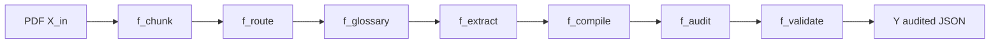
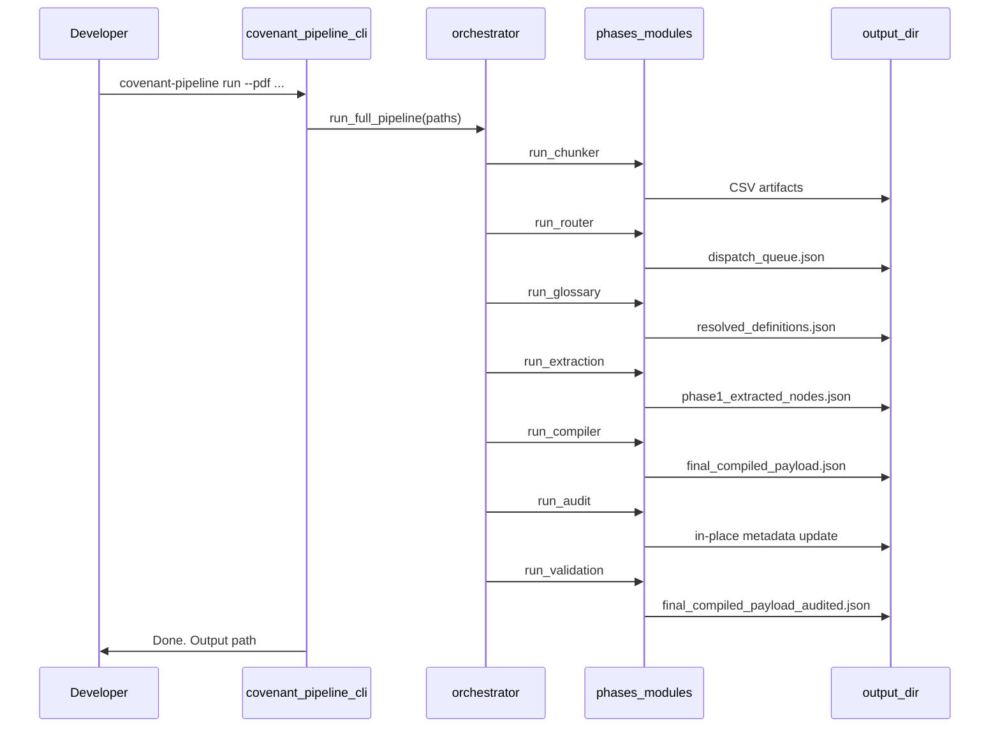

# Reading the Pipeline Code: Personal Learning Notes

Personal learning notes for reading the application layer in this repository. These notes bridge abstract theory ([Math_Application_Pipeline.md](../math/Math_Application_Pipeline.md)), operational reference ([PROJECT_DOCUMENTATION.md](../../../PROJECT_DOCUMENTATION.md)), and the infrastructure walkthrough ([Reading the Docker Code.md](Reading%20the%20Docker%20Code.md)) into a line-by-line code walkthrough of `covenant_pipeline/`.

**Audience:** You read Python comfortably; the credit-agreement extraction pipeline is new.

**Notation:** Reuses $D$, $Y$, $P$, $eval$, $\circ$ from the platform math notes. Introduces phase morphisms $f_{\text{chunk}}, f_{\text{route}}, \ldots$; Kleisli arrow $\rightsquigarrow$ for LLM stages; reference graph $G_{\text{ref}}$.

---

## Table of Contents

- [Section 0: Prelude — What Is the Application Layer?](#section-0-prelude--what-is-the-application-layer)
- [Section 1: The Pipeline as Morphism Composition](#section-1-the-pipeline-as-morphism-composition)
- [Section 2: Chunking as Spatial Coordinatization](#section-2-chunking-as-spatial-coordinatization)
- [Section 3: Routing as Characteristic-Function Filtering](#section-3-routing-as-characteristic-function-filtering)
- [Section 4: The Glossary as a Reference Graph](#section-4-the-glossary-as-a-reference-graph)
- [Section 5: Extraction as a Stochastic (Kleisli) Morphism](#section-5-extraction-as-a-stochastic-kleisli-morphism)
- [Section 6: Compilation as Fixed-Point Reference Resolution](#section-6-compilation-as-fixed-point-reference-resolution)
- [Section 7: Audit as Graph Integrity](#section-7-audit-as-graph-integrity)
- [Section 8: Validation as the Critic Morphism](#section-8-validation-as-the-critic-morphism)
- [Section 9: End-to-End Composition via the CLI](#section-9-end-to-end-composition-via-the-cli)
- [Appendix](#appendix)

---

## Section 0: Prelude — What Is the Application Layer?

### I. Mathematical Field

**Program Morphisms and Codomain Objects**

The containerization notes model Docker as constructing $Y^D$ — an exponential object that **internalizes** the program $P$ together with dependencies $D$. The application layer **is** $P$ itself: the morphism that transforms a credit agreement PDF into validated covenant JSON.

### II. English & Industry Language

The **application layer** is the Python package `covenant_pipeline/`: chunking, routing, glossary building, LLM extraction, compilation, audit, validation, and the CLI that wires them together. Docker (Phase 1 platform engineering) guarantees **where** $P$ runs; this package defines **what** $P$ does.

Running the pipeline natively:

```bash
covenant-pipeline run --pdf agreement.pdf --output-dir out/
```

Running inside Docker (see [Reading the Docker Code.md](Reading%20the%20Docker%20Code.md)):

```bash
docker compose --profile pipeline run --rm pipeline
```

Both invoke the same $P$; only $\Gamma_{\text{host}}$ vs $\Gamma_{\text{container}}$ differs.

**Package entry point** — installed via `pyproject.toml`:

```21:22:pyproject.toml
[project.scripts]
covenant-pipeline = "covenant_pipeline.cli:main"
```

### III. Rigorous Mathematical Definition

Let $X_{\text{in}}$ be the input (PDF + routing config). The full program is:

$$P : D \times X_{\text{in}} \to Y$$

where $Y$ is `final_compiled_payload_audited.json` — structured covenants, master glossary, metadata, and per-covenant validation audits.

Decomposition into phase morphisms (see [Math_Application_Pipeline.md](../math/Math_Application_Pipeline.md)):

$$P_{\text{full}} = f_{\text{validate}} \circ f_{\text{audit}} \circ f_{\text{compile}} \circ f_{\text{extract}} \circ f_{\text{glossary}} \circ f_{\text{route}} \circ f_{\text{chunk}}$$

Deterministic phases are ordinary morphisms in a category of artifacts $\mathcal{A}$. LLM phases (`extract`, `validate`) are **Kleisli arrows** $\rightsquigarrow$ — stochastic maps into schema-typed outputs.

### IV. Reading the Code

**Package layout** (from [PROJECT_DOCUMENTATION.md](../../../PROJECT_DOCUMENTATION.md)):

```
covenant_pipeline/
├── cli.py               # CLI entry: partial evaluations of P
├── config.py            # PipelinePaths — artifact namespace
├── orchestrator.py      # run_full_pipeline — full composition
├── phases/
│   ├── chunker.py       # f_chunk
│   ├── router.py        # f_route
│   ├── glossary.py      # f_glossary
│   ├── extraction.py    # f_extract (Kleisli)
│   ├── compiler.py      # f_compile
│   ├── audit.py         # f_audit
│   └── validation.py    # f_validate (Kleisli)
├── llm/                 # Gemini client, prompts, cost
├── schemas/             # Pydantic subobjects of Y
└── utils/               # io, text normalization
```

| Concern | Infrastructure (Docker doc) | Application (this doc) |
|---------|----------------------------|--------------------------|
| What runs | $Y^D$, $eval$ | $P$, $f_i$ composition |
| Input | Build context, `.env.docker` | PDF, `covenant_config.json` |
| Output | Container logs, `./data/out/` | JSON/CSV artifacts in `out/` |
| Stochastic steps | N/A | `extract`, `validate` (Gemini) |

> **Python reader:** `covenant_pipeline` is a normal installable package (`pip install -e ".[viewer]"`). The CLI is just `argparse` subcommands that call functions in `orchestrator.py` and `phases/`.

> **Gotcha:** `--skip-llm` runs only the deterministic prefix ($f_{\text{glossary}} \circ f_{\text{route}} \circ f_{\text{chunk}}$). No `final_compiled_payload_audited.json` is produced — the viewer needs a full run.

---

## Section 1: The Pipeline as Morphism Composition

### I. Mathematical Field

**Morphism Composition and Shared Object Addressing**

A pipeline is a **composed sequence** of arrows in a category of artifacts. `PipelinePaths` is a functor $\Phi : \mathcal{A} \to \mathbf{Path}$ assigning each artifact type a filesystem location. The orchestrator is the **composition operator** selecting which $f_i$ run and in what order.

### II. English & Industry Language

**Orchestrator** (`orchestrator.py`) runs stages in a fixed order and can run a single stage for debugging. **PipelinePaths** (`config.py`) centralizes every output filename so phases never hardcode paths.

Canonical stage order:

```
chunk → route → glossary → extract → compile → audit → validate
```

Glossary runs before extract (deterministic work ahead of LLM billing) but only **compile** consumes glossary output.

### III. Rigorous Mathematical Definition

Full composition:

$$P_{\text{full}} = f_{\text{validate}} \circ f_{\text{audit}} \circ f_{\text{compile}} \circ f_{\text{extract}} \circ f_{\text{glossary}} \circ f_{\text{route}} \circ f_{\text{chunk}}$$

Partial evaluation (`--skip-llm`):

$$P_{\text{det}} = f_{\text{glossary}} \circ f_{\text{route}} \circ f_{\text{chunk}}$$

Single-stage evaluation (`run_stage`):

$$f_i : X_{i-1} \to X_i$$

**Artifact namespace** — properties on `PipelinePaths`:

| Property | Filename | Stage that writes |
|----------|----------|-------------------|
| `spatial_map` | `final_spatial_map.csv` | chunk |
| `phase1_payload` | `final_extracted_covenants_phase1_payload.csv` | chunk |
| `dispatch_queue` | `dispatch_queue_output.json` | route |
| `glossary` | `resolved_definitions.json` | glossary |
| `phase1_nodes` | `phase1_extracted_nodes.json` | extract |
| `compiled` | `final_compiled_payload.json` | compile |
| `audited` | `final_compiled_payload_audited.json` | validate |

### IV. Reading the Code

**`run_full_pipeline` — composition chain**

```18:66:covenant_pipeline/orchestrator.py
def run_full_pipeline(
    paths: PipelinePaths,
    *,
    skip_llm: bool = False,
    serve_ui: bool = False,
    html_report: bool = True,
) -> Path:
    """Run all pipeline stages in order; return path to final audited JSON."""
    paths.output_dir.mkdir(parents=True, exist_ok=True)

    print("\n=== Stage: chunk ===")
    run_chunker(paths)

    print("\n=== Stage: route ===")
    run_router(paths)

    print("\n=== Stage: glossary ===")
    run_glossary(paths)

    if not skip_llm:
        print("\n=== Stage: extract ===")
        run_extraction(paths)
        # ... compile, audit, validate ...
    else:
        print("\nSkipping LLM stages (extract, compile, audit, validate) due to --skip-llm.")

    result = paths.audited if not skip_llm else paths.phase1_payload
```

Each `run_*` call is one morphism $f_i$. The `if not skip_llm` block gates the Kleisli suffix.

**`run_stage` — single morphism selection**

```69:85:covenant_pipeline/orchestrator.py
def run_stage(stage: str, paths: PipelinePaths) -> Path:
    """Run a single pipeline stage by name."""
    stages = {
        "chunk": run_chunker,
        "route": run_router,
        "extract": run_extraction,
        "glossary": run_glossary,
        "compile": run_compiler,
        "audit": run_audit,
        "validate": run_validation,
    }

    if stage not in stages:
        raise ValueError(f"Unknown stage: {stage}. Choose from: {', '.join(stages)}")

    paths.output_dir.mkdir(parents=True, exist_ok=True)
    return stages[stage](paths)
```

**`PipelinePaths` — artifact namespace**

```22:41:covenant_pipeline/config.py
@dataclass
class PipelinePaths:
    """Centralized artifact paths for all pipeline stages."""

    output_dir: Path = field(default_factory=lambda: DEFAULT_OUTPUT_DIR)
    pdf_path: Path | None = None
    routing_config_json: Path | None = None
    extraction_model: str = DEFAULT_EXTRACTION_MODEL
    rate_limit_seconds: float = DEFAULT_RATE_LIMIT_SECONDS
    enable_adversarial_test: bool = False

    spatial_map_csv: str = "final_spatial_map.csv"
    covenants_csv: str = "final_extracted_covenants.csv"
    phase1_payload_csv: str = "final_extracted_covenants_phase1_payload.csv"
    dispatch_queue_json: str = "dispatch_queue_output.json"
    phase1_nodes_json: str = "phase1_extracted_nodes.json"
    glossary_json: str = "resolved_definitions.json"
    compiled_json: str = "final_compiled_payload.json"
    audited_json: str = "final_compiled_payload_audited.json"
```

`__post_init__` resolves defaults: PDF defaults to `{output_dir}/Credit_Agreement_Hallador.pdf`, routing config to `config/covenant_config.json`.



> **Python reader:** `PipelinePaths` is a `@dataclass` — think of it as a single config object passed through every function instead of scattering path strings.

> **Gotcha:** Running `covenant-pipeline extract` without prior `route` fails — `require_file` checks that `dispatch_queue_output.json` exists.

---

## Section 2: Chunking as Spatial Coordinatization

### I. Mathematical Field

**Partial Maps, Normalization Morphisms, and Provenance Labels**

Chunking constructs a coordinatization from PDF geometry to structured rows. Printed pages $\mathcal{P}$ and absolute pages $\mathcal{A}$ are related by a partial map $\phi : \mathcal{P} \rightharpoonup \mathcal{A} \times \mathcal{A}$. Text normalization $\eta$ (whitespace collapse + lowercase) makes boundary detection invariant under EDGAR formatting.

Each chunk carries a **provenance label** $\rho$ (Article, Section, page range) that propagates unchanged through routing and extraction as `Receipt`.

### II. English & Industry Language

**Phase 0** (`phases/chunker.py`) deterministically slices a 150-page credit agreement PDF into section-level chunks. It never calls an LLM.

Four passes:

1. **TOC skeleton** — scan first 20 pages for Article/Section titles and printed page numbers
2. **Page spread map** — read footers to map printed pages to absolute PDF pages
3. **Boundary search** — find exact absolute start page for each section
4. **Extraction engine** — state machine accumulates text per section; writes Silver and Gold CSVs

**Files:** [covenant_pipeline/phases/chunker.py](../../../covenant_pipeline/phases/chunker.py), [covenant_pipeline/utils/text.py](../../../covenant_pipeline/utils/text.py)

### III. Rigorous Mathematical Definition

$$f_{\text{chunk}} : X_{\text{pdf}} \to X_{\text{payload}}$$

Intermediate: $X_{\text{spatial}}$ (`final_spatial_map.csv`, `final_extracted_covenants.csv`).

**Normalization:**

$$\eta(s) = \text{lower}(\text{regex\_replace}(\text{whitespace}, "", s))$$

**Monotonic page drop (TOC kill switch):** If parsed TOC page $p < \max_{\text{seen}} - 2$, stop scanning — prevents body-text cross-references from polluting the skeleton.

**Receipt:** $\rho(\text{chunk}) = (\text{PDF Pages}, \text{Printed Pages}, \text{Article}, \text{Section})$ — used later for validation rehydration.

### IV. Reading the Code

**Pass 1 — TOC skeleton with kill switch**

```62:70:covenant_pipeline/phases/chunker.py
    for match in matches:
        item_type = match.group("type").title().strip()
        num = match.group("num")
        title = match.group("title").replace("\n", " ").strip()
        page = int(match.group("page"))

        if page < (highest_page_seen - 2):
            print("   -> TOC boundary detected. Stopping scan.")
            break
```

**Pass 1.5 — printed $\to$ absolute page spread**

```106:130:covenant_pipeline/phases/chunker.py
    for page_num in range(10, len(doc)):
        absolute_page = page_num + 1
        lines = doc[page_num].get_text("text").split("\n")

        for line in reversed(lines):
            # ... footer_pattern matches "CREDIT AGREEMENT - Page N"
            if match:
                printed_page = int(match.group(1))
                if not any(d["Printed_Page"] == printed_page for d in spread_data):
                    absolute_start = last_known_end + 1
                    spread_data.append({...})
```

**Pass 2 — compressed boundary match**

```173:177:covenant_pipeline/phases/chunker.py
            for line in lines:
                target_compressed = section_target.replace(" ", "").lower()
                line_compressed = re.sub(r"\s+", "", line).lower()

                if target_compressed in line_compressed:
```

Same idea as `compress_string` — zero-trust matching against EDGAR kerning.

**`compress_string` — shared normalization**

```8:15:covenant_pipeline/utils/text.py
def compress_string(text: str) -> str:
    """
    Aggressively strips all whitespace, newlines, and lowercases the string.
    Neutralizes EDGAR formatting artifacts for deterministic boundary detection.
    """
    if pd.isna(text):
        return ""
    return re.sub(r"\s+", "", str(text)).lower()
```

**`run_chunker` — orchestrates all passes**

```283:302:covenant_pipeline/phases/chunker.py
def run_chunker(paths: PipelinePaths) -> Path:
    """Run Phase 0: TOC skeleton, page spread, boundaries, and extraction."""
    require_file(paths.pdf_path, "PDF file")

    skeleton_df = build_simplified_skeleton(paths.pdf_path)
    page_spread_dictionary = build_page_spread_map(paths.pdf_path)

    final_mapping_df = calculate_exact_boundaries(
        paths.pdf_path,
        skeleton_df,
        page_spread_dictionary,
        paths.spatial_map,
    )

    return run_extraction_engine(
        paths.pdf_path,
        final_mapping_df,
        paths.covenants,
        paths.phase1_payload,
    )
```

> **Python reader:** `fitz` is PyMuPDF — `doc[page_num].get_text("text")` pulls plain text from a PDF page. Chunking is pure Python + Pandas; no ML.

> **Gotcha:** Printed page numbers in footers do not equal absolute PDF page indices. The page spread map exists because EDGAR HTML-to-PDF treats text as a continuous ribbon.

---

## Section 3: Routing as Characteristic-Function Filtering

### I. Mathematical Field

**Characteristic Functions and Singleton-Fiber Selection**

For chunk set $C$ and rule $r$, define binary characteristic functions $\chi_{\text{zone}}^r, \chi_{\text{trigger}}^r, \chi_{\text{body}}^r, \chi_{\text{density}}^r : C \to \{0,1\}$. The surviving set $S_r = \{ c : \prod_i \chi_i^r(c) = 1 \}$. Tier 1 dispatch requires $|S_r| = 1$ — **singleton-fiber selection**.

### II. English & Industry Language

**Tier 1 Router** (`phases/router.py`) filters the phase 1 payload CSV into LLM **extraction envelopes** — one isolated text block per covenant agent. Rules live in `config/covenant_config.json` (not hardcoded in Python).

Four gates per rule:

| Gate | Column | Logic |
|------|--------|-------|
| Zone | `Article_Title` | Must contain a `valid_zones` substring |
| Section | `Section_Title` | Must match `section_title_triggers` regex |
| Body | `Raw_Text` | Must not match blacklist (`intentionally omitted`, etc.) |
| Density | `Raw_Text` | Length > 150 characters |

Exactly one surviving chunk $\Rightarrow$ envelope appended to `dispatch_queue_output.json`. Zero or multiple $\Rightarrow$ log and skip (Tier 2 not implemented).

### III. Rigorous Mathematical Definition

$$f_{\text{route}} : X_{\text{payload}} \times \Sigma_{\text{rules}} \to X_{\text{dispatch}}$$

Rules are evaluated **independently** — one chunk may satisfy multiple rules (fiber product, not partition).

Envelope structure is a morphism into the dispatch object:

$$\text{envelope} : S_r \hookrightarrow X_{\text{dispatch}}, \quad |S_r| = 1$$

### IV. Reading the Code

**Routing config — externalized rules**

```1:8:config/covenant_config.json
{
  "routing_rules": [
    {
      "target_name": "TotalLeverageRatio",
      "description": "Maximum consolidated leverage ratio covenant and any step-down schedules.",
      "valid_zones": ["NEGATIVE COVENANTS", "FINANCIAL COVENANTS"],
      "section_title_triggers": ["Total Leverage Ratio", "Consolidated Leverage", "Leverage Ratio"]
    },
```

**Four-mask filter**

```58:78:covenant_pipeline/phases/router.py
        for rule in self.rules:
            target = rule["target_name"]
            description = rule.get("description", "")

            zone_mask = df["Article_Title"].str.upper().apply(
                lambda article: any(zone.upper() in article for zone in rule["valid_zones"])
            )

            regex_pattern = "|".join(rule["section_title_triggers"])
            trigger_mask = df["Section_Title"].str.contains(
                regex_pattern, flags=re.IGNORECASE, regex=True
            )

            blacklist_pattern = "intentionally omitted|left blank|reserved"
            body_mask = ~df["Raw_Text"].str.contains(
                blacklist_pattern, flags=re.IGNORECASE, regex=True
            )

            density_mask = df["Raw_Text"].str.len() > 150

            surviving_chunks = df[zone_mask & trigger_mask & body_mask & density_mask]
```

**Singleton-fiber dispatch**

```80:89:covenant_pipeline/phases/router.py
            if len(surviving_chunks) == 1:
                row = surviving_chunks.iloc[0]
                envelope = self._build_dispatch_envelope(target, description, row)
                dispatch_queue.append(envelope)

            elif len(surviving_chunks) == 0:
                print(f"[{target}] Tier 1 Failed (0 chunks). Cascading to Tier 2 Vector Search...")

            else:
                print(f"[{target}] Tier 1 Ambiguity ({len(surviving_chunks)} chunks). Cascading to Tier 2 Vector Search...")
```

**Envelope with Receipt $\rho$**

```38:52:covenant_pipeline/phases/router.py
    def _build_dispatch_envelope(self, target_name: str, description: str, row: pd.Series) -> Dict[str, Any]:
        detailed_receipt = (
            f"PDF Pages {row.get('Absolute_Start_Page', 'N/A')}-{row.get('Absolute_End_Page', 'N/A')} "
            f"(Printed Pages {row.get('Printed_Start_Page', 'N/A')}-{row.get('Printed_End_Page', 'N/A')}) | "
            f"{row.get('Article', 'N/A')}: {row.get('Article_Title', 'N/A')} | "
            f"{row.get('Section', 'N/A')}: {row.get('Section_Title', 'Unknown Section')}"
        )

        return {
            "Agent": target_name,
            "Schema": f"{target_name}Schema",
            "Definition_Guardrail": description,
            "Receipt": detailed_receipt,
            "Payload_Text": row.get("Raw_Text", ""),
        }
```

> **Python reader:** Pandas boolean masks with `&` are element-wise AND across rows — vectorized filtering without Python loops over chunks.

> **Gotcha:** Tier 2 log messages are placeholders. Failed routes produce **no envelope** — that covenant is silently skipped in extraction.

---

## Section 4: The Glossary as a Reference Graph

### I. Mathematical Field

**Directed Graphs and Prefix-Free Edge Detection**

Glossary construction builds $G_{\text{ref}} = (V, E)$ where vertices are defined terms and $(u,v) \in E$ if $u$'s definition text contains $v$ at a word boundary. Terms are sorted by length descending before edge detection — a **prefix-free resolution order** preventing shorter terms from matching inside longer composite names.

### II. English & Industry Language

**Phase 2a Glossary** (`phases/glossary.py`) extracts every `"Term" means ...` definition from Article 1 using regex — zero API cost. Output: `resolved_definitions.json` with `raw_definition_text` and `nested_references` per term.

Runs after route, before extract. Extract does not read the glossary, but compile requires it.

### III. Rigorous Mathematical Definition

$$f_{\text{glossary}} : X_{\text{payload}} \to X_{\text{glossary}}$$

Restriction to Article 1 rows:

$$\pi_{\text{Art1}} : X_{\text{payload}} \twoheadrightarrow \text{Text}_{\text{Art1}}$$

Edge detection for term $t$ with definition text $d_t$:

$$E(t) = \{ t' \in V \setminus \{t\} \mid \text{word\_boundary}(d_t, t') \}$$

### IV. Reading the Code

**Definition sweep regex**

```19:29:covenant_pipeline/phases/glossary.py
    pattern = r'[""“”]([^""“”]+)[""“”]\s*(?:of\s+a\s+Person)?\s*means'
    matches = list(re.finditer(pattern, article_1_text, re.IGNORECASE))

    raw_glossary = {}

    for i, match in enumerate(matches):
        term = match.group(1).strip()
        start_idx = match.start()
        end_idx = matches[i + 1].start() if i + 1 < len(matches) else len(article_1_text)
        raw_definition_text = article_1_text[start_idx:end_idx].strip()
        raw_glossary[term] = raw_definition_text
```

**Length-descending sort for nested reference mapping**

```34:52:covenant_pipeline/phases/glossary.py
    all_terms = list(raw_glossary.keys())
    all_terms.sort(key=len, reverse=True)

    print("  -> Executing deterministic reference mapping...")
    for term, text in raw_glossary.items():
        nested_refs = set()

        for potential_target in all_terms:
            if potential_target == term:
                continue

            escape_term = re.escape(potential_target)
            if re.search(rf"\b{escape_term}\b", text):
                nested_refs.add(potential_target)

        final_glossary[term] = {
            "raw_definition_text": text,
            "nested_references": list(nested_refs),
        }
```

**`run_glossary` — filter Article 1 from CSV**

```57:64:covenant_pipeline/phases/glossary.py
def run_glossary(paths: PipelinePaths) -> Path:
    """Build glossary from Article 1 sections in the phase 1 payload CSV."""
    require_file(paths.phase1_payload, "Phase 1 payload CSV")

    df = pd.read_csv(paths.phase1_payload)
    article_1_df = df[df["Article"].astype(str).str.contains("Article 1", case=False, na=False)]
    real_article_1_text = " ".join(article_1_df["Raw_Text"].dropna().tolist())
```

> **Python reader:** `\b` in regex is a word boundary — prevents matching `"Debt"` inside `"Consolidated Debt"`.

> **Gotcha:** Glossary quality depends on chunker correctly isolating Article 1. If chunk boundaries are wrong, definitions are truncated or merged.

---

## Section 5: Extraction as a Stochastic (Kleisli) Morphism

### I. Mathematical Field

**Kleisli Category and Schema Subobjects**

LLM extraction is a Kleisli arrow:

$$f_{\text{extract}} : X_{\text{dispatch}} \rightsquigarrow X_{\text{nodes}}$$

Pydantic schemas define **subobjects** $S_{\text{agent}} \subset Y$ — the typed codomain each agent must land in. `SCHEMA_ROUTER` is the agent $\to$ subobject classifier.

Reference tags `[$REF: Term]` are **free variables** — unresolved until $f_{\text{compile}}$.

### II. English & Industry Language

**Phase 1 Extraction** (`phases/extraction.py`) iterates the dispatch queue, calls Gemini with `temperature=0.0`, and constrains output to a Pydantic JSON schema per agent. Each result includes `Receipt`, `Agent`, `Extracted_Data`, and `Cost_Metrics`.

Supporting modules:

| Module | Role |
|--------|------|
| `llm/client.py` | `GEMINI_API_KEY` from `.env` |
| `llm/prompts.py` | `MASTER_SYSTEM_PROMPT` |
| `llm/cost.py` | Token cost from `usage_metadata` |
| `schemas/covenants.py` | `SCHEMA_ROUTER` + per-agent models |

### III. Rigorous Mathematical Definition

For envelope $e$ with agent $a$:

$$f_{\text{extract}}(e) \in T(S_a)$$

where $T$ is the stochastic monad (API may fail; output is schema-validated with probability $\approx 1$ at $T=0$).

**Missing variable protocol:** unknown capitalized terms $\mapsto$ `[$REF: Exact Term Name]` — elements of a free algebra over term names, resolved in Section 6.

### IV. Reading the Code

**Main extraction loop**

```28:57:covenant_pipeline/phases/extraction.py
    for index, envelope in enumerate(dispatch_queue):
        agent_name = envelope.get("Agent")

        if agent_name not in SCHEMA_ROUTER:
            print(f"[{index}] Skipping {agent_name}... Schema not yet built.")
            continue

        print(f"[{index}] Processing Envelope: {agent_name}")
        print(f"    Receipt: {envelope.get('Receipt')}")

        target_schema = SCHEMA_ROUTER[agent_name]
        raw_text = envelope.get("Payload_Text", "")
        clean_text = raw_text.replace("\n", " ").replace("\xa0", " ")

        formatted_prompt = MASTER_SYSTEM_PROMPT.format(
            agent_name=agent_name,
            guardrail=envelope.get("Definition_Guardrail", ""),
            payload_text=clean_text,
        )

        try:
            response = client.models.generate_content(
                model=paths.extraction_model,
                contents=formatted_prompt,
                config={
                    "response_mime_type": "application/json",
                    "response_schema": target_schema,
                    "temperature": 0.0,
                },
            )
```

**`SCHEMA_ROUTER` — agent $\to$ subobject**

```126:136:covenant_pipeline/schemas/covenants.py
SCHEMA_ROUTER = {
    "TotalLeverageRatio": TotalLeverageIntermediate,
    "FixedChargeCoverageRatio": FixedChargeIntermediate,
    "CapitalExpenditures": CapExIntermediate,
    "RestrictedPayments": RestrictedPaymentsIntermediate,
    "InvestmentsAndAcquisitions": InvestmentsIntermediate,
    "DebtIncurrence": DebtIntermediate,
    "ReportingRequirements": ReportingIntermediate,
    "LimitationOnLiens": LiensIntermediate,
    "MergersAndConsolidations": MergersIntermediate,
}
```

**Base schema fields — false-flag escape hatch**

```17:22:covenant_pipeline/schemas/covenants.py
class TotalLeverageIntermediate(BaseModel):
    is_false_flag: bool = Field(...)
    false_flag_reason: Optional[str] = Field(None)
    is_applicable: bool = Field(...)
    static_ratio_limit: Optional[Union[float, str]] = Field(None)
    step_downs: Optional[List[LeverageStepDown]] = Field(None)
```

`Union[float, str]` allows numeric limits **or** `[$REF: ...]` tags.

**Gemini client — requires `GEMINI_API_KEY`**

```22:32:covenant_pipeline/llm/client.py
def get_client() -> genai.Client:
    """Initialize GenAI client using GEMINI_API_KEY from the environment."""
    _ensure_env_loaded()
    api_key = os.environ.get("GEMINI_API_KEY")
    if not api_key:
        raise EnvironmentError(
            "GEMINI_API_KEY is required for LLM stages (extract, validate). "
            "Copy .env.example to .env in the project root and set your key, "
            "or export GEMINI_API_KEY in your shell."
        )
    return genai.Client(api_key=api_key)
```

**Cost tracking**

```6:14:covenant_pipeline/llm/cost.py
def calculate_api_cost(usage_metadata) -> dict:
    """Calculate cost based on Gemini 3.1 Flash-Lite rates."""
    input_tokens = usage_metadata.prompt_token_count
    output_tokens = usage_metadata.candidates_token_count
    total_tokens = usage_metadata.total_token_count

    input_cost = (input_tokens / 1_000_000) * INPUT_PRICE_PER_MILLION
    output_cost = (output_tokens / 1_000_000) * OUTPUT_PRICE_PER_MILLION
```

Rates are constants in `config.py`: `INPUT_PRICE_PER_MILLION = 0.25`, `OUTPUT_PRICE_PER_MILLION = 1.50`.

**Rate limiting between Kleisli calls**

```82:82:covenant_pipeline/phases/extraction.py
        time.sleep(paths.rate_limit_seconds)
```

> **Python reader:** `response_schema=target_schema` tells Gemini to return JSON matching the Pydantic model — like `json.loads` + validation in one API call.

> **Gotcha:** Sequential `for` loop + `time.sleep(2)` is a PoC RPM guard. Empty dispatch queue $\Rightarrow$ no `phase1_extracted_nodes.json` written.

---

## Section 6: Compilation as Fixed-Point Reference Resolution

### I. Mathematical Field

**Resolution Operators and Monotone Glossary Growth**

The compiler applies a resolution operator $R : \mathcal{T} \to \mathcal{T}$ across all `[$REF: $\cdot$]` leaves in the JSON tree. Glossary map $G$ grows **monotonically** when TOC sections are dynamically injected. `_traverse_and_mutate` is an endofunctor on the JSON tree.

### II. English & Industry Language

**Phase 2b Compiler** (`phases/compiler.py`) — `MultiHopRelationalCompiler` resolves `[$REF: Term]` tags from Phase 1 extraction against the Phase 2 glossary and document TOC. Five-hop fallback: exact glossary $\to$ exact TOC $\to$ fuzzy TOC $\to$ plural strip $\to$ fuzzy glossary $\to$ dangling pointer.

Output: `final_compiled_payload.json` with `Document_Metadata`, `Phase1_Extracted_Covenants`, `Phase2_Master_Glossary`.

### III. Rigorous Mathematical Definition

$$f_{\text{compile}} : X_{\text{nodes}} \times X_{\text{glossary}} \times X_{\text{payload}} \to X_{\text{compiled}}$$

Resolution chain for term $\tau$:

$$R(\tau) = \begin{cases}
\tau & \text{if } \tau \in \text{keys}(G) \\
\text{inject}_{\text{TOC}}(\tau) & \text{if exact/fuzzy TOC match} \\
R_{\text{plural}}(\tau) & \text{if strip trailing } s \\
\text{fuzzy}_G(\tau) & \text{if close glossary match} \\
\tau & \text{else (dangling)}
\end{cases}$$

### IV. Reading the Code

**Five-hop `_resolve_term`**

```63:105:covenant_pipeline/phases/compiler.py
    def _resolve_term(self, raw_term: str) -> str:
        clean_term = raw_term.strip()
        lower_term = clean_term.lower()

        if clean_term in self.glossary_keys:
            return clean_term

        if lower_term in self.toc_routing_index:
            print(f"  [Multi-Hop] Injected external section into Glossary: '[$REF: {raw_term}]'")
            self.master_glossary[clean_term] = {
                "raw_definition_text": self.toc_routing_index[lower_term]["extracted_text"],
                "nested_references": [],
            }
            self.glossary_keys.append(clean_term)
            return clean_term

        toc_keys = list(self.toc_routing_index.keys())
        toc_matches = difflib.get_close_matches(lower_term, toc_keys, n=1, cutoff=0.85)
        # ... fuzzy TOC injection ...

        base_term = clean_term[:-1] if lower_term.endswith("s") else clean_term
        if base_term in self.glossary_keys:
            print(f"  [Linker] Fixed Plural: '[$REF: {raw_term}]' -> '[$REF: {base_term}]'")
            return base_term

        close_matches = difflib.get_close_matches(clean_term, self.glossary_keys, n=1, cutoff=0.8)
        if close_matches:
            best_match = close_matches[0]
            print(f"  [Linker] Fuzzy Matched: '[$REF: {raw_term}]' -> '[$REF: {best_match}]'")
            return best_match

        self.dangling_pointers.add(raw_term)
        print(f"  [WARNING] Dangling Pointer: Could not link '[$REF: {raw_term}]'")
        return raw_term
```

**Recursive tree traversal**

```115:127:covenant_pipeline/phases/compiler.py
    def _traverse_and_mutate(self, node: Any):
        if isinstance(node, dict):
            for key, value in node.items():
                if isinstance(value, str):
                    node[key] = self._process_string(value)
                else:
                    self._traverse_and_mutate(value)
        elif isinstance(node, list):
            for i, value in enumerate(node):
                if isinstance(value, str):
                    node[i] = self._process_string(value)
                else:
                    self._traverse_and_mutate(value)
```

**`run_compiler` entry**

```158:172:covenant_pipeline/phases/compiler.py
def run_compiler(paths: PipelinePaths) -> Path:
    """Run relational compiler and write compiled payload."""
    require_file(paths.glossary, "Glossary JSON")
    require_file(paths.phase1_payload, "Phase 1 payload CSV")
    require_file(paths.phase1_nodes, "Phase 1 extracted nodes JSON")

    compiler = MultiHopRelationalCompiler(
        phase2_glossary_path=paths.glossary,
        document_chunks_csv_path=paths.phase1_payload,
    )
    compiler.compile(
        phase1_data_path=paths.phase1_nodes,
        output_path=paths.compiled,
    )
    return paths.compiled
```

> **Python reader:** `difflib.get_close_matches` is fuzzy string matching — handles LLM pluralization (`Acquisitions` vs `Acquisition`).

> **Gotcha:** Dynamic TOC injection **mutates** `master_glossary` during compile. Dangling pointers are logged but do not abort — audit catches them in Section 7.

---

## Section 7: Audit as Graph Integrity

### I. Mathematical Field

**Endomorphisms and Graph Predicates**

Audit is an endomorphism on the compiled payload:

$$f_{\text{audit}} : X_{\text{compiled}} \to X_{\text{compiled}}$$

Three predicates on $G_{\text{ref}}$ and covenant JSON:

1. **Acyclicity** — DFS cycle detection on `nested_references`
2. **Pointer closure** — every `[$REF: t]` satisfies $t \in \text{keys}(G)$
3. **Type safety** — keys containing `"limit"` map to $\mathbb{R}$

Fails **soft** — warnings appended to `Document_Metadata`; payload still written.

### II. English & Industry Language

**Phase 3a Audit** (`phases/audit.py`) runs three sequential checks on `final_compiled_payload.json` and updates the file **in place**. No LLM. No separate output file.

### III. Rigorous Mathematical Definition

$$f_{\text{audit}}(x) = x' \text{ where } x'.\text{Warnings} = (W_{\text{cycle}}, W_{\text{dangle}}, W_{\text{type}})$$

Cycle detection: DFS with `current_path` set — if $v$ revisited in path, record loop.

### IV. Reading the Code

**Circular reference DFS**

```44:57:covenant_pipeline/phases/audit.py
    def dfs(current_term, current_path):
        if current_term not in glossary:
            return

        if current_term in global_visited:
            return

        for nested_term in glossary[current_term].get("nested_references", []):
            if nested_term in current_path:
                loop_idx = current_path.index(nested_term)
                loop = current_path[loop_idx:] + [nested_term]
                circular_loops.add(" -> ".join(loop))
            else:
                dfs(nested_term, current_path + [nested_term])

        global_visited.add(current_term)
```

**Dangling pointer sweep**

```79:91:covenant_pipeline/phases/audit.py
    def find_pointers(node):
        if isinstance(node, dict):
            for value in node.values():
                find_pointers(value)
        elif isinstance(node, list):
            for item in node:
                find_pointers(item)
        elif isinstance(node, str):
            for match in ref_pattern.findall(node):
                pointer_count["checked"] += 1
                if match not in glossary:
                    warnings["Dangling_Pointers"].append(match)
```

**Numeric type validation**

```103:110:covenant_pipeline/phases/audit.py
    for cov in covenants:
        data = cov.get("Extracted_Data", {})
        for key, value in data.items():
            if "limit" in key and value is not None:
                if not isinstance(value, (int, float)):
                    warnings["Type_Violations"].append(
                        f"{cov.get('Agent')} -> {key} is a {type(value).__name__} (Expected int/float)"
                    )
```

**In-place metadata update**

```118:123:covenant_pipeline/phases/audit.py
    total_warnings = sum(len(v) for v in warnings.values())
    payload["Document_Metadata"]["Audit_Status"] = "Clean" if total_warnings == 0 else "Warnings_Detected"
    payload["Document_Metadata"]["Warnings"] = warnings

    with open(payload_path, "w", encoding="utf-8") as out:
        json.dump(payload, out, indent=2)
```

> **Python reader:** Audit mutates the same JSON file it reads — unlike validate, which writes a new `audited` file.

> **Gotcha:** `[$REF: Term]` strings that failed compilation still appear in covenant JSON — audit flags them as dangling if `Term` is not a glossary key.

---

## Section 8: Validation as the Critic Morphism

### I. Mathematical Field

**Actor-Critic and Pullback over Source Text**

- **Actor:** $f_{\text{extract}}$ — generates `Extracted_Data` from source text
- **Critic:** $f_{\text{validate}} : X_{\text{compiled}} \times X_{\text{payload}} \rightsquigarrow Y$ — compares extraction to rehydrated source

Rehydration builds join $h : \text{Receipt} \to \text{Raw\_Text}$ from CSV. Critic output is **appended** as `Validation_Audit` — actor data is not overwritten.

### II. English & Industry Language

**Phase 3b Validation** (`phases/validation.py`) — LLM-as-a-Judge using `AUDITOR_SYSTEM_PROMPT`. For each covenant, rehydrates original `Raw_Text` from the phase 1 CSV via receipt string matching, then asks Gemini whether `Extracted_Data` matches the source.

`--adversarial` enables `apply_chaos_injection` — corrupts known fields to test detection (non-production).

### III. Rigorous Mathematical Definition

$$f_{\text{validate}} = \text{append}_{\text{audit}} \circ f_{\text{critic}} \circ (h \times \text{id})$$

where $h$ is the rehydration morphism and $\text{append}_{\text{audit}}$ adds `Validation_Audit` without changing `Extracted_Data`.

Output codomain $Y$ = `final_compiled_payload_audited.json`.

### IV. Reading the Code

**Rehydration join**

```36:54:covenant_pipeline/phases/validation.py
def build_rehydration_db(df_raw: pd.DataFrame) -> Dict[str, str]:
    if df_raw.empty:
        return {}

    def build_receipt_string(row):
        return (
            f"PDF Pages {row['Absolute_Start_Page']}-{row['Absolute_End_Page']} "
            f"(Printed Pages {row['Printed_Start_Page']}-{row['Printed_End_Page']}) | "
            f"{row['Article']}: {row['Article_Title']} | "
            f"{row['Section']}: {row['Section_Title']}"
        )

    df_raw = df_raw.copy()
    df_raw["Reconstructed_Receipt"] = df_raw.apply(build_receipt_string, axis=1)
    df_raw["Reconstructed_Receipt"] = (
        df_raw["Reconstructed_Receipt"].astype(str).str.strip().str.replace(r"\s+", " ", regex=True)
    )

    return dict(zip(df_raw["Reconstructed_Receipt"], df_raw["Raw_Text"]))
```

Receipt format must match router's `_build_dispatch_envelope` — same $\rho$ string.

**Critic LLM call**

```86:107:covenant_pipeline/phases/validation.py
def execute_llm_audit(
    client: genai.Client, raw_text: str, data_to_audit: Dict[str, Any], model: str
) -> Tuple[Dict[str, Any], float]:
    formatted_prompt = AUDITOR_SYSTEM_PROMPT.format(
        raw_text=str(raw_text).replace("\n", " ").replace("\xa0", " "),
        json_payload=json.dumps(data_to_audit, indent=2),
    )

    response = client.models.generate_content(
        model=model,
        contents=formatted_prompt,
        config={
            "response_mime_type": "application/json",
            "response_schema": ValidationAudit,
            "temperature": 0.0,
        },
    )

    audit_result = response.parsed.model_dump()
    cost_metrics = calculate_api_cost(response.usage_metadata)

    return audit_result, cost_metrics["total_cost_usd"]
```

**`ValidationAudit` schema**

```8:26:covenant_pipeline/schemas/validation.py
class ValidationAudit(BaseModel):
    """Schema for the Node L LLM-as-a-Judge output."""

    is_verified: bool = Field(
        ...,
        description="True ONLY if every numerical value and [$REF] tag perfectly matches the source text.",
    )
    confidence_score: float = Field(
        ...,
        description="A DATA FIDELITY SCORE from 0.0 to 1.0.",
    )
    requires_human_context: bool = Field(
        ...,
        description="True if the source text is inherently ambiguous, contradictory, or relies on an external schedule not present in the text.",
    )
    flagged_discrepancies: Optional[List[str]] = Field(
        None,
        description="If is_verified is False, provide a detailed list explaining exactly which keys failed and why.",
    )
```

**Non-destructive append in validation loop**

```166:169:covenant_pipeline/phases/validation.py
        try:
            audit_result, call_cost = execute_llm_audit(client, raw_text, data_to_audit, model)
            total_audit_cost += call_cost
            covenant_node["Validation_Audit"] = audit_result
```

Writes separate audited file:

```187:188:covenant_pipeline/phases/validation.py
    with open(output_path, "w", encoding="utf-8") as outfile:
        json.dump(compiled_data, outfile, indent=4)
```

> **Python reader:** Actor-critic here means two different LLM calls with different prompts — extract **generates**, validate **judges**. Pydantic audit (Section 7) is the deterministic compiler gate between them.

> **Gotcha:** Rehydration fails if receipt strings don't match exactly (whitespace, page numbers). Failed join sets `requires_human_context: true` with a pipeline error message.

---

## Section 9: End-to-End Composition via the CLI

### I. Mathematical Field

**Partial Evaluation and the Deterministic–Stochastic Boundary**

The CLI exposes **partial evaluations** of $P$: each subcommand applies one or more $f_i$. The `--skip-llm` flag truncates composition before the Kleisli suffix.

### II. English & Industry Language

**CLI** (`covenant_pipeline/cli.py`) — installed as `covenant-pipeline`. Subcommands mirror pipeline stages. `run` invokes `run_full_pipeline`; individual stages (`chunk`, `route`, …) invoke `run_stage`.

Typical workflows:

```bash
# Full pipeline
covenant-pipeline run --pdf agreement.pdf --output-dir out/

# Deterministic only (no API key)
covenant-pipeline run --pdf agreement.pdf --skip-llm

# Debug single stage
covenant-pipeline route --output-dir out/

# Re-run validation only
covenant-pipeline validate --output-dir out/
```

### III. Rigorous Mathematical Definition

| CLI command | Morphism |
|-------------|----------|
| `run` | $P_{\text{full}}$ or $P_{\text{det}}$ |
| `chunk` | $f_{\text{chunk}}$ |
| `route` | $f_{\text{route}}$ |
| `glossary` | $f_{\text{glossary}}$ |
| `extract` | $f_{\text{extract}}$ |
| `compile` | $f_{\text{compile}}$ |
| `audit` | $f_{\text{audit}}$ |
| `validate` | $f_{\text{validate}}$ |

Deterministic–stochastic boundary:

$$P_{\text{det}} = f_{\text{glossary}} \circ f_{\text{route}} \circ f_{\text{chunk}}$$

$$P_{\text{stoch}} = f_{\text{validate}} \circ f_{\text{audit}} \circ f_{\text{compile}} \circ f_{\text{extract}}$$

### IV. Reading the Code

**Subcommand registration**

```58:80:covenant_pipeline/cli.py
    run_parser = subparsers.add_parser("run", help="Run the full pipeline")
    _add_common_args(run_parser)
    run_parser.add_argument("--pdf", help="Path to source PDF")
    run_parser.add_argument(
        "--skip-llm",
        action="store_true",
        help="Run deterministic stages only (chunk, route, glossary)",
    )
    run_parser.add_argument(
        "--adversarial",
        action="store_true",
        help="Enable chaos injection during validation (non-production)",
    )
    run_parser.add_argument(
        "--serve-ui",
        action="store_true",
        help="Launch the Covenant Viewer after the pipeline completes",
    )
    run_parser.add_argument(
        "--no-html-report",
        action="store_true",
        help="Skip generating covenant_audit_report.html after validation",
    )
```

**Dispatch to orchestrator**

```134:148:covenant_pipeline/cli.py
    try:
        if args.command == "run":
            result = run_full_pipeline(
                paths,
                skip_llm=args.skip_llm,
                serve_ui=getattr(args, "serve_ui", False),
                html_report=not getattr(args, "no_html_report", False),
            )
        elif args.command == "report":
            result = generate_html_report(paths)
        elif args.command == "serve":
            launch_dev(paths, open_browser=not args.no_browser)
            result = paths.audited
        else:
            result = run_stage(args.command, paths)
```



**Step-by-step with files**

| Step | Command | Primary files |
|------|---------|---------------|
| 1. Chunk | `covenant-pipeline chunk --pdf ...` | `phases/chunker.py`, `utils/text.py` |
| 2. Route | `covenant-pipeline route` | `phases/router.py`, `config/covenant_config.json` |
| 3. Glossary | `covenant-pipeline glossary` | `phases/glossary.py` |
| 4. Extract | `covenant-pipeline extract` | `phases/extraction.py`, `schemas/`, `llm/` |
| 5. Compile | `covenant-pipeline compile` | `phases/compiler.py` |
| 6. Audit | `covenant-pipeline audit` | `phases/audit.py` |
| 7. Validate | `covenant-pipeline validate` | `phases/validation.py` |
| Full | `covenant-pipeline run --pdf ...` | `orchestrator.py`, `cli.py` |

> **Gotcha:** `serve` and `report` subcommands exist in CLI but are outside this doc's scope (viewer/report modules). They still use `PipelinePaths` for artifact resolution.

---

## Appendix

### A. Quick Reference: Code Concept → Math → This Repo

| Code concept | Math concept | Where in this repo |
|--------------|--------------|-------------------|
| `run_full_pipeline` | $P = f_n \circ \cdots \circ f_1$ | `orchestrator.py:18-66` |
| `run_stage` | Single $f_i$ | `orchestrator.py:69-85` |
| `PipelinePaths` | Functor $\Phi : \mathcal{A} \to \mathbf{Path}$ | `config.py:22-91` |
| `run_chunker` | $f_{\text{chunk}} : X_{\text{pdf}} \to X_{\text{payload}}$ | `phases/chunker.py:283-302` |
| `compress_string` | Normalization $\eta$ | `utils/text.py:8-15` |
| Boolean masks | Characteristic functions $\chi$ | `phases/router.py:62-78` |
| `len(surviving_chunks) == 1` | Singleton-fiber selection $|S_r|=1$ | `phases/router.py:80-83` |
| `nested_references` | Edges in $G_{\text{ref}}$ | `phases/glossary.py:49-51` |
| `SCHEMA_ROUTER` | Agent $\to$ subobject $S_a$ | `schemas/covenants.py:126-136` |
| `generate_content` + schema | Kleisli arrow $\rightsquigarrow$ | `phases/extraction.py:49-57` |
| `_resolve_term` | Resolution operator $R$ | `phases/compiler.py:63-105` |
| `_traverse_and_mutate` | Endofunctor on JSON tree | `phases/compiler.py:115-127` |
| DFS in audit | Cycle detection on $G_{\text{ref}}$ | `phases/audit.py:44-57` |
| `build_rehydration_db` | Join $h : \text{Receipt} \to \text{Text}$ | `phases/validation.py:36-54` |
| `Validation_Audit` | Critic fiber (non-destructive) | `phases/validation.py:169` |
| `--skip-llm` | Partial composition $P_{\text{det}}$ | `orchestrator.py:37-56`, `cli.py:62-65` |

### B. Which Sections Matter Most for a Python Reader

If the pipeline is new, read in this order:

1. **Section 1 (Composition)** — how `PipelinePaths` and `orchestrator.py` wire stages
2. **Section 3 (Routing)** — why envelopes exist and what `Receipt` means
3. **Section 5 (Extraction)** — schemas, Gemini, and `[$REF:]` tags
4. **Section 6 (Compiler)** — how references get resolved
5. **Section 9 (CLI)** — how to run and debug stages

Sections 0, 2, 4, 7, 8 fill in theory and edge cases. Section 2 is essential when chunk boundaries look wrong.

### C. Related Documents

| Document | Purpose |
|----------|---------|
| [Math_Application_Pipeline.md](../math/Math_Application_Pipeline.md) | Category-theoretic foundations of $P$ and phase composition |
| [Math_Containerization.md](../../../../notes/math/Math_Containerization.md) | $Y^D$, $eval$, internalization |
| [Reading the Docker Code.md](Reading%20the%20Docker%20Code.md) | Infrastructure layer walkthrough |
| [PROJECT_DOCUMENTATION.md](../../../PROJECT_DOCUMENTATION.md) | Operational architecture reference |
| [PE_Roadmap_1.md](../PE_Roadmap_1.md) | Phases 1–4 overview |
| [Docker_Documentation.md](../../../Docker_Documentation.md) | Container ops manual |

### D. Application ↔ Infrastructure Concept Map

| Application concept | Infrastructure analogue (Docker doc) |
|---------------------|--------------------------------------|
| `covenant-pipeline run` | `docker compose --profile pipeline run` |
| `out/` artifacts | `./data/out/` volume mount |
| `GEMINI_API_KEY` in `.env` | `GEMINI_API_KEY` in `.env.docker` |
| `PipelinePaths.output_dir` | `COVENANT_OUTPUT_DIR` env var |
| Program morphism $P$ | Image contents inside $Y^D$ |
| `run_full_pipeline()` | Dockerfile `CMD` / pipeline `entrypoint` |
| Phase CSV/JSON files | Persistent state $S$ on volume |
| `--skip-llm` | Partial eval without critic/actor LLM |

### E. Deterministic vs Stochastic Phase Boundary

| Phase | Type | API key required? |
|-------|------|-----------------|
| chunk | Deterministic | No |
| route | Deterministic | No |
| glossary | Deterministic | No |
| extract | Kleisli (Gemini) | Yes |
| compile | Deterministic | No |
| audit | Deterministic | No |
| validate | Kleisli (Gemini) | Yes |
